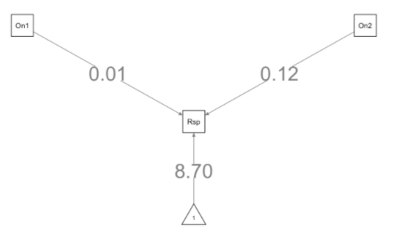
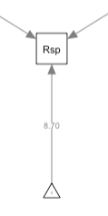
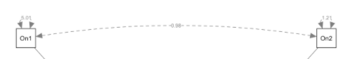
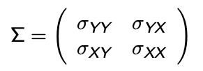
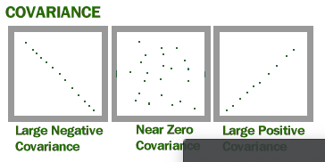
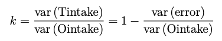
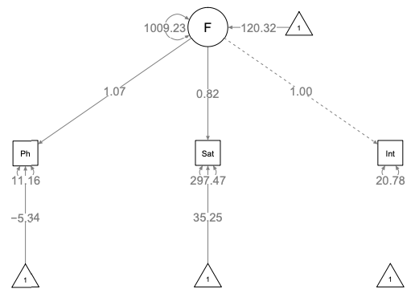

# Structure equation models

*Class given by: Albert Satorra*

**Structural Equation Modeling (SEM):** is an extremely broad and flexible framework for data analysis, perhaps better thought of as a family of related methods rather than as a single technique. Measuring latent constructs is challenging and we must also incorporate estimates of measurement error into our models. SEM excels at both of these tasks. SEM is especially suited for causal analysis.[@kdnuggets2017]

VS

**Ordinary least-squares (OLS):** models assume that the analyst is fitting a model of a relationship between one or more explanatory variables and a continuous or at least interval outcome variable that minimizes the sum of square errors, where an error is the difference between the actual and the predicted value of the outcome variable. The most common analytic method that utilizes OLS models is linear regression (with a single or multiple predictor variables).

**Latent variables =** Unobserved variables (or unmeasured variables in SEM lingo). These are theoretical concepts which can be inferred but not directly measured.

Linear regression model = $Y = alpha + betaX + error$

The model has to account for randomization. If there is a factor that that cannot be explained, it is included in the error. When this unmeasured factor that is in the error is correlated to another independent variable, there is ***endogeneity***.

**Endogeneity variables =** correlated with the error terms. Arises when the marginal distribution of the independent variable is not independent of the conditional distribution of the dependent variable given the independent.

**Exogenous variables =** not driven by other factors (observable or observable)

*Sources of endogeneity =*

    1. Omitted variables: relevant variables left out of the model,  attributing to effect to those that were included. 
    2. Simultaneity: where x causes y and y causes x
    3. Selection bias: sampling bias

In the structural equation model we can effectively avoid endogeneity.

------------------------------------------------------------------------

## Path analysis (structural equations)

**Path diagrams =** Communicates the structure of our model. Useful for structural equation models. The objects in the model mean:

-   Rectangular = any variable that we can observe directly (observed variable), measured variables

-   Circle / Ovals = Cannot be observed (Latent variable)

-   Arrow = directed effect. One variable impacts the other. Hypothetical causal relationship.

-   Numbers by the arrows = regression coefficient.

{width="352"}

-   Triangle is the constant in the Linear Model.

{width="81"}

-   Double handed arrows = indicate co-variances or correlations without a causal interpretation.

-   Double handed arrow between two independent variables = they are correlated to each other.

{width="350"}

-   Residual error term = measurement errors. We expect that the factor will not perfectly predict the observed variables.

-   The bi-directed arrows, the ones with two side arrows (in this representation, a connecting line with no arrows) represent co-variances among variables.

------------------------------------------------------------------------

## Coding the model

```{r, warning=FALSE, message=FALSE}
library(semPlot)
library(lavaan)
```

**Setting up the model and summarizing**

```{r comment= ""}
fit <- 'dist ~ speed'
model <- lavaan(fit, data = cars, estimator="MLM", auto.var = TRUE)
summary(model)
```

*Estimator = MLM in the model:* protects for non-linearity, non-normality and elasticity of the raw data. This needs the raw data, not only the covariance matrix.

**Setting up the path diagram**

```{r}
semPaths(model, "std", title = FALSE,
weighted = FALSE, sizeInt = 4, sizeMan = 5,
edge.label.cex = 1.3, asize = 2)
title("SEM path", line = 3)
```

*"std" =* standardizing the variables

*"est" =* true estimation

*style="ram" =* to get circles around the measurement arrows

**With latent variable & SEM**

```{r, warning = FALSE}
model <- "
# regression
Petal =~ Petal.Width + Petal.Length
Sepal.Length ~ Sepal.Width  + Petal
"

fit <- sem(model, data = iris, sample.cov = S, sample.nobs = 122)
semPaths(fit, "std", sizeInt = 4, sizeMan = 3, edge.label.cex = 1, asize=3, weighted=TRUE, exoCov = TRUE)
```

\
**Testing the model**

```{r}
fitMeasures(fit)[ c("chisq","df", "pvalue" ,"rmsea")]
```

1.  Chisq is a chi-squared test statistic for. H0: moment restrictions implied by the model hold true
2.  The degrees of freedom
3.  P-value of the chi-square test
4.  Rmsea is a fit index, the root mean square of approximation. It should be small for a good fit of the model. Threshold of .05 is often applied to declare good fit.

*See later chapter for further explanation*

**Modification indices**

This tells us how we could improve your model. If i liberate one parameter, then \_ would change.

```{r}
modi = modindices(fit)
modi[order(modi[,4], decreasing=T), ]
```

**Parameters fit**

```{r}
parameterestimates(fit, 
standardized = TRUE, rsquare=TRUE, ci=FALSE)[1:4,] # showing the top 4
```

\+

------------------------------------------------------------------------

### Covariance

Covariance is a measure of how much two random variables vary together. It's similar to variance, but where variance tells you how a single variable varies, co variance tells you how two variables vary together.

Cov(1, 2) =

$sum (1- mean(1) * (2-mean(2)  / n$

**Moment matrix:**

{width="261"}

**Covariance matrix:**

```{r}
cov(cars)
```

{width="353"}

Creating the covariance matrix when only having the lower half:

```{r}
lower <- "
0.03300863
0.15894229 5.0185561
0.15670560 0.9841531 1.2142232
"
S <- getCov(lower,
names = c("variable1", "variable2", "variable3"))
print(S)
```

------------------------------------------------------------------------

### Reliability

In statistics ***reliability*** is the consistency of a set of measurements or measuring instrument, often used to describe a test. This can either be whether the measurements of the same instrument give or are likely to give the same measurement (test-retest), or in the case of more subjective instruments, such as personality or trait inventories, whether two independent assessors give similar scores (inter-rater-reliability). Reliability is inversely related to random error. In words, reliability is defined as a proportion of observed variance that is true variance. Reliability is interpreted as a proportion and therefore cannot be negative.

Various kinds of reliability coefficients, with values ranging between 0.00 (much error) and 1.00 (no error), are usually used to indicate the amount of error in the scores.

The reliability is expressed as [k]{.ul} and there are several options to calculate:

**Option 1: reliability of a latent variable**

1 - Measurement error variable 1 / observed variable 2 (latent variable). Dividing the true variance by the observed variance.

Here is an example:



**Option 2: based on the standardized path diagram**

The square of the standardized loading is the reliability of the variable. Example:

```{r echo=FALSE}
fit <- 'dist ~ speed'
model <- lavaan(fit, data = cars, estimator="MLM", auto.var = TRUE)
semPaths(model, "std", title = FALSE,
weighted = FALSE, sizeInt = 4, sizeMan = 5,
edge.label.cex = 1.3, asize = 2)
title("SEM path", line = 3)
```

Here the reliability of the variable distance (dst) = $0.35 ^ 2 = 0.12 = k$

\_\_\_\_\_\_\_\_\_\_\_\_\_\_\_\_\_\_\_\_\_\_\_\_\_\_\_\_\_\_\_\_\_\_\_\_\_\_\_\_\_\_\_\_\_\_\_\_\_\_\_\_

**Testing the model**

`fitMeasures(fit) [ c("chisq", "df", pvalue", "rmsea")]`

**Model chi-square test =** We test whether the fitted model is correct. HO: moment restrictions implied by the model hold. The fit is correct If \> 0.05 we cannot reject the model. I accept the model.

Therefore, the chi-square test allows researchers to evaluate the fitness of a model by using the null hypothesis significance test approach.


**Degrees of freedom (df) =** Number of observations available for model estimation - Number of observations used to estimate parameters.

"Number of free parameters" refers to all of the things that this model estimated freely. Parameter is a regression coefficient when standardized is called a beta coefficient.

**The Root Mean Square Error of Approximation (RMSEA) =** fit index: how the covariance fit in the model. Difference between observed and the fitted.

The RMSEA is widely used in Structural Equation Modeling to provide a mechanism for adjusting for sample size where chi-square statistics are used. Measures the discrepancy due to the approximation per degree of freedom.

The objective is to have the RMSEA as low as possible.

------------------------------------------------------------------------

## Factor model

**Factor analysis:** a statistical method used to describe variability among observed, correlated variable in terms of a potentially lower number of unobserved variables called factors. For example, it is possible that variations in six observed variables mainly reflect the variations in two unobserved (underlying) variables. Factor analysis searches for such joint variations in response to unobserved latent variables. The observed variables are modeled as linear combinations of the potential factors, plus "error" terms.

It is including a common return that has a impact to multiple variables. Then, you can find how much variance is due to permanent and depended on these variables.

Below we can find the factor model including means based on the Spearman model from 1903.



**Difference in regression equations:**

***Basic model - Y, X are centered :***

$Y = beta X + error$

***Y, X NOT centered - including constant:***

$Y = alpha*1 + beta X + error$

***Factor model:***

$Y = lambda*F + error1$

**Lamba =** the weights \
**F =** common factor \
**Error =** Specific to the factors

Here instead of setting the alpha to 1 which we do in the basic model, now we add a weight which is the lambda.

When the data is standardized, beta becomes the standardized beta coefficient. Because y, x are centered, you do not need to present the constant in the model.

Next step in factor models with simultaneous equations --\> ML estimation of a general model. Linear structural relations

You have to fix the variance of a variable that you do not observe. If you do not do this, the model is not identified. Meaning there is no minimum. Including latent variables two options:

    A) Var(F) = 1, F Standardized (F typically has mean zero)
    B) Lambda_1 = 1

They are equivalent regarding degrees of freedom or model fit. When you put 1\* variable1, you force the true beta to be 1.

**In r setting the model =**

```{r}
#regression equation option 1
Model <- "dist =~ 1 * speed
"

#regression equation option 2
Model <- "dist =~ NA * speed
"
```

When using: Default NA = not available. We are asking R to calculate the beta instead of setting it to 1. This gives the equation: $Y = Lambda*F + Error$. \

**Degrees of freedom**

When you bring variables into the model, the degrees of freedom increases. When there are 0 degrees of freedom, you cannot test but you can fit the model. Now you cannot reject the model, but you can check the reliability.

### Setting covariance & variances

Independent variables have variances and co-variances, unless the model specification puts them to zero. Variance is to be estimated in the model and if necessary we should be imposing restrictions. When you include all variances, you put a lot of tension on your model.

Y \~\~ 1\* Y = forces the variable to be standardized

X \~\~ X = Gives two explanatory variables the possibility to covariance

Equality with error variances (multiple independent variables) X\~\~X \*A = setting a restriction.

**Auto regressive =** one variables keeps impacting the following. For example: 2011 impacts 2012 which impacts 2013 etc. In this case, the variables need to be set to allow for correlation.

