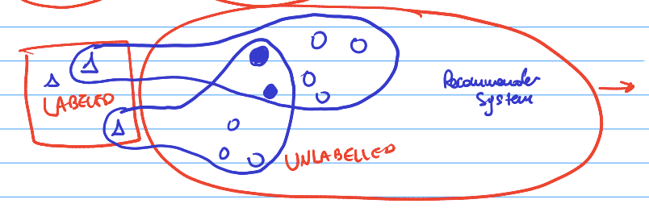
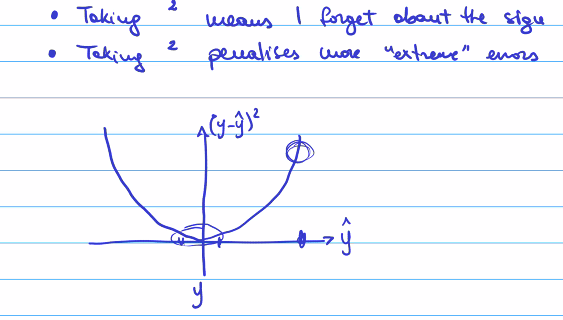
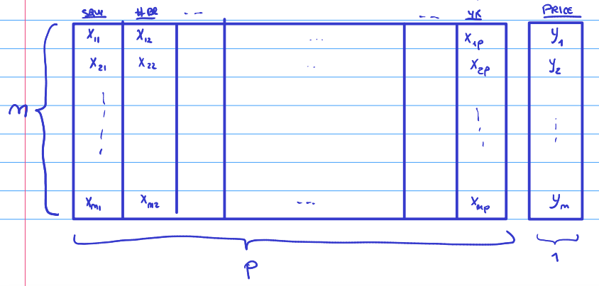
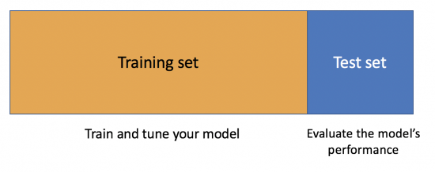
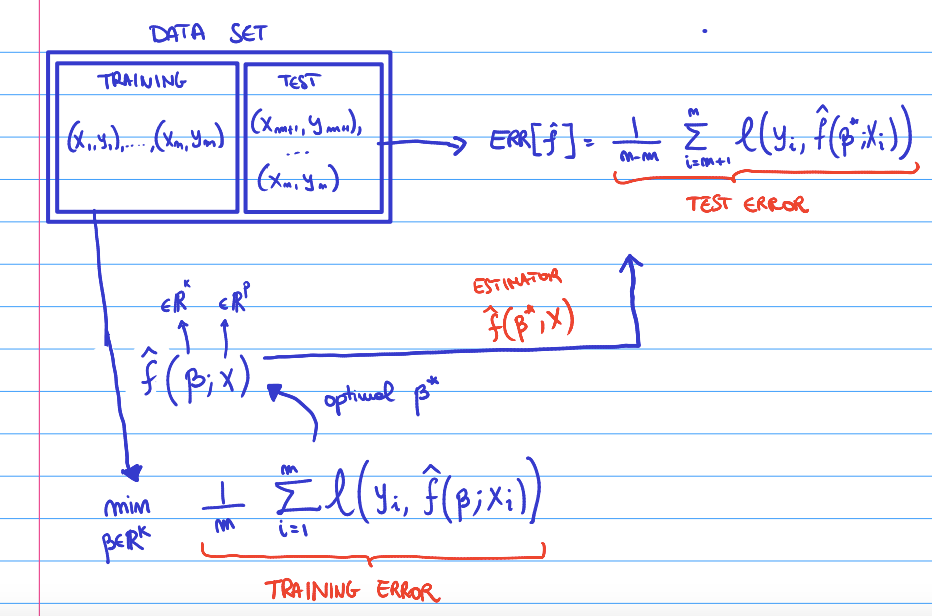

# Practical data science

## Machine Learning

There are multiple types of machine learning:

-   Supervised

-   Unsupervised

-   Reinforcement learning

#### **Reinforcement learning:**

Alpha go. ML for chess. Trained by trial and error. First they are
taught the simple rules and then asked to train by themselves and learn
from their mistakes. The algorithms are asked to do something and either

-   Get a rewards or

-   A penalty

As a result, they learn which moves are good and continue to try
something else. Machine learning still does not understand casual
relationships.

#### **Unsupervised learning:**

We do not have labels on the data. Can still observe patterns, it
understands there are commonalities but not with a reason.

You can combine labeled data, for example from the passed and look for
patterns with the unlabeled data.

{width="656"}

#### **Supervised learning**

Supervised learning: Extracting patterns from data and making
predictions based on passed behavior.

An example is a picture of an animal and the algorithms predicts which
animal it is.

Hereby we use training data to train the algorithm. However, the data
must be labeled: we already know the correct answer. This method does
not include trial or error.

For example, first showing examples of cats and then it can make
predictions. Meaning, we show a new picture and it can predict whether
it is a cat or not a cat.

-   Regression tasks: label is a continuous number. Hereby what we want
    to predict is continuous, not necessarily the data given to predict.
    F.E. House prices

-   Classification tasks: Label is one of discrete set of possible
    values. F.E. Is it a dog or a cat

### Theory

Supervised learning - Regression - Classification

+-----------+---------------------------------------------------------+
| Symbol    | Explanation                                             |
+===========+=========================================================+
| y         | Real value                                              |
+-----------+---------------------------------------------------------+
| **ŷ**     | Prediction                                              |
+-----------+---------------------------------------------------------+
| **y-ŷ**   | Absolute error                                          |
+-----------+---------------------------------------------------------+
| **(       | Squared error \|                                        |
| y-ŷ)\^2** |                                                         |
+-----------+---------------------------------------------------------+
| **x**     | Generic input / Features. The things I use to predict   |
|           | y.                                                      |
|           |                                                         |
|           | The independent variable (statistics).                  |
+-----------+---------------------------------------------------------+
| **y**     | Generic output. The label. (ML) The thing I want to     |
|           | predict.                                                |
|           |                                                         |
|           | Dependent variable (statistics).                        |
+-----------+---------------------------------------------------------+
| **p**     | Number of features (machine learning).                  |
|           |                                                         |
|           | Number of independent variables I have (statistics).    |
+-----------+---------------------------------------------------------+
| **n**     | Size of the data set                                    |
+-----------+---------------------------------------------------------+

If I know the inputs, I could try to "predict" the output. This would
state that in the real world the outputs (y) are a function of the
inputs (x). In mathematical terms:

$y = f(x)$

For example, if we know multiple features of a house, we could try to
predict whether a person would like it. (based on f.e. Square meters,
number of bedrooms etc.) However, realistically and economically we
cannot always find all the possible features that would predict an
output. It is always affected by some uncertainty. Therefore, y is a
function of x but adding some noise. Which leads to:

Deterministic function: $y = f(x) + E$

E = (error) noise, a random variable which models some unpredictable
events that happens in the real world that we do not have a
corresponding input for to take into account.

We assume that E obeys at least a couple of properties:

1.  E is not correlated with any of the features
2.  Expected value of the random variable, E[E] = 0

Assumption 1 can be F.E. that someone really wants to buy a house
because there is a good place to put a dog bed. This cannot be predicted
based on the other inputs (features) that are in my data set. They
should not be correlated.

Assumption 2 says that the $e$ doesn't ALWAYS cause either a increase or
a decrease in the output. It has to be truly random.

------------------------------------------------------------------------

The real world: $y = f(x) + E$. We want to try to learn more about this
function f.

Estimator = $\hat f$.

If we do a good job, we are able to find a $\hat f$ that is similar to
the true value of f. If I am able to find a $\hat f$, I can plug in the
input into the estimator and make a prediction. The estimator is the
thing that I want to use to approximate as best as possible the real
relationship between the inputs and outputs in the real world. In
mathematical terms:

$\hat f (x) = \hat y$ = prediction

If the model is **accurate** the prediction is **accurate** =

$\hat f$ is similar to $f$ and therefore $\hat y$ is similar to $y$ and
therefore We have accurate predictions.

*What is key for the data scientist is: **Out-Of-Sample Accuracy.***

This means that your model is accurate with your sample but also with
out-of-sample data.

How can I measure how accurate $\hat y$ is compared to $y$? We look at
the error.

**Squared error:** Most classical error measure = $(y-\hat y)^2$

Multiple reasons on why squared errors are used:

\- Taking square means I forget about the sign of the error (negative vs
positive)\
- Taking square penalizes more 'extreme' errors

Alternative way of valuing the error is the **absolute error:**
$y-\hat y$

#### Data Visualized

Typically we will call our data: x & y

One data point looks like:

$(x1, x2, …., xp, y)$

Here X1 can be independent variable 1 for example square meters. X2 can
be number of rooms and Xp the year it is build. Y is the price of the
house.

{width="535"}

### Finding the expected value of the error

**Random variable:** is described informally as a variable whose values
depend on outcomes of a random phenomenon.

The error is a random variable. Therefore, y is also a random variable
because some of its expression is: $f(x) + ϵ = y$.

$Eϵ[y-\hat y]^2$ = expected value of the squared error

Because we know that the formula for y is = $f(x) + ϵ = y$, we can
re-write this expression as:

$Eϵ[(f(x)+ ϵ-\hat y]^2$

We continue to solve the equation. We can re-write $\hat y$ as
$\hat f(x)$:

$Eϵ[(f(x)+ ϵ-\hat f(x)]^2$

We rearrange these terms:

$Eϵ[(f(x)-\hat f(x)+ ϵ]^2$

For ease of notation, $f(x)-\hat f(x)$ becomes alpha

$Eϵ[\alpha+ ϵ]^2$

We expand:

$Eϵ[\alpha^2 + 2\alphaϵ + ϵ^2]$

Make use of it being linear:

$Eϵ[\alpha^2] + 2Eϵ[\alphaϵ] + Eϵ[ϵ^2]$

Now we can see that alpha does not have the random element ϵ making it
not a random variable and is deterministic term (constant). As it is
constant and without error, it is already the expected value. We
re-write again:

$\alpha^2 + 2Eϵ[\alphaϵ] + Eϵ[ϵ^2]$

As previously explained in the theory, the expect value of the noise
should be 0. This is the assumption made.

$\alpha^2 + 0 + Eϵ[ϵ^2]$

The variance of a random variable is, for example variable z =

$Var[z] = E[z^2] - (E[z])^2$

If we apply this definition to the above ϵ:

$Var[ϵ] = E[ϵ^2] - (E[ϵ])^2$

As we said before, the expected value of ϵ is 0 and therefore the
variance is:

$Var[ϵ] = E[ϵ^2] - 0 = E[ϵ^2]$

To combine this with the previous equation:

$\alpha^2 + Eϵ[ϵ^2] = [f(x) - \hat f(x)]^2 + Var[ϵ]$

This can be separated in two parts:

+---------------------------------+-----------------------------------+
| $[f(x) - \hat f(x)]^2$          | $Var[ϵ]$                          |
+---------------------------------+-----------------------------------+
| Reducible error:                | Irreducible error                 |
|                                 |                                   |
| Real relation - estimator       | Intrinsic property of the error   |
+---------------------------------+-----------------------------------+

If the model is really good, the estimator is similar to the real
relation and I can "reduce" the error. If the model is extremely
precise, the estimator can even be exactly the real relation. It
therefore depends on the accuracy of the estimator.

$\hat f = f$

However, even when this happens, I still cannot affect the "irreducible"
error because it is noise from the real world. It is intrinsic property
/ characteristics of the data, not the estimator.

To conclude, we can only affect the reducible error.

------------------------------------------------------------------------

Data set = $(x1, y1)….,(xn, yn)$

Data point i = $Xi ϵR^p$

The estimator is a function that takes a p dimensional and produces a
real values output.

$\hat f:R^p –> R$

$\hat y = \hat f (x)$= prediction or estimate

$\hat f$ = estimator

If I have a concrete set of observations, I can estimate the expected
value. For example, I can take the average height of a class to estimate
the expected value of the height of the class.

Mean squared error (MSE): The empirical average of the expected value of
the error term. In mathematical terms:

$MSE(\hat f) = \frac{1}{n} \sum_{i=1}^{n}(y_i-\hat y_i)^2$

Considering that $\hat y_i$ is nothing else than the prediction for the
i input = $\hat y_i = \hat f(x_i)$. Therefore, we can transform again:

$MSE(\hat f) = \frac{1}{n} \sum_{i=1}^{n}(y_i-\hat f(x_i))^2$

I can apply $\hat f$ to one row, calculate the p features and look at
the real label, to compute the MSE.

{width="353"}

Mean absolute error (MAE): Hereby the only difference is that it is not
squared.

$MAE(\hat f) = \frac{1}{n} \sum_{i=1}^{n}[y_i-\hat f(x_i)]$

------------------------------------------------------------------------

### Loss function

We can use a loss function which takes as input two numbers: the real
and the predicted value and gives as output another real number. This is
the formula:

$L(y, \hat y): R^2 = R$

| Squared error                 | Absolute error              |
|-------------------------------|-----------------------------|
| $L(y, \hat y) = (y-\hat y)^2$ | $L(y, \hat y) = (y-\hat y)$ |

\
*I want the loss function to obey two properties:*

1)  If I make a correct prediction $(\hat y = y)$, then I have 0 loss
    $L(y, \hat y) = 0$ if $(\hat y = y)$.

2)  For most loss function, I want $L(y, \hat y)$ to be large than the\
    "wronger" my prediction \$\$\\hat y\$ is. The loss function should
    not become smaller when the prediction becomes "wronger". Wronger =
    the more different my prediction is than the true number.

Loss function should be small when my prediction is close to the true
value and it should be large when it is not.

Estimating the error on existing data on which I know the label:

$Error(\hat f) = \frac{1}{n} \sum_{i=1}^{n}L(y_i-\hat f(x_i))$

Now I am calculating how accurate my model is based on my data set.
However, we want our model to work well on new previously unseen data
that is out of my data set / sample. In other words: **Out of sample
accuracy.**

We therefore, separate our data in two parts: the training set and the
test set.

{width="365"}

**Training set:** Data we show our model to have it learn a good
estimator. $\hat f = +/- f$. The training set will be used to derive to
a estimator.

**Test set:** Data which we hide from our model. After the model has
been trained, we will simulate it to the test data to evaluate the
model's performance. The test set will be sued to estimate the error fo
the $\hat f$.

The training set is called: N = $(x_1,y_1)....,(x_n,y_n)$

The test set is called: M = $(x_1,y_1)....,(x_m,y_m)$

Therefore, to calculate the estimate of the error of the model:

$Err(\hat f) = \frac{1}{n-m} \sum_{i=m+1}^{n}L(y_i-\hat f(x_i))$

\
To train a model = to find good values for its parameters. First I have
to fix the shape of the model.

-   **Linear:** $\hat f(x_1-,x_p) = \beta_0+\beta_1,.....+\beta_p X_p$\
    Beta's are the linear coefficients and the X1, Xp are the variables.
    The $\beta$ 's are parameters. I can train a model to find a good
    estimator by finding good parameters

-   **Quadratic:**
    $\hat f(x_1-,x_p) = \beta_0+\beta_1,.....+\beta_p X_p + \beta_1X_1^2+....\beta_1pX_1p + etc.$

I do not know what model is the good model. So I train each model and
then I pick the model that has the lowest error.

$x$ = an input (p)

$\beta$ = a vector of parameters (k)

$\beta^*$ = optimal solution of the betas

This is a optimization problem where I try to minimize the empirical
error of the model on the training set. Once we solve the following
model, I find the optimal values for the $\beta$'s and this will find me
the estimator. Once I have my estimator, I can take the test data and
estimate an error for the model.

**Training error
=**$\frac{1}{n} \sum_{i=1}^{n}L(y_i-\hat f(\beta_ix_i))$

**Test error =**
$Err(\hat f) = \frac{1}{n-m} \sum_{i=m+1}^{n}L(y_i-\hat f(\beta^*_i,x_i))$

------------------------------------------------------------------------
