# Practical Data Science

```{r, echo=FALSE}
knitr::opts_chunk$set(echo = TRUE, class.source = "watch-out", options(scipen=999), out.width = "100%", comment = "", warning=FALSE, reticulate.repl.quiet = FALSE) 
```

*Class given by: Alberto Santini* \ 

*Literature used: [@GJames2013], [@THastie2017]*

## Machine Learning

There are multiple types of machine learning:

-   Supervised

-   Unsupervised

-   Reinforcement learning

**Reinforcement learning:**

**Reinforcement learning** (RL) is an area of **machine learning**
concerned with how intelligent agents ought to take actions in an
environment in order to maximize the notion of cumulative reward. An
example of application is by playing chess where through trial and
error, the algorithm was eventually able to beat any player. First they
are taught the simple rules and then asked to train by themselves and
learn from their mistakes. The algorithms are asked to make a move and
either receive:

-   A reward or

-   A penalty

As a result, they learn which moves are good and continue to try
something else. However, machine learning still does not understand
casual relationships.

**Unsupervised learning:**

Unsupervised learning is a type of algorithm that learns patterns from
unlabeled data. The hope is that, through mimicry, the machine is forced
to build a compact internal representation of its world and then
generate imaginative content. While there are no labels available, the
algorithm can still observe patterns and understand that there are
commonalities. Again, it won't be able to understand causality.

It is possible to combine labeled data, for example from the passed and
look for patterns with the unlabeled data.

{width="656"}

**Supervised learning**

**Supervised learning** is an approach to creating **artificial
intelligence** (**AI**), where a computer algorithm is trained on input
data that has been labeled for a particular output. Therefore, it is
extracting patterns from data and making predictions based on passed
behavior.

An example is a picture of an animal and the algorithms predicts which
animal it is. Hereby we use training data to train the algorithm.
However, the data must be labeled meaning we already know the correct
answer. This method does not include trial or error.

For example, first showing examples of cats and then it can make
predictions. Then we show a new picture and it can predict whether it is
a cat or not a cat. There are also multiple types of models than can be
applied for supervised learning such as:

-   Regression tasks: label is a continuous number. Hereby what we want
    to predict is continuous, not necessarily the data given to predict.
    F.E. House prices

-   Classification tasks: Label is one of discrete set of possible
    values. F.E. Is it a dog or a cat. Or it is a score from 1 to 5,
    integer.

### Theory

Throughout this chapter, only supervised learning is explored in the two
methods: regression and classification.

+---------------+-----------------------------------------------------+
| Symbol        | Explanation                                         |
+===============+=====================================================+
| y             | The real value. Generic output. The label. (ML) The |
|               | thing I want to predict.                            |
|               |                                                     |
|               | Dependent variable (statistics).                    |
+---------------+-----------------------------------------------------+
| **ŷ**         | Prediction                                          |
+---------------+-----------------------------------------------------+
| **y-ŷ**       | Absolute error                                      |
+---------------+-----------------------------------------------------+
| **( y-ŷ)\^2** | Squared error                                       |
+---------------+-----------------------------------------------------+
| **x**         | Generic input / Features. The things I use to       |
|               | predict y.                                          |
|               |                                                     |
|               | The independent variable (statistics).              |
+---------------+-----------------------------------------------------+
| **p**         | Number of features (machine learning).              |
|               |                                                     |
|               | Number of independent variables I have              |
|               | (statistics).                                       |
+---------------+-----------------------------------------------------+
| **n**         | Size of the data set                                |
+---------------+-----------------------------------------------------+

If I know the inputs, I could try to "predict" the output. This would
state that in the real world, the outputs (y) are a function of the
inputs (x). In mathematical terms:

$y = f(x)$

For example, if we know multiple features of a house, we could try to
predict whether a person would like it. (based on f.e. square meters,
number of bedrooms etc.) However, realistically and economically we
cannot always find all the possible features that would predict an
output. It is always affected by some uncertainty. Therefore, y is a
function of x but adding some noise. Which leads to:

Deterministic function: $y = f(x) + ϵ$

**ϵ** = (error) noise --> a random variable which models some
unpredictable events that happens in the real world, that we do not have
a corresponding input for to take into account.

We assume that ϵ obeys at least a couple of properties:

1.  ϵ is not correlated with any of the features
2.  Expected value of the random variable, ϵ[ϵ] = 0

Assumption 1 can be F.E. that someone really wants to buy a house
because there is a good place to put a dog bed. This cannot be predicted
based on the other inputs (features) that are in my data set. They
should not be correlated.

Assumption 2 says that the $e$ doesn't ALWAYS cause either a increase or
a decrease in the output. It has to be truly random.

------------------------------------------------------------------------

In the real word we have the following: $y = f(x) + E$. Next we want to
try to learn more about this function f. In order to be able to do so,
we have to find an estimator. The estimator is the thing that I want to
use to approximate as best as possible the real relationship between the
inputs and outputs in the real world.

Estimator = $\hat f$

If we do a good job, we are able to find a $\hat f$ that is similar to
the true value of f. If I am able to find a $\hat f$, I can plug in the
input into the estimator and make a prediction. In mathematical terms:

$\hat f (x) = \hat y$ = prediction

If the model is **accurate** the prediction is **accurate** =

$\hat f$ is similar to $f$ and therefore $\hat y$ is similar to $y$ --\>
We have accurate predictions.

> What is key for the data scientist -\> **Out-Of-Sample Accuracy.**

This means that your model is accurate with your sample but also with
out-of-sample data. How can I measure how accurate $\hat y$ is compared
to $y$? We can have a look at the error.

**Squared error:** Most classical error measure = $(y-\hat y)^2$

Multiple reasons on why squared errors are used:

\- Taking square means I forget about the sign of the error (negative vs
positive)\
- Taking square penalizes more 'extreme' errors


Alternative way of valuing the error is the **absolute error:**
$y-\hat y$

### Data set

Typically we will call our data: x & y. One data point looks like:

$(x1, x2, …., xp, y)$

Taken the example of predicting house prices, the X1 can be independent
variable 1 for example square meters. X2 can be number of rooms and XP
the year it is build. Y is the price of the house.

{width="535"}

------------------------------------------------------------------------

### Finding the expected value of the error

A **random variable** is a **variable** whose value is unknown or a
function that assigns values to each of an experiment's outcomes. A
**random variable** can be either discrete (having specific values) or
continuous (any value in a continuous range). It is described informally
as a variable whose values depend on outcomes of a random phenomenon.

The error is a random variable. Therefore, y is also a random variable
because some of its expression is: $f(x) + ϵ = y$.

$Eϵ[y-\hat y]^2$ = expected value of the squared error

Because we know that the formula for y is = $f(x) + ϵ = y$, we can
re-write this expression as:

$Eϵ[(f(x)+ ϵ-\hat y]^2$

We continue to solve the equation. We can re-write $\hat y$ as
$\hat f(x)$:

$Eϵ[(f(x)+ ϵ-\hat f(x)]^2$

We rearrange these terms:

$Eϵ[(f(x)-\hat f(x)+ ϵ]^2$

For ease of notation, $f(x)-\hat f(x)$ becomes alpha

$Eϵ[\alpha+ ϵ]^2$

We expand:

$Eϵ[\alpha^2 + 2\alphaϵ + ϵ^2]$

Make use of it being linear:

$Eϵ[\alpha^2] + 2Eϵ[\alphaϵ] + Eϵ[ϵ^2]$

Now we can see that alpha does not have the random element ϵ making it
not a random variable and is **deterministic term** (constant). As it is
constant and without error, it is already the expected value. We
re-write again:

$\alpha^2 + 2Eϵ[\alphaϵ] + Eϵ[ϵ^2]$

As previously explained in the theory, the expect value of the noise
should be 0. This is the assumption made.

$\alpha^2 + 0 + Eϵ[ϵ^2]$

The variance of a random variable is, for example variable z =

$Var[z] = E[z^2] - (E[z])^2$

If we apply this definition to the above ϵ:

$Var[ϵ] = E[ϵ^2] - (E[ϵ])^2$

As we said before, the expected value of ϵ is 0 and therefore the
variance is:

$Var[ϵ] = E[ϵ^2] - 0 = E[ϵ^2]$

To combine this with the previous equation:

$\alpha^2 + Eϵ[ϵ^2] = [f(x) - \hat f(x)]^2 + Var[ϵ]$

This final expression can be separated in two parts:

+---------------------------+---------------------------------+
| $[f(x) - \hat f(x)]^2$    | $Var[ϵ]$                        |
+---------------------------+---------------------------------+
| **Reducible error:**      | **Irreducible error**           |
|                           |                                 |
| Real relation - estimator | Intrinsic property of the error |
+---------------------------+---------------------------------+

If the model is really good, the estimator is similar to the real
relation and I can "reduce" the error. If the model is extremely
precise, the estimator can even be exactly the real relation. It
therefore depends on the accuracy of the estimator.

$\hat f = f$

However, even when this happens, I still cannot affect the "irreducible"
error because it is noise from the real world. It is intrinsic property
/ characteristics of the data, not the estimator.

> To reiterate, we can only affect the reducible error.

### Finding the error

Data point i = $Xi ϵR^p$

The estimator is a function that takes a p dimensional and produces a
real values output.

$\hat f:R^p –> R$

If I have a concrete set of observations, I can estimate the expected
value. For example, I can take the average height of a class to estimate
the expected value of the height of the class.

**Mean squared error (MSE):** The empirical average of the expected
value of the error term. The average squared difference between the
estimated values and the actual value. In mathematical terms:

$MSE(\hat f) = \frac{1}{n} \sum_{i=1}^{n}(y_i-\hat y_i)^2$

Considering that $\hat y_i$ is nothing else than the prediction for the
i input = $\hat y_i = \hat f(x_i)$, it can be transformed again:

$MSE(\hat f) = \frac{1}{n} \sum_{i=1}^{n}(y_i-\hat f(x_i))^2$

I can apply $\hat f$ to one row, calculate the p features and look at
the real label, to compute the MSE.

{width="626"}

**Mean absolute error (MAE):** Here the only difference is that it is
not squared.

$MAE(\hat f) = \frac{1}{n} \sum_{i=1}^{n}[y_i-\hat f(x_i)]$

------------------------------------------------------------------------

### Loss function

We can use a loss function which takes as input two numbers: the real
and the predicted value and gives as an output another real number. This
is the formula:

$L(y, \hat y): R^2 = R$

| Squared error                 | Absolute error              |
|-------------------------------|-----------------------------|
| $L(y, \hat y) = (y-\hat y)^2$ | $L(y, \hat y) = (y-\hat y)$ |

\
*I want the loss function to obey two properties:*

1)  If I make a correct prediction $(\hat y = y)$, then I have 0 loss
    $L(y, \hat y) = 0$ if $(\hat y = y)$.

2)  For most loss function, I want $L(y, \hat y)$ to be large than the
    "wronger" my prediction . The loss function should not become
    smaller when the prediction becomes "wronger". Wronger = the more
    different my prediction is than the true number.

The loss function should be small when my prediction is close to the
true value and it should be large when it is not. Estimating the error
on existing data on which I know the label:

$Error(\hat f) = \frac{1}{n} \sum_{i=1}^{n}L(y_i-\hat f(x_i))$

### Training vs test set

Now it is being calculated how accurate the model is based on the
available data set. However, we want the model to work well on new
previously unseen data that is out of the data set / sample. In other
words: **Out of sample accuracy.**

Therefore, the data is separated **randomly** in two parts: the training
set and the test set.

{width="686"}

> **Training set:** A subset to train a model. Data we show our model to
> have it learn a good estimator. $\hat f \approx f$. The training set
> will be used to derive to a estimator.
>
> **Test set:** A subset to test the trained model​. Data which we hide
> from our model. After the model has been trained, we will simulate it
> to the test data to evaluate the model's performance. The test set
> will be used to estimate the error of the $\hat f$.

The training set is called: N = $(x_1,y_1)....,(x_n,y_n)$

The test set is called: M = $(x_1,y_1)....,(x_m,y_m)$

Therefore, to calculate the estimate of the error of the model:

$Err(\hat f) = \frac{1}{n-m} \sum_{i=m+1}^{n}L(y_i-\hat f(x_i))$

\
To train a model means to find good values for its parameters. First the
shape of the model has to be fixed. As previously stated, there are
several options. The below offers some of the options for regression
problems:

-   **Linear:** $\hat f(x_1-,x_p) = \beta_0+\beta_1,.....+\beta_p X_p$\
    Beta's are the linear coefficients and the X1, XP are the variables.
    The $\beta$ 's are parameters. I can train a model to find a good
    estimator by finding good parameters.

-   **Quadratic:**
    $\hat f(x_1-,x_p) = \beta_0+\beta_1,.....+\beta_p X_p + \beta_1X_1^2+....\beta_1pX_1p + etc.$

Prior to analysis, it isn't always clear what model will perform better.
Subsequently, the data is trained on multiple models and the final
selection is based on the lowest error.


$x$ = an input (p)

$\beta$ = a vector of parameters (k)

$\beta^*$ = optimal solution of the betas

This is a optimization problem the goal is to minimize the empirical
error of the model on the training set. Once the model is fitted to the
data, the optimal values for the $\beta$'s are found which will
therefore be the estimator. Once the estimator is found, it is applied
to the test data and an error for the model estimated. In mathematical
terms:

**Training error
=**$\frac{1}{n} \sum_{i=1}^{n}L(y_i-\hat f(\beta_ix_i))$

**Test error =**
$Err(\hat f) = \frac{1}{n-m} \sum_{i=m+1}^{n}L(y_i-\hat f(\beta^*_i,x_i))$

------------------------------------------------------------------------

## Bias-variance trade off

Splitting the test and training set is performed in a random manner.
Thus, if the split is made twice, it will most likely get different
results. As there are now different training sets with different data
points, an different optimal value for $B*$ is found leading to
additionally a different estimator and estimate of the error.
Nevertheless, there is a second source of randomness.

Bias-variance trade-off =

$E_{Traintestsplit} [(y-\hat y)^2] = Var[\hat y] + (Bias[\hat y])^2 + Var [ϵ]$

How much does the estimator (random variable) defer from the real values

$Bias[\hat y] = E[\hat y]-f(x)$ =$Bias^2[\hat y] = (E[\hat y] -f(x))^2$

Recalling:

Variance = $Var[Z] = E[Z^2] - (E[Z])^2$

Rewrite $E[(Z - E[Z])^2$

$\mu = E[Z]$

$E[(Z-\mu)^2]$

The expected value of a random variable is a constant. Therefore, I can
transform:

$E[E[Z]] = E[Z]$

Training test split = the expected value in the following scenario.

$E[(y-\hat y)^2] = E[(y-f(x) + f(x) - \hat y)^2]$

Next we can solve this equation:

$E[(y-f(x))^2] + 2E[(y-f(x))(f(x)-\hat y)] + E[(f(x)-\hat y)^2]$

Definition of $y = f(x)+ ϵ$

$E[ϵ^2] + 2E[yf(x)-(f(x))^2 - y\hat y + \hat yf(x)] + E[(f(x)- \hat y )^2]$

We know that $E[ϵ^2]$ is $var[ϵ]$

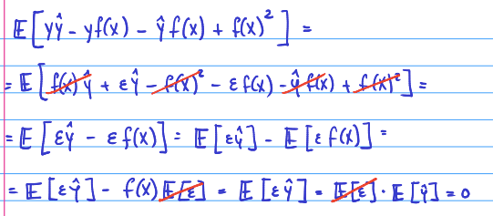{width="684"}

The aim is to make the error of the model as low as possible. Naturally,
the noise cannot be affected. Therefore, the variance and the trade off
needs to be as low as possible. The best scenario is that they are both
0.

Unfortunately if the variance is reduced, naturally there will be at
least some biased introduced and vice verse.

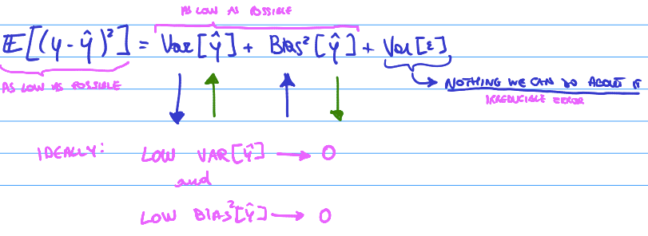{width="684"}

The variance of $\hat y$ = How much the prediction $\hat y$ varies when
the training set is changed.

Remember that the ultimate goal is that the predictor is similar to the
real function = $\hat f \approx f$. If the predictor varies a lot based
on the training data, it cannot really be similar to the real function.
Hence, I want the variance of $\hat y$ to be low.

> **Model with high variance** = Overfitted model (too complex). A small
> change in the training set leads to a large change in the predictions.
> This has a low bias.

If the model learns the noise of the training set, it can make perfect
predictions. Although in this instance, when the model is applied to a
different data set, it will give bad predictions. Having too many
parameters allows the model to learn the noise. If a model is very
complicated, it is more likely to be overfitted (high variance, low
bias).

> **Model with high bias** = Underfitted model (too simple). Large error
> even in the training set. This typically has a low variance. It is
> stable but it will give bad predictions and wont be accurate.

It can be visualized by plotting a linear regression model. We have made
a small change in the training set (one point has moved) and there has
been a small variance in the regression line.

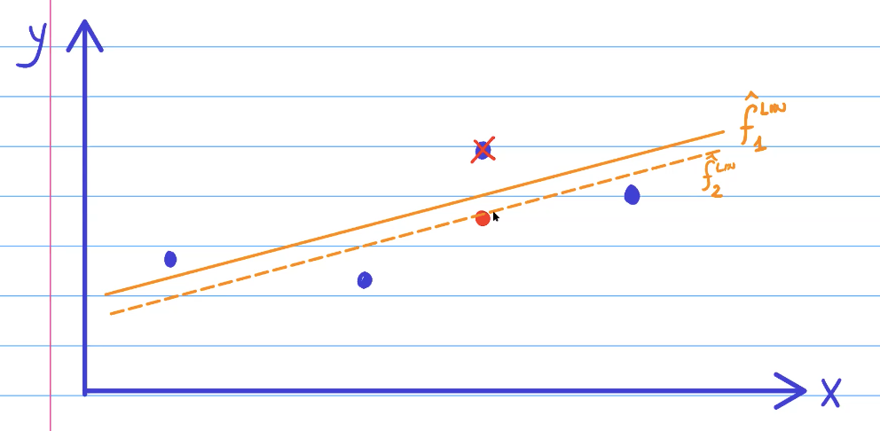

\
So we can conclude that there is a low variance in this model. Now we
will look at a polynomial model where there is 0 bias. Therefore, the
model must intercept perfectly all the points in the training set.

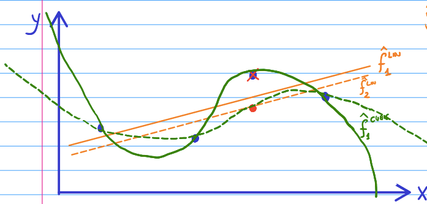

If I want to intercept 4 points in $R^2$, what is the smallest degree of
a polynomial that 1s need? --\> N-1

The green model has a high variance, but the bias = 0. This is a
overfitted model.

------------------------------------------------------------------------

### Training (fitting) a model

**Training a model:** Finding the parameters (of a parametric model)
which minimize the loss function over the training set. Training a model
simply means learning (determining) good values for all the weights and
the bias from labeled examples.

Training set has N points --\> $(X_1,Y_1),....,(X_n,Y_n)$.

*Minimize our parameters:*

$\beta :=(\beta_1....,\beta_k)$ = The K parameters of my model.

The goal is to minimize the error -\>
$\frac{1}{n} \sum_{i=1}^{n}L(y_i-\hat f(\beta_ix_i))$

k = p+1. These are all the parameters plus the intercept in the example
of a regression model.

Renamed function of betas: $g(\beta)$

Not all functions are born equal. There are some functions that are
easier to deal with. F.E. if they are continuous. In the case if I am in
luck there is a good chance that I can find the minimum. If these
conditions don't hold, it will be very difficult. There is a chance that
a algorithm finds not necessarily the global minimum but it does find
the local minimum. This can be visualized below:

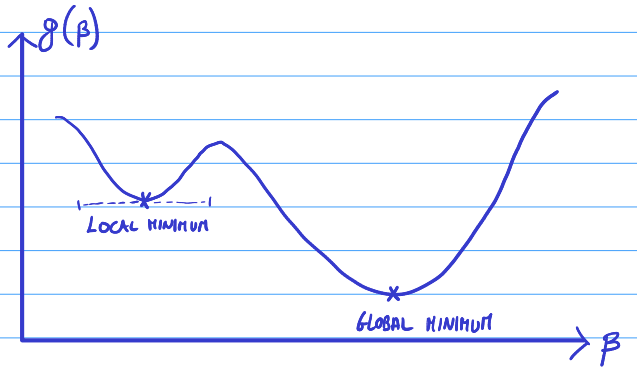{width="700"}

> **A convex function:** a continuous function whose value at the
> midpoint of every interval in its domain does not exceed the
> arithmetic mean of its values at the ends of the interval. Hereby, the
> global minimum is automatically also the local minimum as there is
> only one.

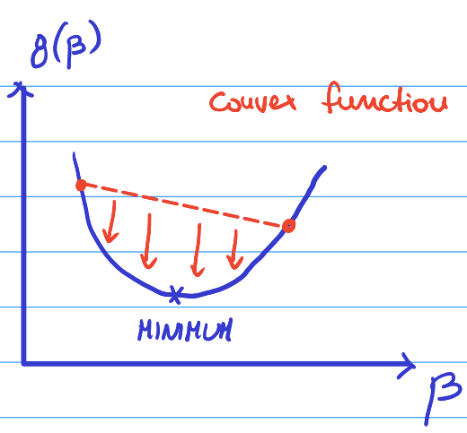{width="418"}

**Convex vs concave:**

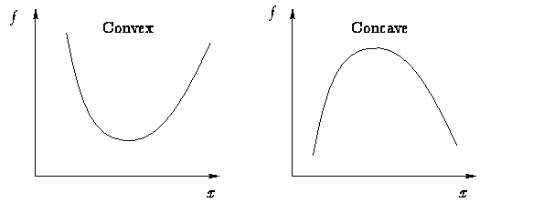

Whilst trying to find a minimum for a function, a point must be found
where the first derivative vanishes. Multiple things could happen:

-   Finding a local min (might be global)

-   Finding a local max (might be global)

-   You find a saddle point

------------------------------------------------------------------------

## Gradient descent

Instead, we present an algorithm that tries to find the local minimum
using the first derivative. A vector that has all the partial
derivatives at that point. It is a multivariate function as:

$g:R^k -> R^+_0$ = $\nabla g$

$\nabla g(\beta_1,....,\beta_k)$ =
$(\frac{\partial g}{\partial\beta_1}(\beta_1,...,\beta_k),....,\frac{\partial g}{\partial\beta_1}(\beta_1,...,\beta_k))$

**Gradient =** a measure of how steep a slope is

**Derivative =** a function of a real variable measures the sensitivity
to change of the function value (output value) with respect to a change
in its argument (input value).

**Function =** something that will take a input and will produce a given
output.

\
We want to go against the gradient (-) to find the minimum by following
the blue steps to arrive at the minimum (pink).

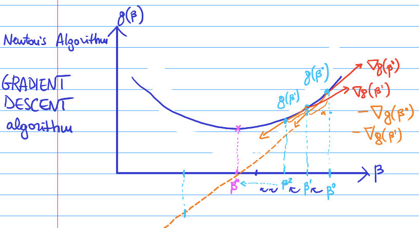

**Newton's Algorithm / Gradient Descent Algorithm =** Gradient descent
is a first-order iterative optimization algorithm for finding a local
minimum of a differentiable function. The idea is to take repeated steps
in the opposite direction of the gradient (or approximate gradient) of
the function at the current point, because this is the direction of
steepest descent. Only uses one parameter -\> alpha ($\alpha$), can be
any positive number. Below are the steps to find the solution:

$\alpha$ **= The step size / learning rate.**

1.  Fix an arbitrary $\beta_0R_k$ to start from.

2.  For t=0,....,T: the maximum number of steps that I will do (going
    from $\beta_1 - \beta_2$). The equation is:

    $\beta^{t+1} = \beta^t-\alpha\nabla g(\beta^t)$\
    If the $\nabla g(\beta^{t+1})=0$ then a break. The global minimum
    was found if the function is convex.

3.  Return the last $\beta^t$ available.

If our function looks like below:

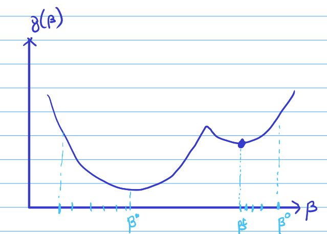{width="554"}

We will find a local minimum and will be stuck in the equation as the
gradient is 0.

The above equation considers a fixed parameter $\alpha$. It is also
possible to consider a **changing parameter =** $\alpha_t$.

If $\alpha$ grows, then we move more at each iteration. This could mean
that we move faster as there are fewer iterations. Alternatively, we
start jumping all over the space of the parameters without converging or
converging slowly.

Here is an example of the set size (learning rate) being too large and
experiencing **"jumping"**:

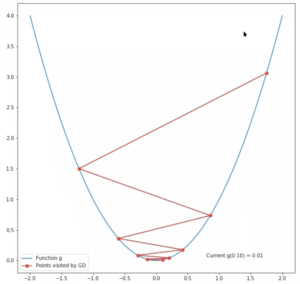{width="311"}

*How to choose* $\alpha$*?* Trying different values and finding the best
solution. "Typically" $\alpha = 10^{-3} = 0.01$.

At each iteration of the gradient descent algorithm we do:

$\beta^{t+1} = \beta^t-\alpha\nabla g(\beta^t)$

$\nabla g(\beta^t) = \nabla(\frac{1}{n} \sum_{i=1}^{n}g_i(\beta^t))$

Rewrite:

$\nabla g(\beta^t) = \frac{1}{n} \sum_{i=1}^{n}\nabla g_i(\beta^t)$

To compute $\nabla g$ there occur N gradients. These are one for each
point in the training set. This must happen at each iteration. In big
data settings, it is not unlikely that we have a training set that has
millions of data points. This would require too many gradients (too
slow).

### Stochastic gradient descent

In the previous computation we had to compute **n** gradients =\
$\nabla g(\beta^t) = \frac{1}{n} \sum_{i=1}^{n}\nabla g_i(\beta^t)$

However, we can replace this with something that only needs to compute 1
gradient, no matter how large the data set is.

1.  Fix an arbitrary $\beta^0 e R^k$ to start from

2.  For $t=0,....T:$

    -   Draw $jϵ$ {1,....,m} with uniform random distribution

    -   $\beta^{t+1} = \beta^t - \alpha \nabla g_j(\beta^t)$

    -   etc. everything else is like in gradient descent

The only difference is how we jump from the iterations. Instead of
computing the entire gradient.

**Gradient descent** =
$\beta^{t+1}= \beta^t - \alpha * \frac{1}{n} \sum_{i=1}^{n}\nabla g_i(\beta^t)$

vs

**Stochastic gradient descent** =
$\beta^{t+1}= \beta^t - \alpha \nabla g_j(\beta^t)$

Where J is taken uniformly at random = j\~$U({1,....,m})$

***GD vs SGD***

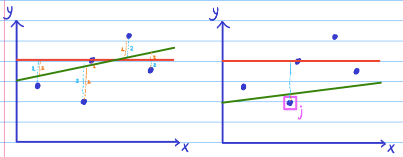

$\beta=(\beta_0, \beta_1)$ initial $\beta^0=(\beta^0_0, \beta^0_1)$

next $\beta^1=(\beta^1_0, \beta^1_1)$

**Here the MSE**$(\beta^0)$ **\< MSE** $\beta^1$

In linear regression the:
$g(\beta) = \frac{1}{n} \sum_{i=1}^{n}y_i-(\beta^0+\beta^1x_i))^2 = MSE(\beta)$

In stochastic gradient descent:

$g_j(\beta) = y_j-(\beta^0+\beta_1x_j))^2 = SE_j(\beta)$

Here the squared error is only regarding the random point j. The
regression line is changing so that the squared error of j becomes
smaller. By doing so over and over and choosing random uniformly j, it
is as if I was optimizing for all the squared errors. This can be proven
by:

Instead of using:

$\nabla g(\beta)= \frac{1}{n} \sum_{i=1}^{n}\nabla g_i(\beta)$

We use:

$\nabla g_j(\beta)$

Therefore, in expectation of a discrete random variable:

$E [\nabla g_j(\beta)] = \frac{1}{n} \sum_{i=1}^{n}\nabla g_i(\beta) = \nabla g(\beta)$

In expectation the gradient computed on that function $g_j$ is equal to
the big gradient (the gradient with respect to all the points).
Subsequently, on average, the squared error of j is equal to the mean
squared error of all the points.

-   SGD needs more iterations then GD. However, each iteration is much
    quicker. In the end, you can expect that SGD takes less time than
    GD.

-   Even if you have a convex differential function, you have less
    guarantee. GD with any alpha in 0,1 is guaranteed to converge to the
    optimum (global minimum). Stochastic gradient descent you only
    guarantee that you will arrive at a ball around the global minimum.
    But inside this ball there is no guarantee anymore.

1.  GD
2.  SGD

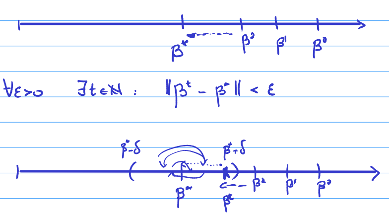{width="356"}

SGD could jump around in the ball and never arrive to the global
minimum. If this happens, you could go back to classic gradient descent
and try to converge.\

**Mini-Batch Gradient descent**

Takes the average of a subset of n of size k.

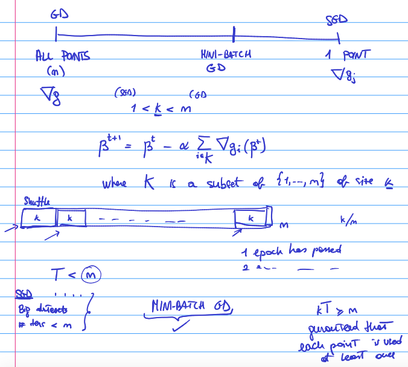

These points are mostly not taken at random. Takes k points for each
iteration. 1 epoch has passed per iteration.

------------------------------------------------------------------------

## Model Selection

Model selection = choosing the "best" model out of a set of possible
models that we are trying to consider. The "best" is considering the
out-of-sample predictive accuracy = lowest error (loss) on the point NOT
used for training = test set.

While doing predictions, we want to come up with appropriate estimators
($\hat f$) which are similar to our real word function ($f$), that links
our features to our label. Again it is repeated = $\hat f \approx f$.

Typically there are many models that can be used. Therefore, we need to
find out which model is the closest to the real value $f$. Some models
have hyper parameters that we need to choose which would give us even
more different models.

In machine learning, a **hyper parameter** is a parameter whose value is
used to control the learning process. By contrast, the values of other
parameters (typically node weights) are derived theough training. These
are either not trainable through gradient descent or it would not be
effective as it would defeat their purpose.

If we include the hyper parameter through gradient descent, it would be
set to 0. Moreover, setting the alpha to anything other than 0, would
give us a worse model on the training set. Perhaps, this would translate
to a better model on the test set. As we care mainly about the
out-of-sample-accuracy, this would be optimal. Therefore, we need a
different / better way on determining alpha which is different than
gradient descent --\> Hyper parameter tuning procedure.

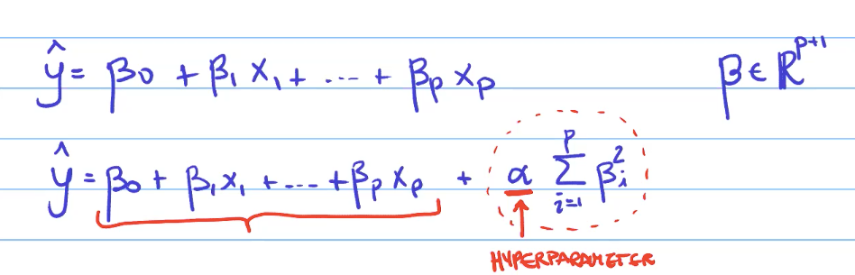

In the models that include hyper parameters, the are a infinite number
of models for each possible value of $\alpha > 0$ . This complicates the
model selection as we have to decide the best value of $\alpha$ .

In order to avoid this, we could choose a model that has 0 hyper
parameters and afterwards add a layer of complexity.

------------------------------------------------------------------------

## Validations methods

### Hold-Out validation method

-   "Simple" if no hyper parameters (training + test)

-   "Nested" if there are hyper parameters (training + validation +
    test)

Average error of the test set = An estimate of the real error which the
model will exhibit on new unseen data. It is an substitute of the
infinitely many data points that my model will classify when I will use
it for real / in production. We compare this estimate of the error of
the test set ($ERR_1$) with the multiple models and choose the lowest
value by definition.

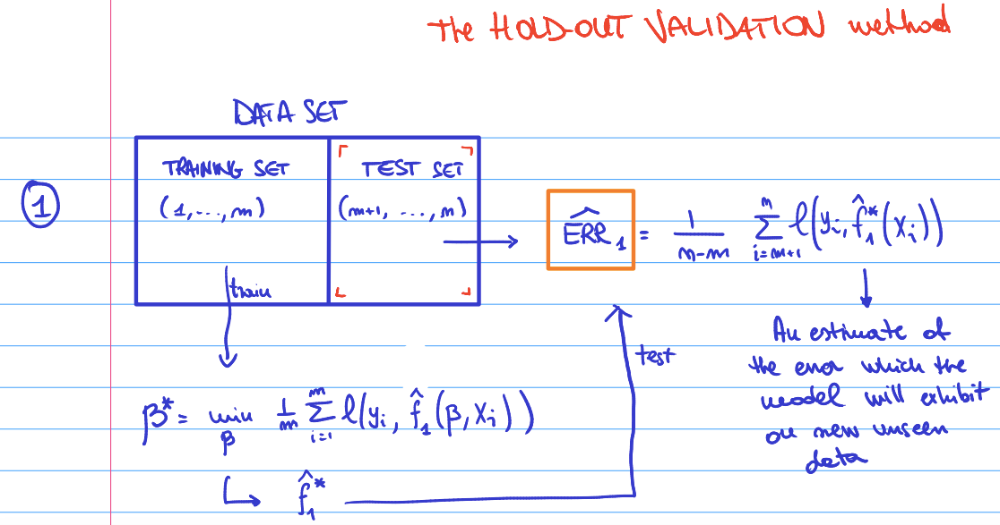

We can additionally do model selection with hyper parameter tuning
recursively.

#### Grid Search:

The traditional way of performing hyperparameter optimization has been
grid search (Parameter sweep), which is simply an exhaustive searching
through a manually specified subset of the hyperparameter space for a
learning algorithm. The first step is specifying a set of parameters
which I believe are reasonable and try all in sequence.

I believe (intuition or proof of concept) any value large than 1 is
unlikely to be a good value for alpha because it would overemphasize the
penalty of the parameter. In other words, it would cause too much bias
for the reduction of the variance.\

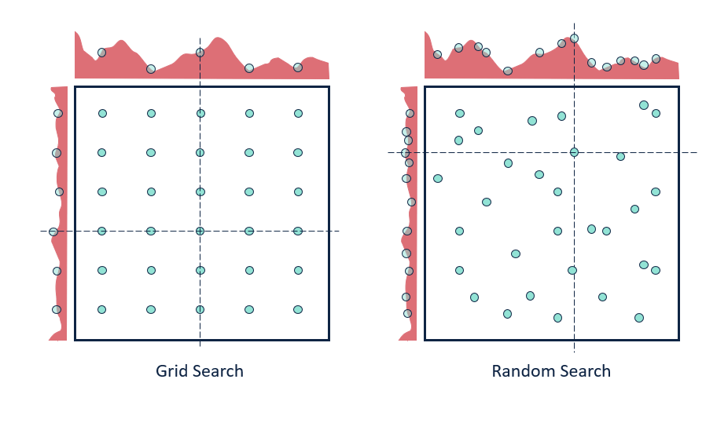

**Hyper parameter tuning =** Hyperparameter tuning is choosing a set of
optimal hyperparameters for a learning algorithm. A hyperparameter is a
model argument whose value is set before the learning process begins.
This entails holdout validations + Grid search.

**Nested procedure:**

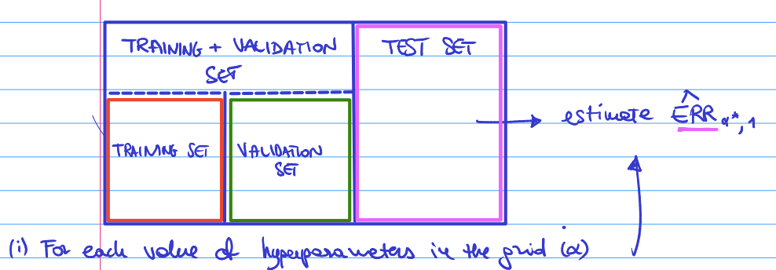

**(i)** For each value of hyper parameters in the grid $\alpha$

1.  Train the model with the $\alpha$ on the training set
2.  Estimate the error on the validation set
3.  Choose the hyper parameter $\alpha$ which gives the lowest error
    estimate on the validation set

Therefore, the chosen $\alpha$ is going to be the hyper parameter
configuration that I am going to use. With this value, I will evaluate
the quality model on the test set. However, a model that is trained by
more data typically performs better than with little data. By splitting
again, the training set becomes smaller leading to a ***scarcity***of
data.

**(ii)** Before passing to the next phase, with the fixed parameter,
there is an intermediate step. We retrain $\hat f_{\alpha*}$ on the
entire training + validation set.

**(iii)** Estimate the $ERR_{\alpha*,1}$ using the test set.

------------------------------------------------------------------------

### Standardization

1.  We do not want our model to see the test data during training as we
    do not want any information about the test data to be accessible by
    the model during training.
2.  Standardize my data set before starting. Still in the data
    exploration phase.

If we standardize the data in the beginning before splitting the data
into training/test, the mean and scaling will be on the entire data.
Therefore there is some information of the test set that would flow to
the model --\> **Information leakage**

*Alternatively:*

1.  We first split the data.
2.  We standardize the training set.
3.  We apply the mean standard deviation on the test set

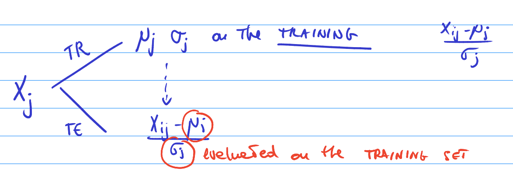

------------------------------------------------------------------------

The "real" error of my estimator: In the limit when I use an infinite
long data set. Considering we do not have this data set, we find the
empirical estimated error of my estimator using the data in the test
set.

Here 1 is the real error and the 2's are the estimates. The first has
higher variance than the second.

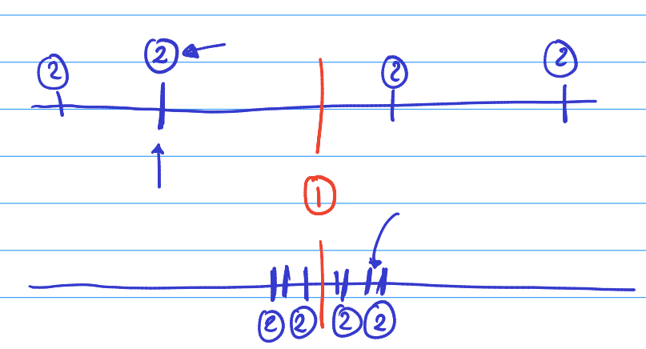{width="406"}

1.  What is the variance of the estimated error $\hat {ERR}$? A standard
    trick to reduce the variance, is to increase the sample size and
    take the average. f.e. bootstrap method.

2.  What is the bias of estimated error $\hat {ERR}$? We can try a
    larger training set.

    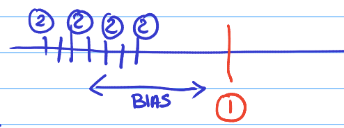{width="384" height="125"}

3.  Is my $\hat {ERR}$ consistently an *overestimation*,
    *underestimation* of $ERR$.

$\hat f$ is training on the training set: just a smaller subset of the
entire data set. We use it to compute the $\hat {ERR}$(on the test set).
The $\hat f$ trained on the training set is worse than the $\hat f$ on
the entire data-set. The $\hat {ERR}$ obtained using the $\hat f$
training on the training set is worse than the $ERR$ (the error made by
$\hat f$ trained on the entire data set, in the limit). When I will use
$\hat f$ in production, I will re-train it on the entire data-set.

Therefore, $\hat {ERR}$ is likely going to be larger than the $ERR$.
$\hat {ERR}$ will be an overestimation of the $ERR$. For an error to be
worse, it implies it is larger than the actual error. Bias is due to the
overestimation of the true error.

#### Reducing bias

**Training set selection probabilities**

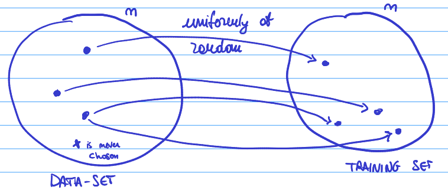

$\frac{1}{n} =$ Probability that a point is chosen for the training set
during 1 draw

$1-\frac{1}{n} =$ Probability that a point is **NOT** chosen for the
training set during 1 draw

$(1-\frac{1}{n})^n =$ The probability that a point is **NOT** chosen
during all the n draws

Limitation n -\> infinite -\>
$(1-\frac{1}{n})^n = e^{-1} \approx 0.3678$

Subsequently, 36.78% of the points are never chosen. 100-36.78% = 63.2%
go into the training set. These are the only values that are unique.

The larger the data set, the better the model as the estimate of the
error is less bias. However, the estimate of the error is affected by
the size of the test set. Therefore, we want to balance the
test-training proportions.

> *The trick to reduce the variance is to average observations.*

There are several methods to reduce the variance such applying different
validation methods. Below K-fold and leave on out methods are further
explained.

------------------------------------------------------------------------

### Leave-One-Out Cross-validation method (LOOCV):

We leave one out of the training set n times and find an estimator. Then
we average the estimations:

$\frac{1}{m} \sum_{i=1}^{m}\hat {ERR}^{(i)}$

**Disadvantages LOOCV:**

-   Crazy amount of computing power. Extremely time consuming. If n is
    huge, it will take too much time. In HPT, we train each model n(n-1)
    \*. This takes even longer. Does not scale with: big data + complex
    model

-   There is still typically high variance compared with estimates
    obtained with other validation methods. This depends on the data &
    models used.

------------------------------------------------------------------------

### K-Fold Cross Validation

The model will be trained k times. K = between 2 and N. Primarily the
data set is split k times into what is called **"folds"**, that are
roughly the sames size. In each iteration we take a different fold as
the test set and the rest as the training set.

{width="733"}

At every iteration we receive an $\hat {ERR}$ and the final used is the
average of k iterations. These are estimated on the test fold (fold \#1)
when $\hat f$ is trained on all other folds (\#2...\#k). This method
trades off the computing power vs bias.

-   If K = small:

    -   Smaller training set -\> more bias

    -   Fewer iterations -\> less computing power

-   If K = large:

    -   Larger training set -\> less bias

    -   More iterations -\> more computing power

In practice, empirically using k=5 or 10 already has very accurate
results. This is typically used.

If the model has hyper parameters, the k-fold can be applied for the
model selection and the k-fold hyper parameter tuning. Therefore it will
be $k^2$ folds. It might be that this is not computationally feasible.
It can also be that holdout validation is used for the models selection
and k-fold for hyper parameter tuning.

**Comparing methods:**

| Holdout Validation          | LOOCV                         | K-Fold Cross validation |
|-----------------------------|-------------------------------|-------------------------|
| High bias                   | Low bias                      | Depends on K            |
| Reasonable computation time | Crazy computation time (high) | Depends on K            |

------------------------------------------------------------------------

## Classification Problems

A classification model attempts to draw some conclusion from observed
values. Given one or more inputs a classification model will try to
predict the value of one or more outcomes. Outcomes are labels that can
be applied to a data set. It is applied when the label is not continuous
but it is a member of a discrete set.

*Examples:*

+----------------------+------------------------------+
| Classification       | Label                        |
+======================+==============================+
| y {Spam, Not Spam}   | Binary Classification        |
+----------------------+------------------------------+
| y {0, 1]             | Binary with one-hot encoding |
|                      |                              |
|                      | Negative vs Positive         |
+----------------------+------------------------------+
| y {Dog, Cat, Rabbit} | Multi-class classification   |
+----------------------+------------------------------+

|                     | Real class | -1             | +1             |
|---------------------|------------|----------------|----------------|
| **Predicted class** | -1         | True Negative  | False Negative |
|                     | +1         | False Positive | True Positive  |

The features are: $XϵR^p$ . If the feature is categorical, it is
converted to numerical values by one-hot-encoding.

We have to define appropriate loss functions. We ask to output the
probability that the observation is either -1 or +1.

1.  Classifier $\hat f:R^p$ -\> {-1, +1}
2.  Classifier $\hat f:R^p$ -\> [0,1]. $\hat y = P[y=+1]$

At which threshold do we want to consider the observation to be 0 or 1
depends on the confidence of the results. The most typical manner:

-   If $\hat y > 0.5$ -\> 1

-   If $\hat y < 0.5$ -\> 0

The threshold depends on the cost of making a mistake in a false
positive vs false negative.

**Loss function**

In classification problems there are two loss functions:

-   Surrogate loss function

-   Loss function

Minimizing the average surrogate loss function will lower the loss
function on the test.

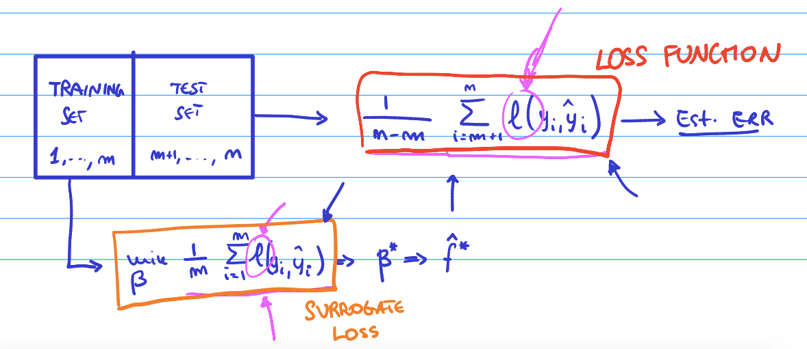

Binary loss $l(y,\hat y)$ = 1+ if $\hat y \neq y$ & 0 if $\hat y = y$

We want to use the binary loss for selecting the model but not for
training the model.

### Evaluating model quality

To see which measures are commonly applied to evaluate the quality of
the model and perform model selection, the table below can be used:

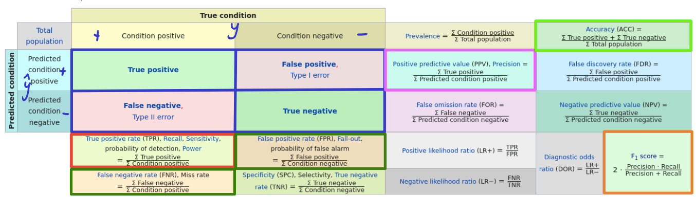{width="844"}

-   Recall = True positive rate (TPR). Probability of prediction.
    $\frac {y+and\hat y+}{y+}$
-   False positive rate. Fall out = Probability of false alarm
-   Precision = positive predictive value
    $\frac {y+and\hat y+}{\hat y+}$
-   False negative rate (FNR). Miss rate

The perfect prediction is recall = 1 & precision = 1.

The bad prediction is recall = 0 & precision = 0.

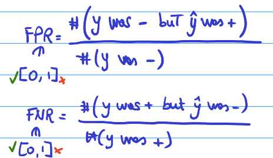{width="697"}

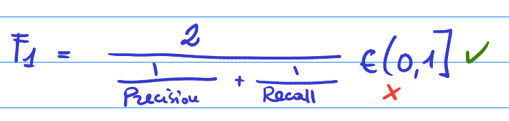

Accuracy = \# times the model is correct / number of predictions -\>
$\frac {(correct \hat y)}{predictions}$ or $TP/TN$

We have to be careful with a **unbalanced data set**. This means that
the amount of 0 are much more than the amounts of 1's or vice verse. If
we are only concerned about the accuracy, it might be that there is a
very low discriminate power.

*F.e.* if a data set has 99 positives and 1 negative, the model could
adopt always classify as positive and it would be accurate 99% of the
time. What is more important, is to identify correctly that 1
observation that is negative.

$\hat f(x) = p$

t = threshold if $p > t$ -\> Positive (+1) if $p < t$ -\> Positive (+1)

if t=0 -\> only prediction positive, where TPR = 1, FPR = 1 if t=1 -\>
only prediction negative, where TPR = 0, FPR = 0

TPR = \# true positives / \# positive obs FPR = \# false positives / \#
negatives obs

### Receiver Operating Characteristics (ROC)

ROC is a graphical plot that illustrates the diagnostic ability of a
binary classifier system as its discrimination threshold is varied.

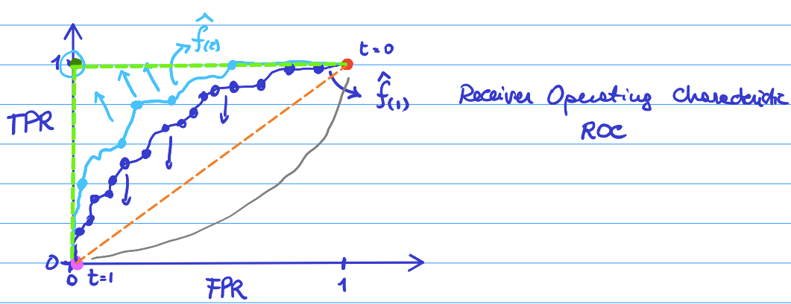

A perfect model = green\
Random model = orange

The light blue is closer to the perfect model. Therefore, we would
select this model.

AUC = area under the curve

------------------------------------------------------------------------

### Multi-class classification

Most models only support binary classification. Some models natively
support multiple classification such as neural networks. However, there
are ways to transforms models to support multi-class classifiers. There
are two methods proposed below:

**1 vs 1 method:** $y{A,B,C}$

-   $\hat f_{A,B} (x)[A,B]$
-   $\hat f_{B,C} (x)[B,C]$
-   $\hat f_{A,C} (x)[A,C]$

After training each model, we use an input (x,y) and predict the
classification: - $\hat f_{A,B} (x)= A$ - $\hat f_{B,C} (x)= B$ -
$\hat f_{A,C} (x)= A$

Which ever group is voted most, will be the one classified. In this
case, we have the most A's.

Advantage of this method is that the binary classifiers can be of any
type. The drawback is that there are k possible classes. If there are
many, classes, this will be a lot of work.

**1 vs All (other) method:** $y{A,B,C}$

-   $\hat f_A(x)[A, -A]$ -\> $P_a$
-   $\hat f_B(x)[B, -B]$ -\> $P_b$
-   $\hat f_C(x)[C, -C]$ -\> $P_C$

Then we choose the highest probability as it has the highest confidence.

The advantages is that it only needs k classifiers. However, there needs
to be models that outputs probabilities. It is more likely in this
approach that the estimators are more precise to the 1-vs-1
classification. As each model here can be trained on the entire data
set.

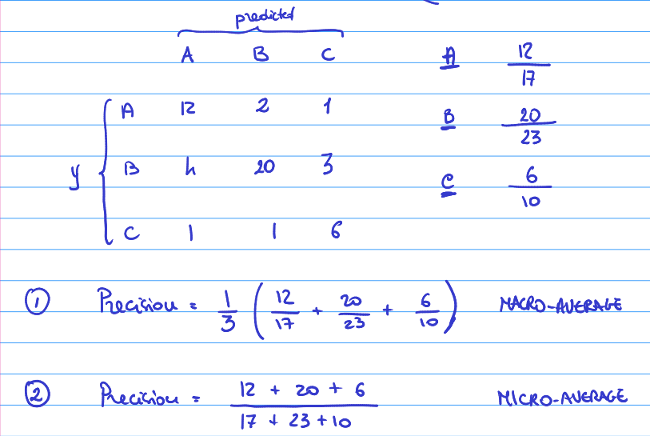

### Maximal Margin Classifier

An easiest model is when there is only one feature with two classes. A
linear classifier can split these classes into two and classify the two
groups perfectly. However, typically there is some overlap where the
variables are not linearly classifiable. Below are examples from both
options:

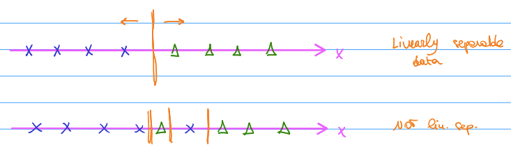

On a two dimensional spaces this looks like:

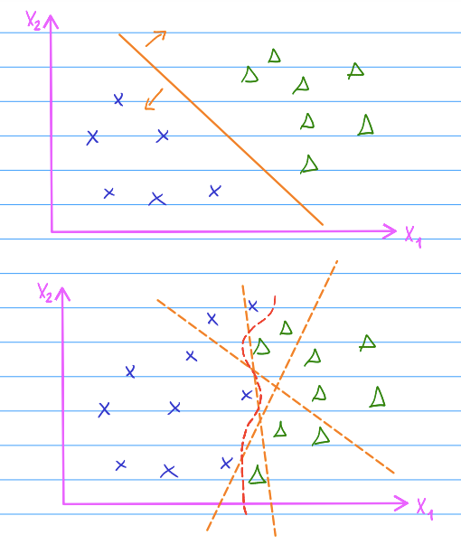

$R^p = H: B_0+B_1X_1+B_2X_2.....B_pX_p=0$

Robustness maximize the "distance" from the 2 classes.

------------------------------------------------------------------------

### Support vector classifier

It is also possible that there is non-linearity where you cannot draw a
hyper plane and draw a line to separate the classes.

If the objection is to still make this separation in a hyper plane,
there has to be some miss-classifications.

For example, the below it might be better to classify the one "outlier"
wrong and keep the linear separator as it might prove better
out-of-sample accuracy. We want to pick up the true plus difference
instead of the noise in the data. therefore, we could use a maximum
margin classified which allows for a few miss-classification. This could
be within a "budget".

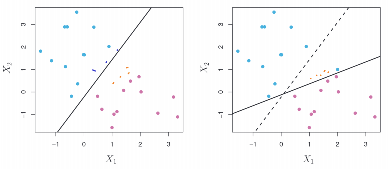

Points that are correct classified on the hyper plane, are additionally
further away than the margin and therefore with confidence classified.

#### 

We want to associate with a certain variable, $ϵ_1$. Somewhat like a
penalty of miss-classifying objects.

1.  Outside of the margin -\> Well-classified = $ϵ_1=0$ =
    $y_i(….)> M(1-ϵ_i)=M$
2.  Correctly classified but within margin -\> Small penalty =
    $ϵ_1=[0,1]$ = $y_i(….)> M(1-ϵ_i)[0,1][0,M]$
3.  Miss-classified -\> Large penalty = $ϵ_1=1>$ =
    $y_i(….)> M(1-ϵ_i)[<0]$

The goal is to maximize the margin. Now we calculate:

$y_i(\beta_0+\beta_1X_i+....\beta_pX_i> M(1-ϵ_i)$

*Type 1:*

If ϵ is 0, the quantity will be larger or equal to M. So if y is larger
than M, it is correctly classified because the distance between y and
the hyper plane is larger than the margin.

*Type 2:*

If ϵ is between 0-1, the margin will also be between 0-1. now we cannot
guarantee that the distance between the hyper plane is larger than 1.
Only that it is between 0 and M.

*Type 3:*

If ϵ is larger than 1, the M becomes negative. This means that y is a
negative number and cannot be classified correctly. As for example the
real class was positive but the predicted class was negative or vice
verse.

However, we only want to allow for a few of the observations to be
miss-classified to maximize the model.

$ϵ_i=0> u_i(....)>M$

Therefore, there will be "budget" Where the sum of the ϵ cannot go above
a certain value. This will be the hyper parameter C.

$ϵ_1 +ϵ_2+....+ϵ_m<C$

If C=0, we do not allow for any miss-classification (maximum margin
classifier). If C=small bias will be low but the variance could be
small. The outlier could change the model a lot. If C=large, the bias is
large and variance small. There will be many miss-classification.

Therefore, C is a trade-off of bias and variance. We can use again the
grid search to find the hyper parameter.

------------------------------------------------------------------------

## Regularization

When a model has very high variance and we want to reduce it at the
expense of increasing the bias a little bit (Bias trade off). We want to
do this to have a higher **out of sample accuracy** *(also for
interpretation we will see it later).* The two of the components of the
accuracy of the model: bias square and the variance. Two components we
can have an effect on.

We use Regularization for models that are complex with many parameters
because they extend to exhibit high variance. We will see it in the
context of regression mainly (polynomial normally).

Regularization term = $\alpha R(\beta)$ where $\alpha$ = hyperparameter.

RIDGE REGULARIZATION (Here I am penalizing a minimization problem, but I
am adding a not negative cost and what I am penalizing is the square, so
if beta is small not penalizing much but if it big, we are penalizing a
lot). This works better if the data is penalized. Doing this, I am
trying to reduce the variance of the parameters and the model.

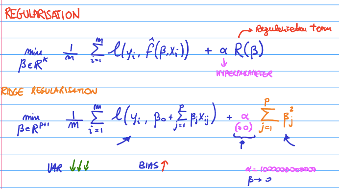

VARIANCE DECREASE BUT THE BIAS INCREASE (because with the regularization
term I am finding other parameters than those minimizing the loss
function I am also penalizing large parameters → large penalty). So this
will not perform as good as the other, so there is a trade-off between
variance and bias (alpha can go to extremes, so a good parameter will
stay somewhere in the middle)

Hyperparameter Alpha

-   Green line: Variance of the model

-   Black Line: Bias square of the model

-   Pink line: Mean square error (the total: sum of the other two)

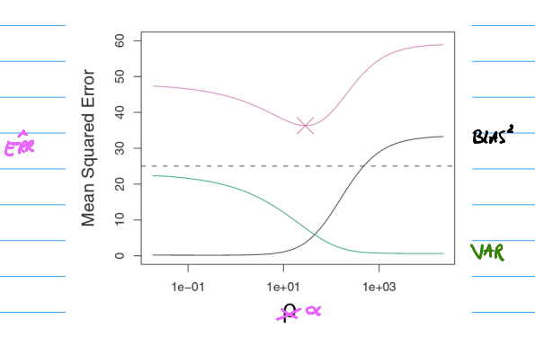

*Using logarithm scale*

[What happens to the parameters in the model:]{.ul}

the possible values for the alpha (-2,5 and use 50 values) then we
create a list of the parameters of my model for each possible value of
alpha. So I have a polynomial model (scale also as logarithmic).

Each line corresponding to a parameter of my model is a polynomial so we
have the linear and the quadratic terms. Here when I increase the
hyperparameter alpha we can see that the parameters are squeezed towards
0. An interesting thing is to count the number of parameters that are
equal to 0 or non 0. How to do that (the number of nonzero)

All will be different from 0. That is why we obtained a flat line for
ridge regularization. So why is this the case and why do we care about
the non zero coefficients?

I want that my models are accurate (that is why we introduced
regularization)) but also due to interpretability. This is a human
factor.

If I find a 0, the feature is not needed to predict good predictions and
vice versa. So we can infer that the feature is not correlated with the
label.

### Interpretability

Is a key feature to help machine learning models in real life.
Interpretability is required in real life and not just having a high
accuracy. We need to know why. Besides, if we select the good features,
it will probably be better. (the features had signal and not notice).
This is called variable selection.

Best subset of variables is a very old problem. Used to obtain the
lowest out of sample loss, → the highest accuracy. F is considering some
features.

If I have p larger than n it will be very difficult to know the noise.
Reducing the number can help despite the ones that we drop are
correlated.

Naive approach: try all subset of possible features.

1.  Forward Heuristic: (Consider the empty set), then the sets with one
    feature. Assume that feature 3 is better. So these features will be
    fixed for all the procedures, this means that will never get out of
    my set F. The same with 2 features and always with 3.  If any of the
    values is better, we are going to fix it with the next iteration. At
    some point you don't obtain something better so you stop.

2.  Backwards stepwise heuristic selection: Which feature to remove. For
    example, 3. So if I remove 1 and 3. And when I can't improve anymore
    I take the last combination.

[**Lasso Regularization**]{.ul}

We can consider using Lasso regularization. It is a bridge between
regularization and feature selection. Set some parameters in the model
equal to 0. Implicitly it helps in interpretability and indirectly to
variable selection.

I have p + 1 parameters. We penalize the large parameters (positive or
negative) and squeeze them equal to 0.

Using the same as in for ridge, this time when we plot the non zero is
not a straight line as before. There is a point, that increase probably
is because it didn't find the global optimum. Empirically it's true that
many parameters are equal to 0. Why does this happen?

**RIDGE AND LASSO REGULARIZATION**

(Unconstrained minimization problems as betas can take any values.
Remember large betas are penalized and squeezed to 0)

There is an equivalent problem that is constrained (minimization
problem) as we can see below in the image above.

Ridge: All the points inside the blue circle are valid points and
outside not valid as violates the constraint. The Beta \* test a good
training MSE = 2 but i cannot accept it. So let's see 2.1. (light blue
beta\*).

Lasso: All the points inside valid and outside not valid. This once has
spiky regios and for that reason, the probability to intersect in one of
the spikes first is very probable. These points have some of the betas=
0. Lasso is more likely to produce optimal parameters where beta is
equal to 0.  

**Finally: ISL book:**

In general neither of them will dominate the other (ridge and lasso) We
will have to do first **model selection**. In general, we expect lasso
to perform better for low predictors, on the other hand perform better
when there are many predictors. However, the number of predictors is
never known a priority.
