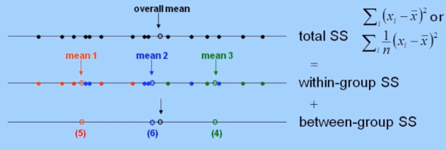
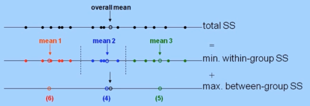
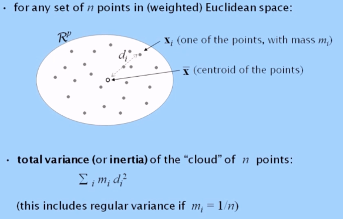
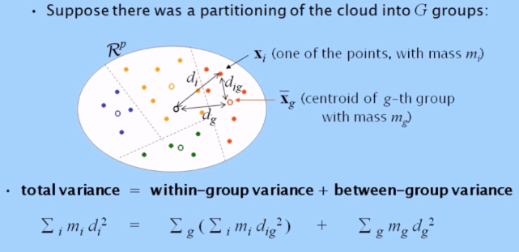
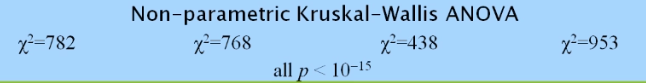

```{r setup, include=FALSE}

knitr::opts_chunk$set(echo = TRUE, class.source = "watch-out", options(scipen=999), out.width = "100%", comment = "", warning=FALSE, reticulate.repl.quiet = FALSE) 

source("www/init.R")
source("www/Table_Design.R")

```

# Advanced Statistical Methods

```{r, warning=FALSE, comment=""}
library(lavaan)
library(formattable)
library(kableExtra)
library(knitr)
```

## Clustering

**Clustering** has the aim to classify similar objects (cases, people,
companies, products, texts, advertising campaigns...) into groups so
that within each group the objects are relatively similar, while the
groups are different between one another.

This is also called segmentation or partitioning.

The basic concept in clustering, as well as in most areas of statistics
where there are many variables being measured simultaneously on the
objects, is that of distance. If we can define a distance between
objects then we can devise algorithms to put those "close" to one
another in the same group, and those "far" from one another in different
groups. The same underlying concept is used in several methods of big
data analysis, for example, finding people in a large database that are
"close" to you as a client in terms of your purchasing choices.

**Three types of hierarchical clustering:**

-   Complete linkage: maximum method: take the maximum level of the two
    options

-   Average linkage: average method

-   Ward linkage

Significance clustering. Visualized by a dendogram.

### Hierachical clustering

```{r, echo=FALSE}
table <- " 
0	
2	0	
7	6	0
6	6	5	0	
8	7	3	7	0	
4	4	4	7	3	0	
6	5	4	7	3	1	0	
7	7	2	6	1	3	3	0	
8	8	4	6	2	4	4	3	0	
4	4	5	7	5	3	3	5	5	0	
6	6	2	5	4	5	5	4	4	6	0
"
table <- getCov(table, names = c("Argentina", "Brazil", "Canada", "China", "Germany", "Spain", "Italy", "Netherlands", "Poland", "Turkey", "USA"))
my_table(table)
```

------------------------------------------------------------------------

#### Complete Linkage

```{r, warning=FALSE, message=FALSE, warning=FALSE}
DK.clust <- hclust(as.dist(table))
plot(DK.clust) +
abline(h = 6, col="red") 
```

------------------------------------------------------------------------

#### Average linkage

```{r}
plot(hclust(as.dist(table), method="average"), main="Average linkage") +
abline(h = 5, col="red") 
```

**Significance clustering**

Total sum of squares (total variance):  

{width="433"}

Each subset has a different mean. We calculate the within-group SS.

ANOVA: We look at the distance between groups and compare it with the
total sum of square. Then we check if this is significant or if it is
random.

------------------------------------------------------------------------

#### Ward linkage

Ward clustering: related to variance criteria & ANOVA. Of particular
interest for all Euclidean and weighted Euclidean distance functions. It
decomposed the total variance of the points in space into parts:
"Within-clusters" and "between-clusters".

The idea can be illustrated by analysis-of-variance (ANOVA) for one
variable (SS= sum[or average] of squared deviations from the mean), when
observations are grouped.

```{r}
plot(hclust(as.dist(table), method="ward.D2"), main="Ward linkage", 
     xlab="Countries", hang=-1) +
  abline(h = 8, col="red") 
```

Ward clustering:

{width="487"}

Ward clustering in multivariate space:

For any set of n points in (weighted) Euclidean space:

{width="332"}

Centroid = overall mean

{width="317"}

For successful clustering, we want the between-group variance to be as
high as possible, which is equivalent to the within-group variance being
as low as possible. This is what the hierarchical form of ward
clustering does at each merging step of the dendogram.

### Non-Hierachical clustering

K-means: K = the number of groups.

To achieve a simple partitioning of a data set (usually very large) into
pre-chosen number of homogeneous groups. Suppose G groups and select 3
points as seeds: the initial point (team leader). Seeds can be chosen at
random or by intelligent selection.

Next these new groups will calculate its mean. The centroids are now the
seeds of the next step. The groups are recalculated and a new centroid
is found. This continues until there is no further improvement to make,
this is the solution.

In these steps, the between-group variance becomes large and the
within-group variance decreases.

Because the seed is randomly chosen, you should repeat it multiple times
to have different starts, and therefore solutions and get the optimal
result.

You can choose to use the Euclidean distance or the Manhattan distance.
Because of the bigger differences in the variables with wide ranges
compared to those with narrower ranges, one way to get rid of this
effect is to simply divide each variable by its maximum value. Now,
there is a range between 0-1. This is classed range-standardized data.



## Multi-Dimensional Scaling

**Scaling**

-   Factorial methods

    -   Principal components analysis (PCA)

    -   Correspondence analysis (CA)

-   Multidimensional scaling (MDS)

    -   Metric MDS

    -   Non-metric MDS

```{r, echo=FALSE}
DK.mds <- cmdscale(table, eig=TRUE)
plot(DK.mds$points, type="n", asp=1, xlab="MDS dimension 1", ylab="MDS dimension 2")
text(DK.mds$points, labels=rownames(table), font=2, cex=0.7, col="red")
```

```{r, echo=FALSE}
DK.mds$GOF
sum(abs(DK.mds$eig)[DK.mds$eig<0]) / sum(abs(DK.mds$eig))
```

```{r, echo=FALSE}
library(rgl)
require(rgl)
DK.mds <- cmdscale(table, eig=TRUE, k=3)
plot3d(DK.mds$points[,c(1,3,2)], xlab="dim1", ylab="dim3", zlab="dim2", type="n")

text3d(DK.mds$points[,c(1,3,2)], text=rownames(table), col="blue", font=2)

play3d(spin3d(c(0,0,1)), duration=12)

rgl.snapshot("view3D.png")
```

## Principal component analysis

```{r, comment=FALSE, warning=FALSE}
satis <- read.csv("www/satisfaction.csv", header = TRUE, sep = ",", dec =
".")
attach(satis)
data <- satis[,c(4:12)]
row.names(data) <- satis[,2]
```

```{r}
DK.diss <- dist(data)
DK.data <- cmdscale(DK.diss, eig=TRUE)
```


### Biplots

```{r, echo=FALSE, fig.align='center'}
library(easyCODA)

DK.PCA <- PCA(as.matrix(data), weight=FALSE)
PLOT.PCA(DK.PCA, map="asymmetric", rescale=0.5, axes.inv=c(-1,1))
```

```{r, echo=FALSE, fig.align='center'}
par(mar=c(2,4,3,1), font.lab=2, mfrow=c(1,5), mgp=c(2,0.7,0))
for(j in 1:5) boxplot(data[,j] ~ satis$EduLevel, main=colnames(data)[j], 
                      col=c("pink","lightblue"), ylab="%")
```

```{r, fig.align='center'}
DK.PCA <- PCA(as.matrix(data), weight=FALSE)
PLOT.PCA(DK.PCA, map="asymmetric", rescale=0.5, axes.inv=c(-1,1), dim=c(2,3))
```


## Correspondence analysis

```{r, warning=FALSE, message=FALSE, comment=FALSE, echo=FALSE}
foo <- read.csv("www/ZA5900.csv", header = TRUE, sep = ",", dec = ".")
attach(foo)
require("easyCODA")
```

```{r, echo=FALSE, include=FALSE}
data <- as.matrix(foo[,(2:17)])
rownames(data) <- foo[,1]

country <- rownames(data)
sex <- data[,"SEX"]
sex.names <- c("M","F")

age <- rep(1,nrow(data)) 
age[data[,"AGE"] > 24] <- 2
age[data[,"AGE"] > 34] <- 3
age[data[,"AGE"] > 44] <- 4
age[data[,"AGE"] > 54] <- 5
age[data[,"AGE"] > 64] <- 6
age[data[,"AGE"] > 74] <- 7
age.names <- c("15-24","25-34","35-44","45-54","55-64","65-74","75+")

marital <- data[,"MARITAL"]
table(marital)

data.US <- data[country=="US",]
age.US  <- age[country=="US"]
V18.US  <- data.US[,"V18"]

age.V18.US <- table(age.US, V18.US) 

age.V18.US <- age.V18.US[,1:5]

rownames(age.V18.US) <- age.names
colnames(age.V18.US) <- c("SA","A","NN","D","SD")
```

**Cross-Tabulation**

```{r}
my_table(age.V18.US)
```

```{r}
my.ca <- ca(age.V18.US)
plot(my.ca, main="One parent can bring up a child as well as two parents together", mass=c(TRUE,TRUE))
```


```{r}
summary(my.ca)
```

## Text analytics
