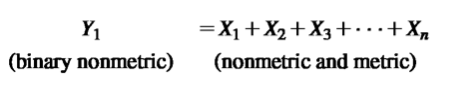
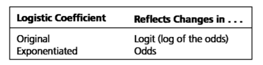
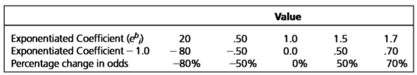
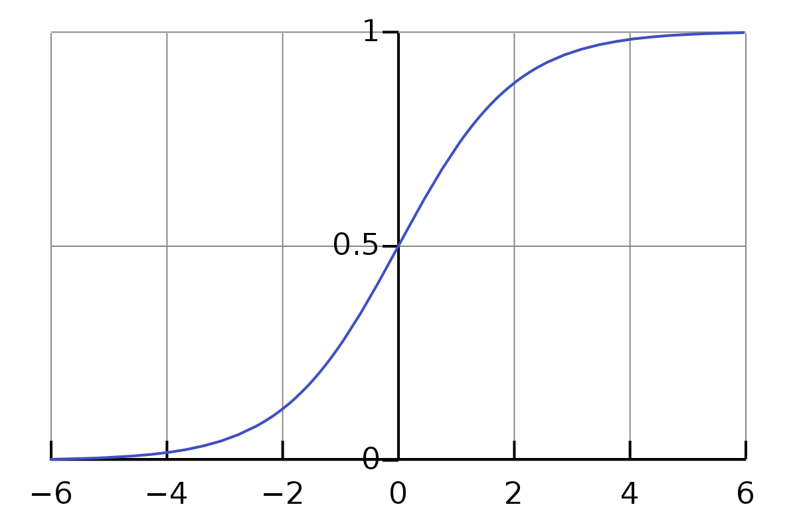
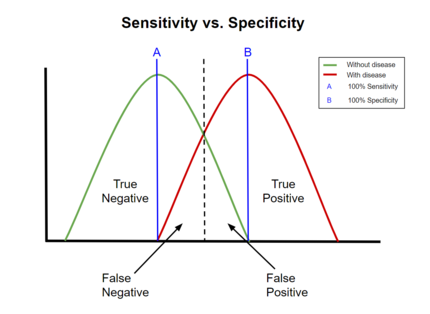

# Marketing Analytics

## Logistic regressions

**Logistic regression:** a specialized form of regression that is
formulated to predict and explain a binary (two-group) categorical
variable rather than a metric dependent measure. May be described as
estimating the relationship between a single-non-metric binary dependent
variable and a set of metric or non-metric independent variables:

{width="359"}

**Classification matrix:** means of assessing the predictive ability of
the logistic regression model. Created by cross-tabulating actual values
with predicted values. Shows incorrect and correct classifications.

**Cross-validation:** Procedure of dividing the data in two parts.
Avoids over fitting.

-   *Analysis sample:* Used in estimating the logistic regression model

-   *Holdout sample* (validation sample): Used to validate the results

**Hit ratio:** Percentage of objects correctly classified by the model.

-   TP + TN / N

-   True Positive + True Negative / Number of observations

*Two types of the logistics coefficient:*

{width="369"}

**Logistic coefficient: (original).** A positive relationship means that
an increase in independent variable is associated with an increase in
the predicted probability.

-   A negative value implies a decrease in the predicted probability

-   A positive values implies a increase of the predicted probability

-   Value 0.0 means a probability of 50%.

**Exponentiated logistic regression:** stated in terms of odds. There
won't be negative values.

-   Coefficient -1.0 = percentage change in the odds

-   F.e. Coefficient of 0.20 = a negative 80 percent change in the odds
    --\> 0.20-1.0 = -0.80 for each unit change in the independent
    variable

-   A value of 1.0 means there is no change in the odds. The odds are
    50% to predict either group. There is a relationship with no
    direction.

-   A value above 1.0 means a positive increase in the predicted odds

------------------------------------------------------------------------

**Assessing magnitude of change:**

**Percentage change in odds =** (Exponentiated coefficient - 1.0) \* 100

{width="533"}

**Logistic curve:** represent the probability of an event.

{width="427"}

**Logit transformation:** transforms values into a discrete binary
dependent variable --\> probability of an event. This probability is
transformed into the odds ratio which acts as the depend variable.

**Maximum chance criteria (MCC) =** Measure of predictive accuracy that
is calculated as the percentage of respondents in the largest group.

    - N largest group / total number of observation. 
    - If your hit rate is larger than this, you are having some value.

**Odds:** the ratio of the probability of an event occurring to the
probability of the event not happening. Used as the dependent variable.

**Model estimation fit:**

**Likelihood value:** the lower the -2LL, the better for of the model.
Perfect fit is 0.

Pseudo R\^2 measures: values from 0.0-1.0. Cox & Snell R\^2 = the higher
value, a greater model fit. The amount of variation accounted for by the
model. 1.0 is a perfect fit model.

### Sensitivity vs Specificity

Sensitivity = TP / TP + FN, second number\
Specificity = TN / FP + TN\
Hit rate = TP + TN / N\
True positive rate = TP / TP + FN\
Actual negative = TN / TN + FP

{width="365"}

**Validation of the results:**

Establishing external validity is done through assessment of hit ratios
through a separate holdout sample. It is supported when the hit ratio of
the selected approach exceeds the comparison standards that represent
the predictive accuracy expected by chance.

------------------------------------------------------------------------

## Conjoint Analytics

*Quick summary*

**'Conjoint Analytics** enables us to understand, describe, and predict
consumers' choices in the contexts where the items/products/services
that they have to choose among could be described based on a collection
of attributes; and that individuals make a trade-off among these
attributes to choose the most appealing offering.'

Products are composed of multiple attributes or features. Purchasing
decisions involve complex and subtle trade-offs between different
features. It is difficult to articulate the value that attribute to a
particular feature in isolation.

Conjoint analytics can give a good indication of how customers
perception of value is built up. It is possible to have an idea
regarding the **"value premium"** that consumers derive from a feature.
This can be applied to decision making such as which features to include
to increase market share.

Customers make trade-offs in selecting a particular product
configuration if:

-   Different combinations of products are provided
-   Customers are asked to choose

Now it is possible to learn from the relative importance of attributes.

**Steps of Conjoint Analytics**

1.  Showing customers various hypothetical product configurations and
    price points and asking them to evaluate them (or choose between
    them)
2.  Regression analytics is then applied to their responses to isolate
    the effects of individual features on the customers perception of
    product value

```{=html}
<!-- -->
```
3.  Result: an increment "perceived value" for each of a products
    features

**Assessing functional value**

-   **Measure** customers' overall preferences for a selected number of
    product configurations

-   **Decompose** these overall preferences into the values that
    customers attach to each level of each attribute

This can be performed through regression analytics.

------------------------------------------------------------------------

**Elicitation process**

1.  Identifying the set of relevant attributes
2.  Assign levels to the attributes
3.  Combine levels to generate profiles
4.  Generate questions & collect data

A product configuration is composed of one specific level for each of
the attribute in the bundle where. Attributes must be relevant to the
consumers choices and be easy to measure.

Profile is a combinations of levels.

As an example we take a pizza where:

-   Attributes --\> cheese, crust, toppings

-   Levels -\> Topping = tuna, mushroom, salami. Crust = thick or thin
    etc.

-   Profile -\> Pizza with mozzarella cheese, tuna and a thick crust

The amounts of profiles possible are the configurations.

Each categorical variable is transformed into dummy variables where 0
indicates not chosen while 1 indicates chosen. This leads to a
regression model for consumer preferences. Applying to the example of a
pizza:

Score: $U = b_0 + b_1MOZ+b_2THIN+b_3TUN+b_4SALAM$

------------------------------------------------------------------------

Conjoint analytics works when consumers choice decision process is a
**compensatory process** where a highly valued option on one attribute
can compensate for an unattractive option on another attribute.

After calculating the betas for the regression model, we can evaluate
what attributes are more important to the individual respondent. This
can then be used to crate **benefit segments** to group individuals on
the basis of the utilities they attach to different product attributes.
Hereby cluster analytics is used to create the benefit segments using
the attribute importance.

The last step is to use this information to:

-   Estimate the most cost-efficient way to deliver a desired set of
    features

-   Identify the "sweet spots" where margin is maximized

-   Obtain the optimal configuration of functionalities to best compete
    in a target segment

-   Apply to product re-featuring, product line extension

------------------------------------------------------------------------

**Setting up the survey**

In the full factorial design, all possible combinations of attributes
and levels are asked to the consumer. However, there might be too many
profiles to question and retrieve relative answers. It should be under
20 combinations.

A method to subset these profiles is:

-   Fractional factorial design: Ratings are only asked on a
    scientifically selected fraction of combinations

-   Orthogonal design

-   Adaptive design

Different method of asking how to value the profiles such as:

-   Ranking
-   Metric conjoint: Ratings
-   Choice-based conjoint (CBC)

*You should include the option of no choice in the choice method.*

*The amount of choice tasks should not exceed 20 and be ideally less
than 15 if possible.*

The consumer choses the product based on the highest utility.

### Random utility model

The choice behavior of individuals is based on the random utility model
(RUM). Each alternative generates a utility for the individual.

Let us denote by $U_i$ that utility that the profile $i$ generates to
the individual. In this case, in a choice task with the choice set:
$C = [i,j]$, the respondent will choose $i$ if $U_i > U_j$.

The utility can be decomposed into two main components

-   A deterministic part that explains the
    contribution of different observable attributes to the choices

-   A random component that simply is the difference between the "true"
    utility of the profile for the individual and the deterministic part

This leads to: $U_i = V_i + e_i$

The random component is due to additional factors that influence choices
that are not observable to the analyst. Therefore, the preferences are
based on *choice probabilities.*

$Pr(i|i,j) = Pr(U_i > U_j) = Pr(V_i+e_i>V_j+e_j) = Pr(e_j-e_i<V_i-V_j)$

Different choice models will be derived by making different assumptions
on the distribution of the random component.

------------------------------------------------------------------------

**Choice models**

**Probit model =** A conventional assumption on the random term in the
above model is to
assume that $e_i$ and $e_j$ are distributed normally.

**Logit model =** Can be derived by assuming Extreme Value of Type I
(EV) distribution on ε, and by assuming that the random components are
independent from each other.

Example using the logit model for a hotel:

$U = 12 + 15*Gym + 10*SwimmingPool - 20*Price150$

Here the baseline for price 100. Therefore, the difference going from a
price 100 to price 150 (50 euros increase) is a decrease in utilities of
20 units. Moreover, the equivalent of having a gym is 15 unites of
utility.

The monetary equivalence of having a gym is therefore = $(15*50)/20=€35$

In other words, by including a gym in the offer, the hotel can charge
€35 more.
