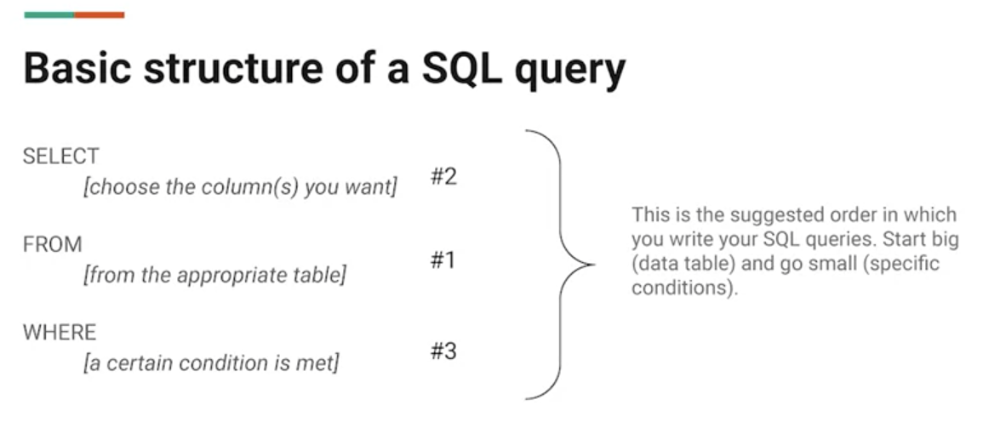
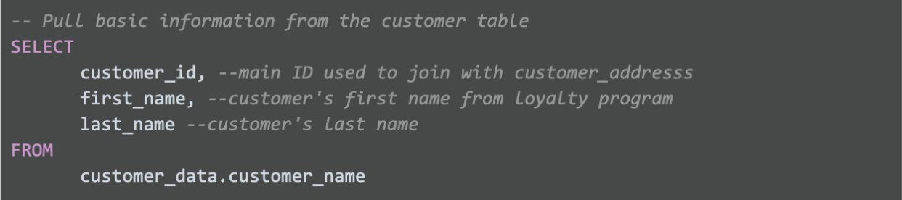
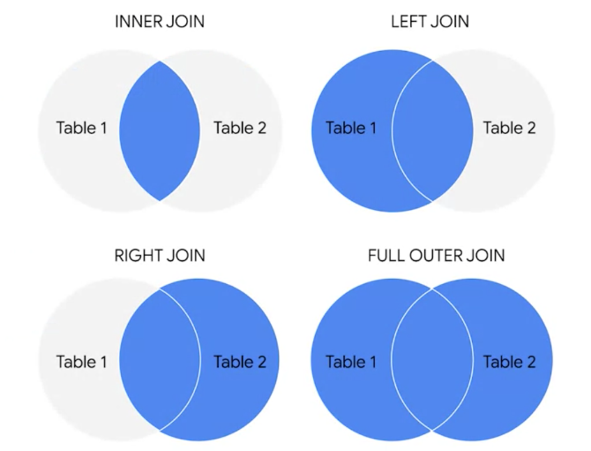

# SQL

```{r, echo=FALSE}
knitr::opts_chunk$set(echo = TRUE, class.source = "watch-out", options(scipen=999), out.width = "100%", comment = "", warning=FALSE, reticulate.repl.quiet = FALSE) 
```

The following chapter includes the notes regarding SQL from the [Google
Data Analytics
Course](https://www.coursera.org/professional-certificates/google-data-analytics?utm_source=gg&utm_medium=sem&utm_campaign=15-GoogleDataAnalytics-ROW&utm_content=15-GoogleDataAnalytics-ROW&campaignid=12566515400&adgroupid=117869292685&device=c&keyword=google%20data%20analytics&matchtype=b&network=g&devicemodel=&adpostion=&creativeid=507290840627&hide_mobile_promo&gclid=Cj0KCQjwtrSLBhCLARIsACh6RmjrcozUpQNz5_s5y0AKtPKbCxqCaCIX78Zltj5e6a_8Ods2YZxEeCkaAogMEALw_wcB).

------------------------------------------------------------------------

## Introduction

A **query language** is a computer programming language that allows you
to retrieve and manipulate data from a database.

**SQL =** Structured Query Language

A database is a collection of structured data stored in a computer
system. Some popular Structured Query Language (SQL) programs include
MySQL, Microsoft SQL Server, and BigQuery.

Query languages

-   Allow analysts to isolate specific information from a database(s)

-   Make it easier for you to learn and understand the requests made to
    databases

-   Allow analysts to select, create, add, or download data from a
    database for analysis

A query is a request for data or information from a database.

{width="297"}

[Basic call:]{.ul}

## SELECT FROM WHERE

SELECT first_name\
FROM move_data.movies\
WHERE Genre\_\_1 = 'Action'

SELECT \* means select ALL columns

[Selecting multiple columns:]{.ul}

SELECT

ColumnA,

ColumnB,

ColumnC\
FROM move_data.movies\
WHERE Genre\_\_1 = 'Action'

[Multiple filters]{.ul}

SELECT \*\
FROM

move_data.movies\
WHERE

Condition 1

AND Condition 2

Or either filter:

WHERE

Condition 1

OR Condition 2

Basic WHERE clause:

+---------------------------+---------------------------------------+
| Function                  | Meaning                               |
+===========================+=======================================+
| WHERE name = "Dave"       | Exact                                 |
+---------------------------+---------------------------------------+
| WHERE NOT name = "Dave"   | All but DaveDave                      |
+---------------------------+---------------------------------------+
| WHERE name LIKE "D%"      | Starting with (sometimes D\*)         |
+---------------------------+---------------------------------------+
| WHERE name NOT LIKE "D%"  | Does not start with                   |
+---------------------------+---------------------------------------+
| WHERE name LIKE "[abc]"   | Starting with multiple options        |
+---------------------------+---------------------------------------+
| WHERE name LIKE "[!abc]"  | Not starting with multiple options    |
+---------------------------+---------------------------------------+
| WHERE name LIKE "%e"      | Ending with e                         |
+---------------------------+---------------------------------------+
| WHERE name                | Second letter is \_                   |
|                           |                                       |
| LIKE '\_a%'               |                                       |
+---------------------------+---------------------------------------+
| WHERE name \<\> 'Dave' or | Exclude                               |
|                           |                                       |
| WHERE name != 'Dave'      |                                       |
+---------------------------+---------------------------------------+
| WHERE salary \<= 3000     | Less than or equal to                 |
+---------------------------+---------------------------------------+
| WHERE salary \>= 3000     | Greater than or equal to              |
+---------------------------+---------------------------------------+
| WHERE salary \< 3000      | Less than                             |
+---------------------------+---------------------------------------+
| WHERE salary \> 3000      | Greater than                          |
+---------------------------+---------------------------------------+
| WHERE SUBJECT NOT NULL    | returns values with no missing values |
+---------------------------+---------------------------------------+
| WHERE SUBJECT IS NULL     | returns values with missing values    |
+---------------------------+---------------------------------------+

It is additionally possible to add comments for further reference:

column1

**/\***

Here I am explain what the data means

**\*/**

or

column1 - - the column of the first name

Example:



**Aliases = new name**

column1 AS last_name - - alias for understanding the column

table AS customers - - to rename the table

*These aliases are good for the duration of the query only. An alias
doesn't change the actual name of a column or table in the database.*

Group By

Helps calculate summary values by the chosen column. It is often used
with aggregate functions (`COUNT`, `SUM`, `AVG`, `MAX`, `MIN`)

SELECT\
SUBJECT,\
AVG(GRADES)\
FROM\
STUDENTS\
GROUP BY\
SUBJECT

The query above will group each subject and calculate the **average**
grades.

SELECT SUBJECT, AVG(GRADES)

FROM STUDENTS

GROUP BY SUBJECTHAVING AVG(GRADES) \>= 90

<https://towardsdatascience.com/sql-cheat-sheet-776f8e3189fa>

[@JLee2020]

------------------------------------------------------------------------

## BigQuery

[[BigQuery]{.ul}](https://cloud.google.com/bigquery/docs "This link takes you to the Google Cloud BigQuery documentation.")
is a data warehouse on Google Cloud that data analysts can use to query,
filter large datasets, aggregate results, and perform complex
operations.

Use a public data source:

SQL workspace

Click on + add data \> explore public data sets

Once selected the data

Go to Preview \> query \> add a \* after select and click run

Uploading own data:

-   First make new project in explorer by clicking the three dots \>
    create dataset

-   Then click on the three dots again and select create table \> create
    table from \> uploads

-   Select the upload (in csv) \> automatic detect \> give filename \>
    create

<https://scribehow.com/shared/2dea0d610-ef6b-4ba8-8e44-d40dfeb0454b>

edit as text: name:string,gender:string,count:integer

Best practice is to use single quotes around a string --\> 'string'.

If there is a apostrophe in a text string, you would use double quotes
as SQL otherwise recognizes it as a string: "Rachel's" instead of
'Rachel's'.

**Naming conventions:** These are consistent guidelines that describe
the content, date, or version of a file in its name.

*CamelCase =* naming tables where the start of each word is a capital.

*Snake_case* = dash in between words of a name.

------------------------------------------------------------------------

## Data cleaning

Insert additional data to a database:

INSERT INTO database

(column1, column2, column3, column4)

VALUES

(12, 34, 55, 77)

Update only certain data for one row of the database:

UPDATE database

SET address = '123 New Address)

WHERE customer_id = 2645

Creating a new table from a data base:

CREATE TABLE IF NOT EXISTS

DROP TABLE IF EXISTS

**Cleaning in SQL**

Substring :

WHERE

SUBSTR(column, starting number, how many numbers) = "US"

For example: SUBSTR(countrycode, 1, 2) = "US"

or

SELECT SUBSTR(countr, 1, 3) AS country_code

Typecasting: converting data from one type to another.

+----------------------------------+----------------------------------+
| Objective                        | Command                          |
+==================================+==================================+
| Filtering on dates               | WHERE                            |
|                                  |                                  |
|                                  | date between '2020-12-01' AND    |
|                                  | '2021-12-31'                     |
+----------------------------------+----------------------------------+
| Combine multiple columns         | CONCAT(column1, column2)         |
| together                         |                                  |
+----------------------------------+----------------------------------+
| Combine together with individual | CONCAT(column1, '-', column2,    |
| separator                        | ',', column3)                    |
+----------------------------------+----------------------------------+
| A function that adds two or more | CONCAT_WS(',', column1, column2) |
| strings together with a          |                                  |
| separator                        |                                  |
+----------------------------------+----------------------------------+
| Display field column1, if null   | C OALESCE(column1, column2)      |
| than display field column2       |                                  |
+----------------------------------+----------------------------------+
| Typecasting                      | SELECT CAST(column AS FLOAT64)   |
+----------------------------------+----------------------------------+
| Ordering                         | ORDER BY column DESC             |
|                                  |                                  |
|                                  | ORDER BY column ASC              |
+----------------------------------+----------------------------------+
| Find all missing values from a   | WHERE                            |
| column                           |                                  |
|                                  | column IS NULL;                  |
+----------------------------------+----------------------------------+
| Min & max                        | SELECT                           |
|                                  |                                  |
|                                  | MIN()                            |
|                                  |                                  |
|                                  | MAX()                            |
+----------------------------------+----------------------------------+
| Calculating average              | AVG()                            |
+----------------------------------+----------------------------------+
| Counting frequencies             | COUNT()                          |
+----------------------------------+----------------------------------+
| Summing                          | SUM()                            |
+----------------------------------+----------------------------------+
| Checking a strings has the same  | SELECT                           |
| length                           |                                  |
|                                  | LENGTH(column)                   |
+----------------------------------+----------------------------------+
| Show which strings have more /   | WHERE                            |
| less / the same number of        |                                  |
| strings                          | LENGTH(column) \> 6              |
+----------------------------------+----------------------------------+
| Removing duplicates              | SELECT                           |
|                                  |                                  |
|                                  | DISTINCT column                  |
+----------------------------------+----------------------------------+
| Trimming spaces                  | WHERE TRIM(column)               |
+----------------------------------+----------------------------------+
| The CASE statement goes through  | CASE                             |
| one or more conditions and       |                                  |
| returns a value as soon as a     | WHEN name = 'wrong' THEN 'Right' |
| condition is met.                |                                  |
|                                  | ELSE name                        |
|                                  |                                  |
|                                  | END AS cleaned_name              |
+----------------------------------+----------------------------------+
| Deleting records                 | DELETE FROM table                |
+----------------------------------+----------------------------------+

------------------------------------------------------------------------

## Analyzing data

+----------------------------------+----------------------------------+
| Objective                        | Command                          |
+==================================+==================================+
| Filtering on dates               | WHERE                            |
|                                  |                                  |
|                                  | date between '2020-12-01' AND    |
|                                  | '2021-12-31'                     |
+----------------------------------+----------------------------------+
| Transforming values / characters | IF(                              |
|                                  |                                  |
|                                  | columnname = amount or           |
|                                  | character,\                      |
|                                  | what to change it to,\           |
|                                  | in which column) FE:             |
|                                  |                                  |
|                                  | IF(\                             |
|                                  | column1= 'No answer',\           |
|                                  | NULL,\                           |
|                                  | column1)                         |
|                                  |                                  |
|                                  | Changes: the values no answer in |
|                                  | column 1 to NULL                 |
+----------------------------------+----------------------------------+
| Transforming variables           | CAST(expression AS typename)     |
|                                  |                                  |
|                                  | Typename: INT, STRING, DATETIME, |
+----------------------------------+----------------------------------+
| The **SAFE_CAST** function       | SAFE_CAST(expression AS          |
| returns a value of Null instead  | typename)                        |
| of an error when a query fail    |                                  |
+----------------------------------+----------------------------------+
|                                  |                                  |
+----------------------------------+----------------------------------+
|                                  |                                  |
+----------------------------------+----------------------------------+

**Saving a query for a data table as a new table:**

Compose new query \>\
Type query \>\
Select more menu \>\
Set a destination table for query results \>\
Change the name and choose somewhere to save

### Combining tables with SQL:

An **inner JOIN** is a function that returns records with matching
values in both tables.

A **LEFT JOIN** is a function that will return all the records from the
left table and only the matching records from the right table. **RIGHT
JOIN** does the opposite.

**OUTER** join combines RIGHT and LEFT JOIN to return all matching
records in both tables.

{width="371"}

+----------------------------------+----------------------------------+
| Description                      | Query                            |
+==================================+==================================+
| Inner joining based on a primary | INNER JOIN                       |
| key                              |                                  |
|                                  | datatable1.datatable2 ON         |
|                                  |                                  |
|                                  | datatable1.column =              |
|                                  | datatable2.column                |
+----------------------------------+----------------------------------+
| Returning all records from left  | LEFT JOIN                        |
| and corresponding from right     |                                  |
|                                  | datatable1.datatable2 ON         |
|                                  |                                  |
|                                  | datatable1.column =              |
|                                  | datatable2.column                |
+----------------------------------+----------------------------------+
| Returning all records from right | RIGHT JOIN                       |
| and corresponding from left      |                                  |
|                                  | datatable1.datatable2 ON         |
|                                  |                                  |
|                                  | datatable1.column =              |
|                                  | datatable2.column                |
+----------------------------------+----------------------------------+
| Joining all records no matter if | FULL OUTER JOIN                  |
| there are matching values        |                                  |
|                                  | datatable1.datatable2 ON         |
|                                  |                                  |
|                                  | datatable1.column =              |
|                                  | datatable2.column                |
+----------------------------------+----------------------------------+

**Aliases:** temporary names for a column or table

COUNT can be used to count the total number of numerical values within a
specific range

COUNT DISTINCT is a query that only returns the distinct values in that
range.
