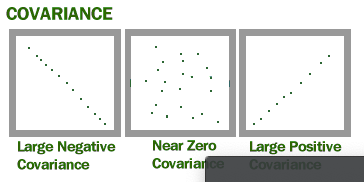
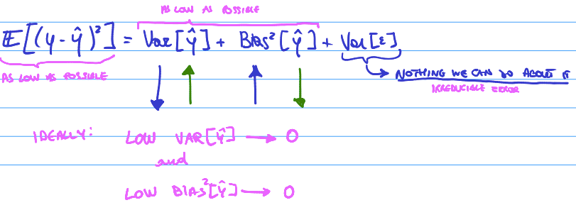
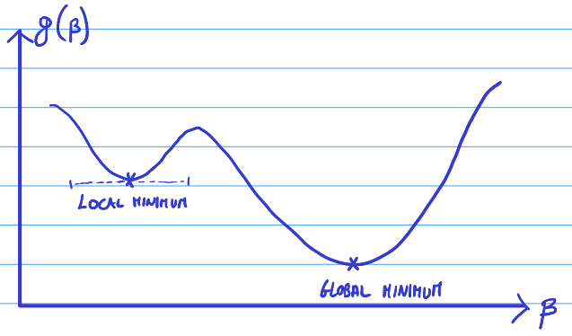
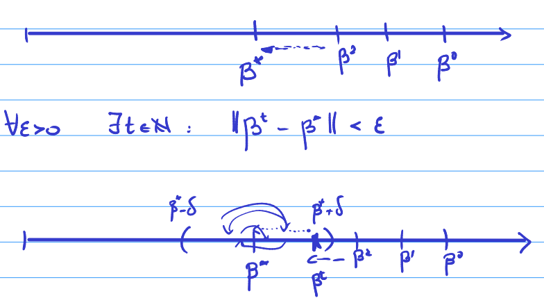
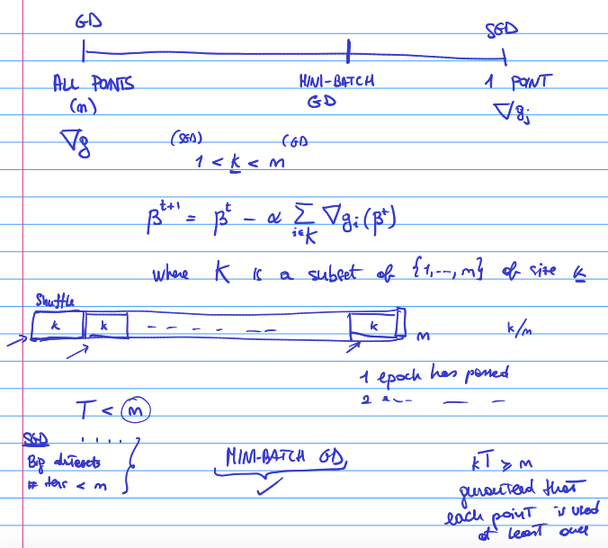
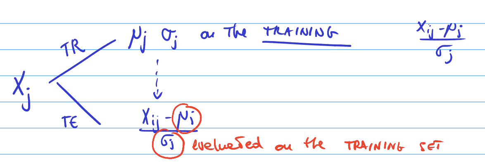

```{r setup, include=FALSE}
knitr::opts_chunk$set(echo = TRUE, class.source = "watch-out", options(scipen=999), out.width = "100%", comment = "", warning=FALSE, reticulate.repl.quiet = FALSE) 
source("www/init.R")
source("www/Table_Design.R")
```

# Preface {.unnumbered}

The following document has been prepared to have a prompt link to the code learned and used throughout several projects in the last year. As a beginner in programming, it is always useful to have input accessible to avoid having to look through numerous repositories.

{width="402"}

------------------------------------------------------------------------

The **bookdown** package that has been used for this format can be installed from CRAN or Github:

```{r eval=FALSE}
install.packages("bookdown")
# or the development version
# devtools::install_github("rstudio/bookdown")
```

To compile this example to PDF, you will need XeLaTeX. You are recommended to install TinyTeX (which includes XeLaTeX): <https://yihui.org/tinytex/>.

```{r include=FALSE}
# automatically create a bib database for R packages
knitr::write_bib(c(
  .packages(), 'bookdown', 'knitr', 'rmarkdown'
), 'packages.bib')
```

------------------------------------------------------------------------

***Prepared by: Daniëlle Kotter***

<!--chapter:end:index.Rmd-->

# Basics R

```{r, include=FALSE}
variable <- 1:10
value <- 5.50
```

```{r include=FALSE}
x <- 5
y <- 10
n <- 30
```

**Sample mean, standard deviation**

```{r}
mean <- mean(variable)
sd <- sd(variable)
```

Removes values NA in a data set:

```{r}
mean <- mean(variable, na.rm = TRUE)
sd <- sd(variable, na.rm = TRUE)
```

**Weighted mean & standard deviation**

```{r message=FALSE, warning=FALSE}
library(Hmisc)
weightedmean <- wtd.mean(x,y)
weightedsd <- sqrt(wtd.var(x,y))/sqrt(n)
```

**Variance**

```{r}
var(variable)
```

### Tables, frames & Matrices

As matrix =

```{r message=FALSE, warning=FALSE}
library(data.table)
matrix(c(1:8), nrow = 4, byrow = TRUE) #organized by row
matrix(c(1:8), ncol = 4, byrow = FALSE) #organized by col
```

As data frame =

```{r}
data.frame(Column1 = c(1:5), Column2 = c(1:5))
data.table(Column1 = c(1:5), Column2 = c(1:5))
```

As data table =

```{r}
data.table(matrix(c(1:8), nrow = 4)) # or
data.table(Variablex = 1:5, Variabley = 1:5)
```

Transforming tables from to other formats =

```{r}
table1 <- data.table(matrix(c(1:8), nrow = 4))
as.data.frame(table1)

table2 <- data.frame(Column1 = c(1:5), Column2 = c(1:5))
as.data.table(table2)
```

Binding and setting names =

rbind(table, newvariable) cbind(data, newvariable)

```{r}
rownames(table1) <- c("One", "Two", "Three", "Four")
colnames(table2) <- c("One", "Two")
```

Changing the order of a frequency table and factor

```{r}
value <- c("one", "three", "five", "one", "two", "three", "four", "two", "three")
table <- as.data.table(table(value))

table

table[,`value`:= factor(
 `value`, 
  levels = c(
    "one",
    "two",
    "three",
    "four",
    "five"
  )
)]

setorder(table, `value`)

table
```

**Frequencies**

```{r}
values <- c(1:10)
table(values)
prop.table(table(values))
round(prop.table(table(values)) * 100, 2)
```

## Data sets

Displaying head or tail of a data set:

```{r}
head(cars) # first 6 rows of the data set
tail(cars) # last 6 rows of the data set
```

Reading excel

`library(readxl)` `data <- read.xls("data.xlsx", stringsAsFactors = TRUE)`

```{r}
names(cars) # shows the column names of the data set
attach(cars) # saves the names to be used as variables
```

### Removing infinite + NA values

1.  Removing Infinite values
2.  Removing NA values
3.  Changing Infinite values to NA values

```{r}
variable[is.finite(variable)]
variable[is.na(variable)]
variable[is.infinite(variable)] <- NA
```

### Transforming variable types

```{r}
as.numeric(value)
as.character(value)
as.factor(value)
```

### Markdown

```{r}
# Putting words in bold: **Word**
```

**Result**

```{r}
# Putting words in italic: *Word*
```

*Result*

```{r}
# dashes like this `here`
```

Show up like this: `here`

```{r}
# dashes like this with the letter r:  `r 4+4`
```

Asks r to have inline code. We can see the results here: `r 4+4`.

```{r}
# \newpage
```

Will start a new page for example in a pdf document

```{r}
# > 
# In here we can put a quote 
# >
```

> In here we can put a quote

### Setup rmarkdown & code chunks

+-------------------------+----------------------------------------------------------+
| Call                    | Description                                              |
+=========================+==========================================================+
| Warning = TRUE/FALSE    | Include / exclude warnings                               |
+-------------------------+----------------------------------------------------------+
| Echo = TRUE/FALSE       | Include / exclude r chunks but show output               |
+-------------------------+----------------------------------------------------------+
| Include = TRUE/FALSE    | Run code but do not include in the knitted document      |
+-------------------------+----------------------------------------------------------+
| Comment = "" \| Include | / exclude \#\# in output code chunks                     |
+-------------------------+----------------------------------------------------------+
| Message = TRUE/FALSE    | Includes / excludes message from code                    |
+-------------------------+----------------------------------------------------------+
| out.width='100%'        | Adjusts size of figure / chart                           |
+-------------------------+----------------------------------------------------------+
| fig.width =             | Set specific size of figure / chart width                |
+-------------------------+----------------------------------------------------------+
| fig.height =            | Set specific size of figure / chart height               |
+-------------------------+----------------------------------------------------------+
| fig.cap=                | Adds a title to a figure                                 |
+-------------------------+----------------------------------------------------------+
| fig.align=              | 'center', 'left', 'right', adjust figure / chart at page |
+-------------------------+----------------------------------------------------------+

### Latex

+--------------------+--------------------+-------------------------------+
| Symbol             | Writing            | Description                   |
+:==================:+:==================:+:=============================:+
| $\mu$              | `$\mu$`            | Population mean               |
+--------------------+--------------------+-------------------------------+
| $\sigma$           | `$\sigma$`         | Population standard deviation |
+--------------------+--------------------+-------------------------------+
| $\bar{x}$          | `$\bar{x}`         | Sample mean                   |
+--------------------+--------------------+-------------------------------+
| ${e}$              | `${e}$`            | Standard error                |
+--------------------+--------------------+-------------------------------+
| $\ge$              | `$\ge$`            | Bigger than                   |
+--------------------+--------------------+-------------------------------+
| $\le$              | `$\le$`            | Smaller than                  |
+--------------------+--------------------+-------------------------------+
| $\pi$              | `$\pi$`            | Pie                           |
+--------------------+--------------------+-------------------------------+
| $\hat f$           | `$\hat f$`         | Estimator                     |
+--------------------+--------------------+-------------------------------+
| $\frac{1}{2}$      | `$\frac{1}{2}$`    | Fraction                      |
+--------------------+--------------------+-------------------------------+
| $\sum$             | `$\sum$`           | Sum                           |
+--------------------+--------------------+-------------------------------+
| $\sum_{i=1}^{n}$   | `$\sum_{i=1}^{n}$` | Sequence                      |
+--------------------+--------------------+-------------------------------+
| $\nabla $          | `$\nabla$`         | Gradient, Nabla               |
+--------------------+--------------------+-------------------------------+
| $\partial$         | `$\partial$`       | Partial                       |
+--------------------+--------------------+-------------------------------+
| $\beta $           | `$\beta$`          | Beta                          |
+--------------------+--------------------+-------------------------------+
| $\beta^1$          | `$\beta^1$`        | Beta 1                        |
+--------------------+--------------------+-------------------------------+
| $\alpha$           | `$\alpha$`         | Alpha                         |
+--------------------+--------------------+-------------------------------+
| $\approx$          | `$\approx$`        | Similar to                    |
+--------------------+--------------------+-------------------------------+


### Miscellaneous

```{r}
round(0.50, 2) # rounds a value with two decimals
rep(5,5) #repeats the number 5, 5 times
describe(variable)
fivenum(variable)
summary(variable)
str(variable) # describing the variable
dim(cars) # amount of rows and amount of columns
```

### Subsetting

```{r}
cars[,1] # subsets by columns
cars[1,] # subsets by row
cars[cars$speed == 4,] # subsets by specific value 
cars[cars$speed > 4,] # subsets over specific value 
cars[cars$speed < 5,] # subsets under specific value 
```

<!--chapter:end:01-Basics.Rmd-->

# Charts templates - R

```{r message=FALSE, warning=FALSE}
library(gridExtra)
library(hrbrthemes)
library(ggplot2)

paletteDani <- c( "#ffa500", "#DAF7A6", "#5F7992", "#69b3a2", "#ffd561", "#ee5c42", "#C8A2C8", "#5c3170", "#990000", "#C70039", "#34495E", "#909497")
```

> **Several basic options:**

**Pie chart**

```{r}
data <- ToothGrowth

dani_theme <- 
    theme(
        axis.title.x = element_blank(),
        axis.title.y = element_blank(),
        panel.border = element_blank(),
        panel.grid = element_blank(),
        axis.ticks = element_blank(),
        axis.text.x=element_blank(),
        legend.title = element_text(face = "bold"),
        plot.title = element_text(hjust = 0.5, size = 12, face = "bold")
    )

ggplot(data, aes(x="",y = dose, fill = supp)) +
  geom_bar(width = 1, stat = "identity") +
  coord_polar("y", start = 0) +
  scale_fill_manual("Legendname:",
                    values = paletteDani) +
  dani_theme  +
  labs(title = "Title",
         x = "variablX",
         y = "variableY"
         )
```

**Bar chart**

```{r}
ggplot(data, aes(x = dose, y = supp)) + 
  geom_bar(stat = "identity", fill="#69b3a2", color="#e9ecef") +
  theme(legend.position="none")
```

**Histogram**

```{r}
ggplot(data = data, aes(len) ) + 
    geom_histogram(fill="#69b3a2", color="#e9ecef", alpha=0.9) +
    ggtitle("Title") +
      xlab("variablex") +
      ylab("variabley") +
    theme(plot.title = element_text(size = 11))
```

**Boxplot**

```{r}
ggplot(data=ToothGrowth, aes(x="", y=len, fill="")) +
    geom_boxplot(fill="#69b3a2", outlier.colour="red", outlier.shape=8, outlier.size=4) +
    theme_ipsum() +
    theme(
      legend.position="none",
      plot.title = element_text(size=12)
      ) +
    ggtitle("Title") +
    theme(plot.title = element_text(hjust = 0.5)) +
    	xlab("")+
    	ylab("")
```

**Scatter plot**

```{r}
 ggplot(data= ToothGrowth, aes(y = len, x = dose)) +
  geom_point(size=2) +
  geom_smooth(method="lm", color="#69b3a2", fullrange=TRUE, 
        formula = y ~ x) +
   theme(plot.title = element_text(hjust = 0.5)) +
    	labs(title = "Title",
         y = "yname",
         x = "xname"
         )
```

**Scatter plot with dummies**

```{r}
ggplot(data = ToothGrowth, aes(y = len, x = supp, colour=factor(supp))) + 
  geom_point(size=2) +
  geom_smooth(method="lm", fill = NA, fullrange=TRUE,  formula = y ~ x) +
    theme(plot.title = element_text(hjust = 0.5)) +
    scale_colour_manual(name="Legendtitle", 
    	labels=c("value1", "value2"),values = c("#69b3a2", "#F6726A"))+
    labs(title = "Title",
         y = "Yname",
         x = "Xname"
         )
```

**Arrange charts next to each other on a page**

```{r}
chart1 <- ggplot(data=ToothGrowth, aes(x="", y=len, fill="")) +
    geom_boxplot(fill="#69b3a2", outlier.colour="red", outlier.shape=8, outlier.size=4) +
    theme_ipsum() +
    theme(
      legend.position="none",
      plot.title = element_text(size=12)
      ) +
    ggtitle("Title") +
    theme(plot.title = element_text(hjust = 0.5)) +
    	xlab("")+
    	ylab("")


chart2 <- ggplot(data=ToothGrowth, aes(x="", y=len, fill="")) +
    geom_boxplot(fill="#69b3a2", outlier.colour="red", outlier.shape=8, outlier.size=4) +
    theme_ipsum() +
    theme(
      legend.position="none",
      plot.title = element_text(size=12)
      ) +
    ggtitle("Title") +
    theme(plot.title = element_text(hjust = 0.5)) +
    	xlab("")+
    	ylab("")


grid.arrange(chart1, chart2, nrow=1, widths=c(0.9,1))
```

**Shows the amounts of missing values (NA) in a data set**

```{r warning=FALSE, message=FALSE}
library(VIM)
aggr(cars, numbers = TRUE, prop = c(TRUE, FALSE), cex.axis = 0.5)
```

**Density plots with semi-transparent fill**

```{r}
ggplot(data = ToothGrowth, aes(x = len, fill = supp)) + 
  geom_density(alpha=.3) +
    theme(
      plot.title = element_text(size=15)
      ) +
    ggtitle("Density plot") +
    theme(plot.title = element_text(hjust = 0.5, face= "bold")) +
    xlab("")+
    ylab("Density")
```

**Correlation matrix - pairs panel**

```{r, warning = FALSE, message = FALSE}
library(psych)

pairs.panels(iris,
method = "pearson",
hist.col = "#00AFBB",
density = TRUE,
ellipses = TRUE
)
```

**Simple plots:**

```{r, warning = FALSE, message = FALSE}
model <- lm(dist ~ speed, data = cars)
plot(model)
plot(model, 4) # cook distance
library(car)
avPlots(model)
```

<!--chapter:end:02-Charts.Rmd-->

# Probability

```{r, message=FALSE, warning=FALSE}
library(prob)
library(LaplacesDemon) # Bayes Theorem
library(BSDA) #tsumtest
library(actuar) 
```

```{r, include=FALSE}
X = 15
x = 15
p = 0.5
n = 30
a = 10
b = 15
mu = 20
se = 15
Y = 10
y = 5
lambda = 5
sigma = 4
pi = 3
ts = 3
df = 4
sd = 2
```

```{r}
out <- c("Red", "White", "Black", "Blue", "Green")
freq <- c(1,2,3,4,5)
s <- probspace(out, probs = freq)
print(s)
```

1. If you toss two fair coins, what is the probability of two heads?

```{r}
space <- tosscoin(2, makespace = TRUE)
p <- Prob(space, toss1 == "H" & toss2 == "H")
```

*The probability is: `r p`*

2. When two dice are thrown, what is the probability of a 3 followed by a 5?

```{r}
space <- rolldie(2, makespace = TRUE)
p <- Prob(space, X1 == 3 & (X2 == 5) )
```

*The probability is: `r round(p, 2)`*

3. Sampling from an urn with or without replacement. 3 balls and sample size of 2:

```{r}
sample1 <- urnsamples(1:3, size = 2, replace = TRUE, ordered = TRUE)
sample2 <- urnsamples(1:3, size = 2, replace = FALSE, ordered = TRUE)
sample3 <- urnsamples(1:3, size = 2, replace = FALSE, ordered = FALSE)
sample4 <- urnsamples(1:3, size = 2, replace = TRUE, ordered = FALSE)
```

------------------------------------------------------------------------

## Bayes Theorem

**Unconditional probability:**

P(S) and P(NS)
Success or no success

```{r}
prS <- c(0.4, 0.6)
```

**Conditional probability:**

P(P | S ) and P( P | NS)
Predicted given it is successful  
Predicted given it is not successful

```{r}
prNS <- c(0.6, 0.2)
```

**Bayes prob, posterior probabilities**  
P(S | P) & P(NS | P)

```{r}
BayesTheorem(prS, prNS)
```

------------------------------------------------------------------------

## Discrete Probablity

### Uniform discrete probability distribution

1. Sample space with a set probability. Size = amount of tries
2. Density function: Individual probability. F.E. Getting a 4
3. Cumulative density: Uniform for a certain value distribution. F.E. 4 or less. 4 or more? 1-punif 3
4. Inverse cumulative density: Uniform for a certain probability ( up until a certain value). F.E. up to 25% of the tries

```{r, warning = FALSE, include = FALSE}
one <- sample(p, size = n, replace = TRUE)
two <- dunif(X, min = a, max = b)
three <- punif(X, min = 0, max = 6)
four <- qunif(X, min = 0, max = 6)
```

***Default = # or less. For # or more do: 1-probability of # or less*** 

### Binomial distribution

1. Binomial for a specific value for a certain sample. F.E. 2 from the sample are successful.
2. Binomial for a certain distribution of the sample. F.E. At most 2 in the sample are successful. Or 5 or more. 
3. Binomial for a certain percentage of the  sample. F.E. 25% of the sample has x value or less. 
4. Difference between two binomial values. F.E. Prob there are between 4 and 5 of the trials successful.

```{r, warning = FALSE}
one <- dbinom(x, size = n, prob = y)	
two <- pbinom(x, size = n, prob = y)	
three <- qbinom(p, size = n, prob = y)	
four <- diff(pbinom(c(X,Y), size = n, prob = y))
```

***Default = # or less (left area of the distribution). For # or more do: 1-probability of # or less***


### Poisson distribution

**Expected value =** $n * p = LAMDA$

1. Poisson for a certain value. Lambda = n*p. F.E. Prob of having a 5
2. Poisson for a certain value distribution. F.E. Prob of having less than 5. More than 5? = 1-	Ppois(4, lambda)
3. Poisson for a certain probability to capture a certain value. F.E. Poisson value for 25%.

```{r, warning=FALSE}
one <- dpois(x,lambda)
two <- ppois(x,lambda)	
three <- qpois(x,lambda)
```

***Default = # or less (left area of the distribution). For # or more do: 1-probability of # or less*** 


### The normal distribution

**Empirical rule**

For all normal distributions: 68-95-99.7 rule

99.7% of observations are located between: -3 mu and 3  
95% of observations are located between: -2 mu 2  
68% of observations are located between: -1 mu 1

**Normal distribution**

**Z-value**

```{r}
# z <- (x - mean) / sd. For example:
(11 - 10) / 2
```

1. Normal distribution for a certain proportion. Pi = population proportion mean%.
2. Normal distribution for a certain value distribution. F.E. Prob of value above 5. FALSE
	Prob less than 9. TRUE
3. Normal distribution for a certain probability to capture a certain value. F.E. Value that is given at 25% point. 
4. Difference between two values on the normal distribution. F.E. between 5 and 10. 

```{r}
one <- pnorm(X, pi, sd, lower.tail = FALSE)
two <- pnorm(X, mu, sd, lower.tail = FALSE)
three <- qnorm(p, mu, sd, lower.tail = FALSE) 
four <- diff(pnorm(c(X,Y), mu, sd, lower.tail = FALSE))
```

lower.tail = TRUE: The area of the left side of the slope  
lower.tail = FALSE: The area of the right side of the slope

**Confidence interval for normal distribution**

z.test(x, sd=sigma)
binconf(x = x, n = n) <- proportions
t.test(variable) <- t-distribution for conf.inv

#### Plotting the normal distribution

"With mean = 3 and standard deviation = 7  
Limits: mean +/- 3 * standard deviation  = 3*7 = 21 
Lower limit = 3 – 21 = -18  
Upper limit = 3 + 21 = 24"  

Example:

```{r}
x <- seq(15, 45, length=50)
y <- dnorm(x, 30, 5)
plot(x,y,type="l",lwd=2,col="black")

x <- seq(15,35, length=100)
y <- dnorm(x, 30,5 )
polygon(c(15,x,35),c(0,y,0), density = c(15, 35), col = "black")

p <- pnorm(35, mean = 30, sd = 5,lower.tail = TRUE)
text(0,0.15,"68%")
```

#### Binomial

It will be possible to use the Normal distribution as an approximation to the Binomial if: n is large and p > 0.1 


1. Density function (individual probability). 
2. Cumulative density (between certain values). 
3. Difference between two binomial values
4. Inverse cumulative density. For a certain prob. 

```{r, warning = FALSE}
one <- dbinom(x, mu, sd)
two <- pbinom(x, mu, sd, lower.tail = FALSE)
three <- diff(pbinom(c(X,Y), mu, sd, lower.tail = FALSE))
four <- qbinom(p, mu, sd, lower.tail = FALSE)
```

------------------------------------------------------------------------

## Samples, estimation & confidence intervals

**The standard error of the sampling distribution of the mean**

```{r}
se <- sigma / sqrt(n)
```

**Probability sample**

1. To find the probability that X is larger than mu
2. To find the probability that X is smaller than mu

```{r}
p <- pnorm(X, mu, se, lower.tail = TRUE) 
p <- pnorm(X, mu, se, lower.tail = FALSE)
```

**Probability proportions sample**

```{r}
sd <- sqrt((pi*(n-pi))/n)
z <- (p - pi)/sd

p <- pnorm(X, pi, se, lower.tail =FALSE)
```


**Sample size**

Package = "samplingbook".

Provides the sample size needed to have a 95% confidence to estimate the population mean. 
Level = confidence level. Se is required standard error. 

**sample.size.mean(se, sigma, level=0.95)**

------------------------------------------------------------------------

## Significance level

### Critical values

**Critical value for normal distribution, sample > 30**  

1. Two-sided: Critical value, 5% significance level = 1.96
2. Two-sided: Critical value, 1% significance level = 2.58
3. Two-sided: Critical value, 10% significance level = 1.96
4. One-sided: Critical value, 5% significance level = 1.64
5. One-sided: Critical value, 1% significance level = 2.33
6. One-sided: Critical value, 10% significance level = 1.28

```{r}
qnorm(0.975)
qnorm(0.995)
qnorm(0.95)

qnorm(0.95)
qnorm(0.99)
qnorm(0.90)
```

**Critical values t-distribution**

1. One-sided: critical value at a 5% significance level
2. One-sided: critical value at a 10% significance level
3. One-sided: critical value at a 1% significance level
4. Two-sided: critical value at a 5% significance level
5. Two-sided: critical value at a 10% significance level
6. Two-sided: critical value at a 1% significance level

```{r}
cv <- qt(0.95, df) 
cv <- qt(0.90, df) 
cv <- qt(0.99, df)

cv <- qt(0.975, df)
cv <- qt(0.95, df) 
cv <- qt(0.995, df)
```

**Confidence interval**

```{r}
cv <- cv
mu <- mu
sd <- sd
se <- sd / (sqrt(n))
n <- n

conf_int95 <- cv * sd / (sqrt(n))
mu_plus <- mu + conf_int95
mu_min <- mu - conf_int95
```

**Large sample significance testing**

1. Two-sided
2. One-sided: X is greater than the population mean
3. One-sided: X is less than the population mean

```{r message=FALSE, warning=FALSE}
library(BSDA)

one <- tsum.test(mean.x = X, s.x = sd, n.x = n, mu = mu, alternative = "two.sided", var.equal = TRUE) 

two <- tsum.test(mean.x = X, s.x = sd, n.x = n, mu = mu, alternative = "greater", var.equal = TRUE) 

three <- tsum.test(mean.x = X, s.x = sd, n.x = n, mu = mu, alternative = "less", var.equal = TRUE) 
```

**For proportions:**

prop.test(x = X, n = n, p = p, correct = TRUE, alternative = "two.sided")

Same goes for above: two.sided, greater, less

### Test of equality - two samples

H_0 <- $\mu1 = \mu2$ or $(\mu1 - \mu2) = 0$  
H_a <- $\mu1 \neq \mu2$ or $\mu1 - \mu2 \neq 0$


Difference in two means with a certain confidence level confidence interval. Default = 95%

```{r}
tsum.test(mean.x = X, s.x = sd, n.x = n, mean.y = X, s.y = sd, n.y = n, var.equal=FALSE)
```

2-sample test for equality of proportions without continuity correction.

prop.test(data, correct=FALSE, alternative="greater")

------------------------------------------------------------------------

## Non-Parametric testing

### Contengency table / frequencies

Obtain contingency table

```{r}
table(ToothGrowth$dose)
```

### Chi-square

1. Chi-square test
2. Get the expected value
3. Probability for chi-square 

```{r}
data <- matrix(c(27,373,33,567),byrow=TRUE,nrow=2)
chisq.test(data,correct=FALSE)

chisq.test(data,correct=FALSE)$expected

prop.table(chisq.test(data,correct=FALSE)$expected,1)
prop.table(chisq.test(data,correct=FALSE)$expected,2)
```

Degree of freedom = # of row - 1 * # of columns = fixed 

***All expected frequencies must be above five! If not, categories must be combined!***


### Goodness of fit

**Uniform:**

Degree of freedom =  number of categories - number of parameters - 1.

```{r}
x <- c(1,2,3,4,5)
p <- rep(1/5, 5)
chisq.test(x, p = p)
```

***All expected frequencies must be above five! If not, categories must be combined!***


**Binomial:**

dbinom(x, size = n, prob = y)	

For example:

```{r message=FALSE, warning=FALSE}
library(actuar)
cj <- c(-0.5, 0.5, 1.5, 2.5, 3.5, 4.5, 5.5)

#or

cj <- seq(from = -0.5, to=5, by=1)

nj <- c(15,20,20,18,13)
data <- grouped.data(Group = cj, Frequency = nj)
p <- mean(data)/5
pr <-c(dbinom(0,5,p),dbinom(1,5,p),dbinom(2,5,p),dbinom(3,5,p),dbinom(4,5,p),dbinom(5,5,p))

nj2 <- c(35,20,18,23)
pr2 <- c(dbinom(0,5,p)+dbinom(1,5,p),dbinom(2,5,p),dbinom(3,5,p),dbinom(4,5,p)+dbinom(5,5,p))

chisq.test(nj2,p=pr2)
```

***All expected frequencies must be above five! If not, categories must be combined!***

**Poisson**

Degree of freedom = number of categories - number of parameters - 1.

NOTE! Distribution goes to infinity. Counter for one value that is X or more. 1 - until X. 

Example:

```{r}
cj <- c(-0.5, 0.5, 1.5, 2.5, 3.5, 4.5, 5.5)

#or

cj <- seq(from = -0.5, to=6, by=1)
nj <- c(16, 30, 37, 7, 10, 5)
data <- grouped.data(Group = cj, Frequency = nj)
m <- mean(data)

pr <- c(dpois(0, m),dpois(1,m),dpois(2, m), dpois(3, m), dpois(4, m), + (1-ppois(4,m)) )

chisq.test(nj, p = pr)
```

**Normal distribution**

Example:

```{r}
cv <- qchisq(0.90, 2)

cj <- c(0, 1, 3, 10, 15, 30)
nj <- c(16, 30, 37, 7, 10)
data <- grouped.data(Group = cj, Frequency = nj) 
m <- mean(data)
s <- sqrt(emm(data,2))

pr <- c(pnorm(1,m,s), diff(pnorm(c(1,3),m,s)), diff(pnorm(c(3,10),m,s)), diff(pnorm(c(10,15),m,s)), 1 - pnorm(c(15),m,s) )
         
chisq.test(nj,p=pr)
```

###Mann-whitney test

N = Number of pairs - number of draws

**For small tests**

c1 values sample 1  
c2 values sample 2  

*wilcox.text(x, c2)*

**Larger sample test > 10**

You can use a approximation based on the normal distribution. Therefore critical values will be 1.96 for this two sided test.


###Wilcoxon test

Two options  
	- Do not predict direction --> two sided  
	- Predict direction --> one sided  
	
*wilcox.test(w1, w2, paired=TRUE,correct=FALSE)*


###Run test

```{r message=FALSE, warning=FALSE}
library(randtests)
pers <- c(0,1,1,0,0,0,0,1,1,0,1)
pers.f <- factor(pers,labels=c("Male","Female"))
runs.test(pers)
```

### P-value

Find p value: Probability of getting this test statistic or more:

```{r}
pchisq(ts, df, lower.tail=FALSE)
```


<!--chapter:end:03-Probability.Rmd-->

# Simple regressions

```{r include=FALSE}
data <- cars
x <- cars$speed
y <- cars$dist
d <- rep(0,50)
```

## Basics regressions

Regressions, correlation and dummy's

Y = Dependent  
X = Explanatory

**Correlation**

```{r}
cor(x, y)
```

**Creating the regression:**

1. To plot the regression model
2. Evaluates the coefficient of the model
3. Only the first colum estimattion 

```{r}
model <- lm(y~x, data = data)
summary(model)$coef
est <- summary(model)$coef[,1]
```


### Summarizing regressions:

1. Using stargazer package

```{r message=FALSE, warning=FALSE}
library(stargazer)

stargazer(lm(y~x, data=data), type="text")

# Multiple models adjacent

model1 <- lm(y~x, data=data)
model2 <- lm(x~y, data=data)

stargazer(model1, model2, type="text")

```

2. Using summary function:

```{r}
summary(lm(y~x))
```

Regressions

**Plotting regression**

```{r}
plot(y~x,data=data, 
     main="Title",
     ylab="yname",
     xlab="xname"
     )
```

**Including regression line:**

```{r}
plot(y~x,data=data, 
     main="Title",
     ylab="yname",
     xlab="xname"
     )
abline(lm(y~x, data=data), col="blue")
```

**Confidence interval around slope**

```{r}
confint(lm(y~x), level=0.95)
```

**Sub-sampling regression**

Specify dimensions [,]. 
First is row. Column, second. 

1. Selects the rows where age is larger than 5.
2. Lower than 5.

```{r}
sub1 <- summary(lm(y~x, data=data["speed">=5,]))
sub2 <- summary(lm(y~x, data=data["speed"<=5,]))
```


### Dummy variables, diff in means


### Regression + dummy

Y = Constant0 + B0 * X - Diff in means + B1 * variable1*2


**Omitting the intercept:**

Shows the means separately and not the difference between means. Tests whether the expected counts are different from zero. 

```{r}
lm(y ~ x - 1, data = data)
```

Reorders group, to specific value to be first.
 
 variable2 <- relevel(variable, "C")

## Prediction  

``` {r}
model <- lm(y~x)

newdata <- data.frame(variablename = c(1:50))
pred <- predict(model, newdata = newdata)
```

**Prediction confidence interval:**

1. One value
2. Multiple values from a existing data frame

```{r}
pred1 <- predict(model, data.frame(valuename = x), interval = "confidence", level=0.95)
pred2 <- predict(model, newdata = newdata, interval = "confidence", level=0.95)
```

**Prediction interval**

1. One value
2. Multiple values from a existing data frame

```{r}
pred1 <- predict(model, data.frame(valuename = x), interval="predict",level=0.95)
pred2 <- predict(model, newdata, interval="predict",level=0.95)
```


### Confidence and prediction plotting

Adds: observed values, fitted line, conf interval, predicted interval

```{r message=FALSE, warning=FALSE}
library(HH)
fit <- lm(y~x, data = data)
ci.plot(fit)
```

### Prediction with dummy variables

Prediction = 𝛼1+𝛼2Constant Dummy+𝛽1𝑆𝑖𝑧𝑒+𝛽2Slope Dummy

### Prediction intervals examples

**Prediction**

```{r}
fit <- lm(y ~ x + d + d, data = data)

pred <- predict(fit, data.frame(VariableX = c(10), Dummy = c(1), Slopedummy = c(10)) )
```
 
**Confidence interval prediction**  

```{r}
fit <- lm(y ~ x + d + d, data = data)

pred <- predict(fit, data.frame(VariableX = c(10), Dummy = c(1), Slopedummy = c(10), interval="confidence"))
```  

**Prediction interval**

```{r}
fit <- lm(y ~ x + d + d, data = data)

pred <- predict(fit, data.frame(VariableX = c(10), Dummy = c(1), Slopedummy = c(10), interval="predict"))
```


## Data problems

**Residual plot**

```{r}
# residual.plots(fitted(fit), resid(fit), sigma.hat(fit), main="Title")
```

**Influential measure test**

```{r}
im <- influence.measures(fit)
```


### Multicollinearity

F-test

```{r}
fit <- lm(y~x + d, data = data)

anova(fit)
```

### Variance inflation factors

The variance inflation factor (vif) is $1 / 1−R2$.
A simple approach to identify collinearity among explanatory variables is the use of variance inflation factors (VIF). It is the ratio of variance in a model with multiple terms, divided by the variance of a model with one term alone. The higher the value, the higher the collinearity. A VIF for a single explanatory variable is obtained using the r-squared value of the regression of that variable against all other explanatory variables: A VIF is calculated for each explanatory variable and those with high values are removed. The definition of ‘high’ is somewhat arbitrary, but values in the range of 5-10 are commonly used for ‘high’. If VIF value exceeding 4.0, or by tolerance less than 0.2 then there is a problem with multicollinearity (Hair et al., 2010). However, it depends on the researcher’s criteria. The lower the vif the better, but you shouldn’t be too concerned as long as your VIF is not greater than 10.

```{r}
vif(fit)
```


### ANOVA

**One-way:** one value

```{r}
res.aov <- aov(y ~ x, data = data)
summary(res.aov)
```

**Two-way:** more than two factors 

```{r}
res.aov <- aov(y ~ x + d, data = data)
summary(res.aov)
```

With interaction

```{r}
res.aov <- aov(y ~ x * d, data = data)
summary(res.aov)
```

**Three-way**

1. Three way
2. With interaction

```{r}
summary(aov(y ~ x + d, data=data))
summary(aov(y ~ x + d, data=data))
```

**MANOVA**: Multiple factors

1. Test in difference
2. Test separately


test_manova <- manova(cbind(y, d) ~ x, data = data)
summary(test_manova)
summary.aov(test_manova)


### Linearizing variables

```{r}
logged <- log(iris$Sepal.Length) # non-linear
quad <- cars$speed ^ 2 # quadratic
```


<!--chapter:end:04-Simpleregressions.Rmd-->

# Structure equation models

**Structural Equation Modeling (SEM):** is an extremely broad and flexible framework for data analysis, perhaps better thought of as a family of related methods rather than as a single technique. Measuring latent constructs is challenging and we must also incorporate estimates of measurement error into our models. SEM excels at both of these tasks. SEM is especially suited for causal analysis.[@kdnuggets2017]

VS

**Ordinary least-squares (OLS):** models assume that the analyst is fitting a model of a relationship between one or more explanatory variables and a continuous or at least interval outcome variable that minimizes the sum of square errors, where an error is the difference between the actual and the predicted value of the outcome variable. The most common analytic method that utilizes OLS models is linear regression (with a single or multiple predictor variables).

**Latent variables =** Unobserved variables (or unmeasured variables in SEM lingo). These are theoretical concepts which can be inferred but not directly measured.

Linear regression model = $Y = alpha + betaX + error$

The model has to account for randomization. If there is a factor that that cannot be explained, it is included in the error. When this unmeasured factor that is in the error is correlated to another independent variable, there is ***endogeneity***.

**Endogeneity variables =** correlated with the error terms. Arises when the marginal distribution of the independent variable is not independent of the conditional distribution of the dependent variable given the independent.

**Exogenous variables =** not driven by other factors (observable or observable)

*Sources of endogeneity =*

    1. Omitted variables: relevant variables left out of the model,  attributing to effect to those that were included. 
    2. Simultaneity: where x causes y and y causes x
    3. Selection bias: sampling bias

In the structural equation model we can effectively avoid endogeneity.

------------------------------------------------------------------------

## Path analysis (structural equations)

**Path diagrams =** Communicates the structure of our model. Useful for structural equation models. The objects in the model mean:

-   Rectangular = any variable that we can observe directly (observed variable), measured variables

-   Circle / Ovals = Cannot be observed (Latent variable)

-   Arrow = directed effect. One variable impacts the other. Hypothetical causal relationship.

-   Numbers by the arrows = regression coefficient.

{width="352"}

-   Triangle is the constant in the Linear Model.

{width="81"}

-   Double handed arrows = indicate co-variances or correlations without a causal interpretation.

-   Double handed arrow between two independent variables = they are correlated to each other.

{width="350"}

-   Residual error term = measurement errors. We expect that the factor will not perfectly predict the observed variables.

-   The bi-directed arrows, the ones with two side arrows (in this representation, a connecting line with no arrows) represent co-variances among variables.

------------------------------------------------------------------------

## Coding the model

```{r, warning=FALSE, message=FALSE}
library(semPlot)
library(lavaan)
```

**Setting up the model and summarizing**

```{r comment= ""}
fit <- 'dist ~ speed'
model <- lavaan(fit, data = cars, estimator="MLM", auto.var = TRUE)
summary(model)
```

*Estimator = MLM in the model:* protects for non-linearity, non-normality and elasticity of the raw data. This needs the raw data, not only the covariance matrix.

**Setting up the path diagram**

```{r}
semPaths(model, "std", title = FALSE,
weighted = FALSE, sizeInt = 4, sizeMan = 5,
edge.label.cex = 1.3, asize = 2)
title("SEM path", line = 3)
```

*"std" =* standardizing the variables

*"est" =* true estimation

*style="ram" =* to get circles around the measurement arrows

**With latent variable & SEM**

```{r, warning = FALSE}
model <- "
# regression
Petal =~ Petal.Width + Petal.Length
Sepal.Length ~ Sepal.Width  + Petal
"

fit <- sem(model, data = iris, sample.cov = S, sample.nobs = 122)
semPaths(fit, "std", sizeInt = 4, sizeMan = 3, edge.label.cex = 1, asize=3, weighted=TRUE, exoCov = TRUE)
```

\
**Testing the model**

```{r}
fitMeasures(fit)[ c("chisq","df", "pvalue" ,"rmsea")]
```

1.  Chisq is a chi-squared test statistic for. H0: moment restrictions implied by the model hold true
2.  The degrees of freedom
3.  P-value of the chi-square test
4.  Rmsea is a fit index, the root mean square of approximation. It should be small for a good fit of the model. Threshold of .05 is often applied to declare good fit.

*See later chapter for further explanation*

**Modification indices**

This tells us how we could improve your model. If i liberate one parameter, then \_ would change.

```{r}
modi = modindices(fit)
modi[order(modi[,4], decreasing=T), ]
```

**Parameters fit**

```{r}
parameterestimates(fit, 
standardized = TRUE, rsquare=TRUE, ci=FALSE)[1:4,] # showing the top 4
```

\+

------------------------------------------------------------------------

### Covariance

Covariance is a measure of how much two random variables vary together. It's similar to variance, but where variance tells you how a single variable varies, co variance tells you how two variables vary together.

Cov(1, 2) =

$sum (1- mean(1) * (2-mean(2)  / n$

**Moment matrix:**

{width="261"}

**Covariance matrix:**

```{r}
cov(cars)
```

{width="353"}

Creating the covariance matrix when only having the lower half:

```{r}
lower <- "
0.03300863
0.15894229 5.0185561
0.15670560 0.9841531 1.2142232
"
S <- getCov(lower,
names = c("variable1", "variable2", "variable3"))
print(S)
```

------------------------------------------------------------------------

### Reliability

In statistics ***reliability*** is the consistency of a set of measurements or measuring instrument, often used to describe a test. This can either be whether the measurements of the same instrument give or are likely to give the same measurement (test-retest), or in the case of more subjective instruments, such as personality or trait inventories, whether two independent assessors give similar scores (inter-rater-reliability). Reliability is inversely related to random error. In words, reliability is defined as a proportion of observed variance that is true variance. Reliability is interpreted as a proportion and therefore cannot be negative.

Various kinds of reliability coefficients, with values ranging between 0.00 (much error) and 1.00 (no error), are usually used to indicate the amount of error in the scores.

The reliability is expressed as [k]{.ul} and there are several options to calculate:

**Option 1: reliability of a latent variable**

1 - Measurement error variable 1 / observed variable 2 (latent variable). Dividing the true variance by the observed variance.

Here is an example:


**Option 2: based on the standardized path diagram**

The square of the standardized loading is the reliability of the variable. Example:

```{r echo=FALSE}
fit <- 'dist ~ speed'
model <- lavaan(fit, data = cars, estimator="MLM", auto.var = TRUE)
semPaths(model, "std", title = FALSE,
weighted = FALSE, sizeInt = 4, sizeMan = 5,
edge.label.cex = 1.3, asize = 2)
title("SEM path", line = 3)
```

Here the reliability of the variable distance (dst) = $0.35 ^ 2 = 0.12 = k$

\_\_\_\_\_\_\_\_\_\_\_\_\_\_\_\_\_\_\_\_\_\_\_\_\_\_\_\_\_\_\_\_\_\_\_\_\_\_\_\_\_\_\_\_\_\_\_\_\_\_\_\_

**Testing the model**

`fitMeasures(fit) [ c("chisq", "df", pvalue", "rmsea")]`

**Model chi-square test =** We test whether the fitted model is correct. HO: moment restrictions implied by the model hold. The fit is correct If \> 0.05 we cannot reject the model. I accept the model.

Therefore, the chi-square test allows researchers to evaluate the fitness of a model by using the null hypothesis significance test approach.


**Degrees of freedom (df) =** Number of observations available for model estimation - Number of observations used to estimate parameters.

"Number of free parameters" refers to all of the things that this model estimated freely. Parameter is a regression coefficient when standardized is called a beta coefficient.

**The Root Mean Square Error of Approximation (RMSEA) =** fit index: how the covariance fit in the model. Difference between observed and the fitted.

The RMSEA is widely used in Structural Equation Modeling to provide a mechanism for adjusting for sample size where chi-square statistics are used. Measures the discrepancy due to the approximation per degree of freedom.

The objective is to have the RMSEA as low as possible.

------------------------------------------------------------------------

## Factor model

**Factor analysis:** a statistical method used to describe variability among observed, correlated variable in terms of a potentially lower number of unobserved variables called factors. For example, it is possible that variations in six observed variables mainly reflect the variations in two unobserved (underlying) variables. Factor analysis searches for such joint variations in response to unobserved latent variables. The observed variables are modeled as linear combinations of the potential factors, plus "error" terms.

It is including a common return that has a impact to multiple variables. Then, you can find how much variance is due to permanent and depended on these variables.

Below we can find the factor model including means based on the Spearman model from 1903.


**Difference in regression equations:**

***Basic model - Y, X are centered :***

$Y = beta X + error$

***Y, X NOT centered - including constant:***

$Y = alpha*1 + beta X + error$

***Factor model:***

$Y = lambda*F + error1$

**Lamba =** the weights \
**F =** common factor \
**Error =** Specific to the factors

Here instead of setting the alpha to 1 which we do in the basic model, now we add a weight which is the lambda.

When the data is standardized, beta becomes the standardized beta coefficient. Because y, x are centered, you do not need to present the constant in the model.

Next step in factor models with simultaneous equations --\> ML estimation of a general model. Linear structural relations

You have to fix the variance of a variable that you do not observe. If you do not do this, the model is not identified. Meaning there is no minimum. Including latent variables two options:

    A) Var(F) = 1, F Standardized (F typically has mean zero)
    B) Lambda_1 = 1

They are equivalent regarding degrees of freedom or model fit. When you put 1\* variable1, you force the true beta to be 1.

**In r setting the model =**

```{r}
#regression equation option 1
Model <- "dist =~ 1 * speed
"

#regression equation option 2
Model <- "dist =~ NA * speed
"
```

When using: Default NA = not available. We are asking R to calculate the beta instead of setting it to 1. This gives the equation: $Y = Lambda*F + Error$. \

**Degrees of freedom**

When you bring variables into the model, the degrees of freedom increases. When there are 0 degrees of freedom, you cannot test but you can fit the model. Now you cannot reject the model, but you can check the reliability.

### Setting covariance & variances

Independent variables have variances and co-variances, unless the model specification puts them to zero. Variance is to be estimated in the model and if necessary we should be imposing restrictions. When you include all variances, you put a lot of tension on your model.

Y \~\~ 1\* Y = forces the variable to be standardized

X \~\~ X = Gives two explanatory variables the possibility to covariance

Equality with error variances (multiple independent variables) X\~\~X \*A = setting a restriction.

**Auto regressive =** one variables keeps impacting the following. For example: 2011 impacts 2012 which impacts 2013 etc. In this case, the variables need to be set to allow for correlation.


<!--chapter:end:05-SEM.Rmd-->

---
editor_options: 
  markdown: 
    wrap: 72
---

```{r, echo=FALSE, warning=FALSE, message=FALSE}
library(knitr)  
library(reticulate)
os <- import("os")
os$listdir(".")
options(reticulate.repl.quiet = FALSE)
use_python("/usr/local/bin/python")
```

```{r, echo=FALSE}
knitr::opts_chunk$set(
  echo = TRUE, 
  warning = FALSE, 
  cache.lazy = FALSE, 
  message=FALSE
)
```

```{python}
# This Python file uses the following encoding: utf-8
import os, sys
```

```{python, warning=FALSE, message=FALSE, comment=FALSE}
import numpy as np
import pandas as pd
import matplotlib.pyplot as plt
from matplotlib.pyplot import figure
import seaborn as sns
import os
```

# Basics Python

```{r}
y = 5 + 5
y
```

Printing characters

```{r}
print('Hello, readers!')
```

Printing numbers

```{r}
print(15)
```

Printing length of a value

```{python, warning=FALSE, message=FALSE}
Length = len('Danielle')
print(Length)
```

------------------------------------------------------------------------

## Data set

Loading the data set & viewing head + tails:

```{python}
sns.set_context('paper')

tips = sns.load_dataset('tips')

tips.head()
tips.tail()
```

1.  Length of the variable
2.  Shape: Number of rows and number of columns
3.  Type of variables + basic info
4.  Descriptive statistics variable

```{python}
len(tips)

tips.shape

tips.info()

tips.describe()
```

------------------------------------------------------------------------

## Matrixes

Series:

Panda series method:

```{python}
Serie1 = pd.Series(
  [4200, 8000, 6500],
  index=["Amsterdam", "Toronto", "Tokyo"]
  )
Serie1
```

Python dictionary method:

```{python}
Serie2 = pd.Series({"Amsterdam": 5, "Tokyo": 8})
Serie2
```

Data frame:

```{python}
Combined_serie = pd.DataFrame({
  "Revenue": Serie1,
  "Employee_count": Serie2
  })
  
Combined_serie
```

Sub-setting by row:

```{python}
Combined_serie["Tokyo":]
```

**Creating our own functions:**

Saying hello + name

```{python, warning=FALSE, message=FALSE}
def printing_name(name):
  print('Good morning,', name)
printing_name('Danielle')
```

Multiple arguments:

Saying hello + name + location

```{python, warning=FALSE, message=FALSE}
def welcome(name, location):
  print("Good morning", name, "Welcome to", location)
welcome("Danielle,", "class.")
```

**Bar plot**

```{python}
sns.set_context('paper')

tips = sns.load_dataset("tips")
tips.head()

sns.barplot(x = 'day', y = 'total_bill', hue = 'sex', data = tips, palette = 'Blues', edgecolor = 'w')
plt.show()

tips.groupby(['day','sex']).mean()
```

**1-hot-encoding:**

Transforming categorical features to values from 0 or 1. F.e. You can be
from origin: America or Europe. If the observation is from America it
receives a 1 for America and a 0 for Europe.

**Reading from a csv file with pandas:**

```{python}
import pandas as pd

d = pd.read_csv('~/Documents/Pompeu Fabra BSM/Practical data science/auto-mpg.csv')
```

```{python}
d.mpg.mean().round() # rounding by amount of decimals
```

```{python}
d.dtypes # describes the type of variables
pd.to_numeric(d.hp) # transforms to numerical
```

```{python}
len(d) # amount of rows
d.shape # amount of rows & columns
d.columns # gives the names of the columns
mpg = d.mpg # shows me only the values from one variable
mpg = d['mpg'] # alternative way to show only one value
d.head() # shows the first 5 observations of a data set
d.tail() # shows the last 5 observations of a data set
```

**Basic statistics:**

```{python}
d.mpg.mean()
d.mpg.median()
d.mpg.max()
d.mpg.min()
d.mean() # mean for all columns
d.describe().round(2).head() # statistics for the whole data set, rounded to two decimals
```

```{python}
d[['year']] # defines a list of one variable
d[['year', 'cylinders']] # defines a list of multiple variables
d.year.unique() # gives me the unique values of that column, not the repetitions
```

------------------------------------------------------------------------

## Filtering a data set

```{python}
d77 = d[d.year == 77] #filters the data set to all observations that are equal to a certain value of a variable 

d77 = d[d.year != 77] #filters the data set to all observations that are NOT equal to a certain value of a variable 

d77 = d[d.year <= 77] # filters those that are smaller than a value

d77 = d[d.year >= 77] # filters those that are large than a value

d77 = d[(d.year >= 77) & (d.year <= 90)] # in between certain values

d77 = d[(d.year == 80) | (d.year == 90)] # those from one value OR another

d77 = d[~(d.year == 70)] # excludes the values
```

**Aggregating**

```{python}
dm = d.groupby('year').mean()

dm = d.groupby(['year', 'cylinders']).mean()

dm = d.groupby(['year', 'cylinders']).median()

dm = d.groupby(['year', 'cylinders']).mean()['mpg'] # for selected variables only
```

**Pivot table**

```{python}
d.pivot_table(index='year', columns='cylinders', values='mpg').round()

d.pivot_table(index='year', columns='cylinders', values='mpg').round().fillna('')
```

**Creating new columns starting from existing columns**

```{python}
d['nam_of_new_column'] = d.mpg * 2
```

Through the package numpy:

```{python}
import numpy as np

d['sqrt_of_mpg_2'] = np.sqrt(d.mpg)

d['log(10)_of_mpg'] = np.log10(d.mpg)
```

**Dropping / deleting columns**

```{python}
d['double_mpg'] = d.mpg * 2

del(d['double_mpg']) # deleting columns

d.drop(columns=['sqrt_of_mpg_2', 'log(10)_of_mpg', 'nam_of_new_column']).head() # dropping columns
```

------------------------------------------------------------------------

## Data imputation

```{python}
pd.to_numeric(d.hp, errors='coerce').head()

d.hp = pd.to_numeric(d.hp, errors='coerce')

d[d.hp.isna()] # transform values to NA

d[-(d.hp.isna())] # delete missing values
```

------------------------------------------------------------------------

## Data visualization

Getting the correlation matrix

**Correlation matrix**

```{python}
d.corr().round(decimals=2)
```

Pair plot

```{python}
#sns.pairplot(d);

#sns.pairplot(d, hue='origin'); # with color
```


```{python}
tips = sns.load_dataset("tips")
sns.set_theme(style="whitegrid")

sns.boxplot(data=tips, x='sex', y='tip')
plt.show()
```


```{python}
sns.boxplot(data=tips, x='sex', y='tip', color='black', boxprops=dict(alpha=.6))
plt.show()

sns.boxplot(x="day", y="total_bill", hue="smoker",
  data=tips, palette="Set3")
plt.show()
```

```{python}
tips['weekend'] = tips.day.isin(['Sat', 'Sun'])

sns.boxplot(data=tips, x='day', y='tip', hue='weekend', dodge=False)
plt.show()
```


```{python}
sns.catplot(data=tips, x='smoker', y='tip', hue='sex', col='time', kind='box');
plt.show()
```

### Other categorical plots

```{python}
sns.stripplot(data=tips, x='sex', y='tip');
plt.show()
```

```{python}
sns.swarmplot(data=tips, x='sex', y='tip');
plt.show()

sns.swarmplot(data=tips, x='sex', y='tip', hue='smoker');
plt.show()

sns.swarmplot(data=tips, x='sex', y='tip', hue='smoker', dodge=True);
plt.show()
```


```{python}
sns.boxplot(data=tips, x='sex', y='tip', fliersize=8)
sns.swarmplot(data=tips, x='sex', y='tip', color='black', alpha=0.6);
plt.show()
```


```{python}
sns.boxenplot(data=tips, x='sex', y='tip');
plt.show()

sns.boxenplot(data=tips, x='sex', y='tip', hue='smoker');
plt.show()
```


***

```{python}
sns.displot(data=tips, x='tip');
plt.show()

sns.displot(data=tips, x='tip', kind='kde');
plt.show()
```

**Multiple plots**

```{python}
fig, axes = plt.subplots(nrows=1, ncols=2, figsize=(12,6))
sns.boxenplot(data=tips, x='sex', y='tip', ax=axes.flat[0]);
sns.violinplot(data=tips, x='sex', y='tip', ax=axes.flat[1]);
plt.show()
```


**Multidimensional KDE for numeric variables**

```{python}
plt.rcParams['figure.figsize'] = (10,8)
sns.kdeplot(data=tips, x='tip', y='total_bill', shade=True, cbar=True);
plt.show()
```

```{python}
sns.histplot(d.mpg); # Histogram
plt.show()
```

```{python}
sns.histplot(d.mpg, bins=20); # with binwidth
plt.show()

sns.histplot(data=d, x='mpg', bins=20); 

sns.histplot(data=d, x='mpg', bins=20, cumulative=True); # cumulative values
```

```{python}
#d.origin = pd.Categorical(d.origin.replace({1: 'america', 2:'europe' 3: 'japan'}))

sns.relplot(data=d, x='hp', y='mpg', hue='origin', palette='tab10')
plt.show()
```

```{python}
corr = d.corr()
sns.heatmap(corr) # simple
plt.show()

sns.heatmap(corr, cmap=plt.cm.RdYlGn, annot=True, linewidths=1, square=True, vmin=-1, vmax=1) # designed
plt.show()
```

### Preparing the data

```{r, echo=FALSE}
library(tidyverse)
py_install("scikit-learn")
```

```{python}
from sklearn.model_selection import train_test_split
```


Creates the input points and the output columns

```{python}
label = 'mpg'
features = [column for column in d.columns if column != label]
```

Setting the train / test split

```{python}
X = d[features]
y = d[label]

X_train, X_test, y_train, y_test = train_test_split(X, y, test_size=0.25)

len(X) # Size of the dataset
len(X_train) # Size of the training set
len(X_test) # Size of the test set (In this case 25% of the dataset)
```

There is also a way to avoid the randomness of the test selection:

```{python}
X_train, X_test, y_train, y_test = train_test_split(X, y, test_size=0.25, random_state=0) # We fix the random state to a certain value. 
```


### Creating the models

- Linear regression (no hyperparameters)
- Quadratic regression (no hyperparameters)
- Quadratic regression with LASSO (1 hyperparameter)

```{python}
from sklearn.linear_model import LinearRegression, Lasso
```


```{python}
from sklearn.preprocessing import StandardScaler, PolynomialFeatures # automatically takes into account standardization

from sklearn.model_selection import GridSearchCV, ShuffleSplit

from sklearn.pipeline import make_pipeline

from sklearn.metrics import mean_squared_error
```

**Pipeline**

A pipeline is a sequence of steps applied to the data. f.e. the first step is scaling the data and is training the model on the training data.

Due to the package sklearn (StandardScaler), the training data is first standardized and then this is used for the training data and test data.

```{python}
# Linear regression
linreg = make_pipeline(StandardScaler(), LinearRegression() 
)

# Quadratic regression
quadreg = make_pipeline(StandardScaler(), PolynomialFeatures(degree=2), 
LinearRegression() 
)

# Quadratic regression with LASSO
quadlasso_empty = make_pipeline(StandardScaler(), PolynomialFeatures(degree=2), 
Lasso(max_iter=10000)
)
```


**Training (+HP tuning)**

```{python}
linreg.fit(X_train, y_train) # fitting linear regression

quadreg.fit(X_train, y_train) # fitting the quadratic regression
```

Logarithmic scale:
Standard scale but raise to the power of e. 

```{python}
# Creating the grid, and deciding which hyper parameters to try
np.linspace(-3, 0, 4) # Linearly spaced
np.logspace(-3, 0, 4) # Logarithm scale

quadlasso_empty.get_params() # tells us all the parameters that we have
```

We want to use lasso__alpha as the name. 

```{python}
grid = {'lasso__alpha': np.logspace(-3, 0, 20)}
# Log space tells it how many parameters to try. The first number: lowest value, second number: highest value, third number how many we want to generate

holdout = ShuffleSplit(test_size=.25, n_splits=1, random_state=0) # validation method holdout
```

Grid search object:

```{python}
quadlasso = GridSearchCV(estimator =   quadlasso_empty, 
param_grid = grid, 
cv = holdout, 
scoring = 'neg_mean_squared_error' # negative to understand which is the best value
)

quadlasso.fit(X_train, y_train) #automatically refits
```


## Model selection

**Mean Squared Error Method**

```{python}
mean_squared_error(y_test, linreg.predict(X_test))

mean_squared_error(y_test, quadreg.predict(X_test))

mean_squared_error(y_test, quadlasso.predict(X_test))
```

'We choose the model with the lowest error. In this example, it is the last model.' 

**IMPORTANT**
It is important to note that before using the model in production, I must retrain it on the entire data set. 

We use the model on the entire data set:

```{python}
winner = quadlasso.best_estimator_ # selects the best hyper parameter

winner.fit(X, y)
```

As an example, below a car has been included which was not part of our data set. We can test the model on the prediction accuracy. 

```{python}
seat_marbella = [4, 899 * 0.061, 41, 680 * 2.2, 19.2, 83, 2] # features loaded to compare

y_marbella = (100 * 3.78) / (1.61 * 5.1) # labels loaded
```

Now we ask the model to predict the full efficiency of the car:

```{python}
#prediction = winner.predict([seat_marbella])
#prediction[0]
```

The real value is:

```{r}
#y_marbella
```

We can compare the accuracy of the prediction and the real value. 

**Leave-One-Out Cross validation (LOOCV):**

```{python}
from sklearn.model_selection import LeaveOneOut, cross_val_score

d = pd.read_csv('~/Documents/Pompeu Fabra BSM/Practical data science/auto-mpg.csv')
label = 'mpg'
features = [col for col in d.columns if col != label]
X = d[features]
y = d[label]
```

```{python}
linreg = make_pipeline(StandardScaler(), LinearRegression() 
)

quadreg = make_pipeline(StandardScaler(), PolynomialFeatures(degree=2), 
LinearRegression() 
)

quadlasso_empty = make_pipeline(StandardScaler(), PolynomialFeatures(degree=2), 
Lasso(max_iter=10000)
)
```

Creating a function: a set of instructions that we combine to provide some inputs to retrieve some outputs. This functions computers the $\hat {ERR}_{\hat f}$ and will take as its input the model $\hat f$:

```{python}
def get_mse(model):
  mses = cross_val_score(estimator=model,
  X=X, 
  y=y, 
  cv=LeaveOneOut(),
  scoring='neg_mean_squared_error'
  )
  return np.average(-mses) # takes the average of the mean square errors
```

Calculating the mean squared error through the leave one out method:

```{python}
get_mse(linreg)
get_mse(quadreg)
```

```{python}
grid = {'lasso__alpha': np.logspace(-3, 0, 4)}
quadlasso = GridSearchCV(estimator=quadlasso_empty, 
param_grid=grid, 
cv=LeaveOneOut(), scoring='neg_mean_squared_error',
n_jobs=4 
)

get_mse(quadlasso)
```


<!--chapter:end:06-Python.Rmd-->

---
editor_options: 
  markdown: 
    wrap: 72
---

# Practical data science

## Machine Learning

There are multiple types of machine learning:

-   Supervised

-   Unsupervised

-   Reinforcement learning

#### Reinforcement learning:

Alpha go. ML for chess. Trained by trial and error. First they are
taught the simple rules and then asked to train by themselves and learn
from their mistakes. The algorithms are asked to do something and either

-   Get a rewards or

-   A penalty

As a result, they learn which moves are good and continue to try
something else. Machine learning still does not understand casual
relationships.

#### Unsupervised learning:

We do not have labels on the data. Can still observe patterns, it
understands there are commonalities but not with a reason.

You can combine labeled data, for example from the passed and look for
patterns with the unlabeled data.

{width="656"}

#### Supervised learning

Supervised learning: Extracting patterns from data and making
predictions based on passed behavior.

An example is a picture of an animal and the algorithms predicts which
animal it is.

Hereby we use training data to train the algorithm. However, the data
must be labeled: we already know the correct answer. This method does
not include trial or error.

For example, first showing examples of cats and then it can make
predictions. Meaning, we show a new picture and it can predict whether
it is a cat or not a cat.

-   Regression tasks: label is a continuous number. Hereby what we want
    to predict is continuous, not necessarily the data given to predict.
    F.E. House prices

-   Classification tasks: Label is one of discrete set of possible
    values. F.E. Is it a dog or a cat

### Theory

Supervised learning - Regression - Classification

+---------------+-----------------------------------------------------+
| Symbol        | Explanation                                         |
+===============+=====================================================+
| y             | Real value                                          |
+---------------+-----------------------------------------------------+
| **ŷ**         | Prediction                                          |
+---------------+-----------------------------------------------------+
| **y-ŷ**       | Absolute error                                      |
+---------------+-----------------------------------------------------+
| **( y-ŷ)\^2** | Squared error \|                                    |
+---------------+-----------------------------------------------------+
| **x**         | Generic input / Features. The things I use to       |
|               | predict y.                                          |
|               |                                                     |
|               | The independent variable (statistics).              |
+---------------+-----------------------------------------------------+
| **y**         | Generic output. The label. (ML) The thing I want to |
|               | predict.                                            |
|               |                                                     |
|               | Dependent variable (statistics).                    |
+---------------+-----------------------------------------------------+
| **p**         | Number of features (machine learning).              |
|               |                                                     |
|               | Number of independent variables I have              |
|               | (statistics).                                       |
+---------------+-----------------------------------------------------+
| **n**         | Size of the data set                                |
+---------------+-----------------------------------------------------+

If I know the inputs, I could try to "predict" the output. This would
state that in the real world the outputs (y) are a function of the
inputs (x). In mathematical terms:

$y = f(x)$

For example, if we know multiple features of a house, we could try to
predict whether a person would like it. (based on f.e. Square meters,
number of bedrooms etc.) However, realistically and economically we
cannot always find all the possible features that would predict an
output. It is always affected by some uncertainty. Therefore, y is a
function of x but adding some noise. Which leads to:

Deterministic function: $y = f(x) + E$

E = (error) noise, a random variable which models some unpredictable
events that happens in the real world that we do not have a
corresponding input for to take into account.

We assume that E obeys at least a couple of properties:

1.  E is not correlated with any of the features
2.  Expected value of the random variable, E[E] = 0

Assumption 1 can be F.E. that someone really wants to buy a house
because there is a good place to put a dog bed. This cannot be predicted
based on the other inputs (features) that are in my data set. They
should not be correlated.

Assumption 2 says that the $e$ doesn't ALWAYS cause either a increase or
a decrease in the output. It has to be truly random.

------------------------------------------------------------------------

The real world: $y = f(x) + E$. We want to try to learn more about this
function f.

Estimator = $\hat f$.

If we do a good job, we are able to find a $\hat f$ that is similar to
the true value of f. If I am able to find a $\hat f$, I can plug in the
input into the estimator and make a prediction. The estimator is the
thing that I want to use to approximate as best as possible the real
relationship between the inputs and outputs in the real world. In
mathematical terms:

$\hat f (x) = \hat y$ = prediction

If the model is **accurate** the prediction is **accurate** =

$\hat f$ is similar to $f$ and therefore $\hat y$ is similar to $y$ and
therefore We have accurate predictions.

*What is key for the data scientist is: **Out-Of-Sample Accuracy.***

This means that your model is accurate with your sample but also with
out-of-sample data.

How can I measure how accurate $\hat y$ is compared to $y$? We look at
the error.

**Squared error:** Most classical error measure = $(y-\hat y)^2$

Multiple reasons on why squared errors are used:

\- Taking square means I forget about the sign of the error (negative vs
positive)\
- Taking square penalizes more 'extreme' errors


Alternative way of valuing the error is the **absolute error:**
$y-\hat y$

#### Data Visualized

Typically we will call our data: x & y

One data point looks like:

$(x1, x2, …., xp, y)$

Here X1 can be independent variable 1 for example square meters. X2 can
be number of rooms and Xp the year it is build. Y is the price of the
house.

{width="535"}

### Finding the expected value of the error

**Random variable:** is described informally as a variable whose values
depend on outcomes of a random phenomenon.

The error is a random variable. Therefore, y is also a random variable
because some of its expression is: $f(x) + ϵ = y$.

$Eϵ[y-\hat y]^2$ = expected value of the squared error

Because we know that the formula for y is = $f(x) + ϵ = y$, we can
re-write this expression as:

$Eϵ[(f(x)+ ϵ-\hat y]^2$

We continue to solve the equation. We can re-write $\hat y$ as
$\hat f(x)$:

$Eϵ[(f(x)+ ϵ-\hat f(x)]^2$

We rearrange these terms:

$Eϵ[(f(x)-\hat f(x)+ ϵ]^2$

For ease of notation, $f(x)-\hat f(x)$ becomes alpha

$Eϵ[\alpha+ ϵ]^2$

We expand:

$Eϵ[\alpha^2 + 2\alphaϵ + ϵ^2]$

Make use of it being linear:

$Eϵ[\alpha^2] + 2Eϵ[\alphaϵ] + Eϵ[ϵ^2]$

Now we can see that alpha does not have the random element ϵ making it
not a random variable and is deterministic term (constant). As it is
constant and without error, it is already the expected value. We
re-write again:

$\alpha^2 + 2Eϵ[\alphaϵ] + Eϵ[ϵ^2]$

As previously explained in the theory, the expect value of the noise
should be 0. This is the assumption made.

$\alpha^2 + 0 + Eϵ[ϵ^2]$

The variance of a random variable is, for example variable z =

$Var[z] = E[z^2] - (E[z])^2$

If we apply this definition to the above ϵ:

$Var[ϵ] = E[ϵ^2] - (E[ϵ])^2$

As we said before, the expected value of ϵ is 0 and therefore the
variance is:

$Var[ϵ] = E[ϵ^2] - 0 = E[ϵ^2]$

To combine this with the previous equation:

$\alpha^2 + Eϵ[ϵ^2] = [f(x) - \hat f(x)]^2 + Var[ϵ]$

This can be separated in two parts:

+---------------------------+---------------------------------+
| $[f(x) - \hat f(x)]^2$    | $Var[ϵ]$                        |
+---------------------------+---------------------------------+
| Reducible error:          | Irreducible error               |
|                           |                                 |
| Real relation - estimator | Intrinsic property of the error |
+---------------------------+---------------------------------+

If the model is really good, the estimator is similar to the real
relation and I can "reduce" the error. If the model is extremely
precise, the estimator can even be exactly the real relation. It
therefore depends on the accuracy of the estimator.

$\hat f = f$

However, even when this happens, I still cannot affect the "irreducible"
error because it is noise from the real world. It is intrinsic property
/ characteristics of the data, not the estimator.

To conclude, we can only affect the reducible error.

------------------------------------------------------------------------

Data set = $(x1, y1)….,(xn, yn)$

Data point i = $Xi ϵR^p$

The estimator is a function that takes a p dimensional and produces a
real values output.

$\hat f:R^p –> R$

$\hat y = \hat f (x)$= prediction or estimate

$\hat f$ = estimator

If I have a concrete set of observations, I can estimate the expected
value. For example, I can take the average height of a class to estimate
the expected value of the height of the class.

Mean squared error (MSE): The empirical average of the expected value of
the error term. In mathematical terms:

$MSE(\hat f) = \frac{1}{n} \sum_{i=1}^{n}(y_i-\hat y_i)^2$

Considering that $\hat y_i$ is nothing else than the prediction for the
i input = $\hat y_i = \hat f(x_i)$. Therefore, we can transform again:

$MSE(\hat f) = \frac{1}{n} \sum_{i=1}^{n}(y_i-\hat f(x_i))^2$

I can apply $\hat f$ to one row, calculate the p features and look at
the real label, to compute the MSE.

{width="353"}

Mean absolute error (MAE): Hereby the only difference is that it is not
squared.

$MAE(\hat f) = \frac{1}{n} \sum_{i=1}^{n}[y_i-\hat f(x_i)]$

------------------------------------------------------------------------

### Loss function

We can use a loss function which takes as input two numbers: the real
and the predicted value and gives as output another real number. This is
the formula:

$L(y, \hat y): R^2 = R$

| Squared error                 | Absolute error              |
|-------------------------------|-----------------------------|
| $L(y, \hat y) = (y-\hat y)^2$ | $L(y, \hat y) = (y-\hat y)$ |

\
*I want the loss function to obey two properties:*

1)  If I make a correct prediction $(\hat y = y)$, then I have 0 loss
    $L(y, \hat y) = 0$ if $(\hat y = y)$.

2)  For most loss function, I want $L(y, \hat y)$ to be large than the\
    "wronger" my prediction \$\$\\hat y\$ is. The loss function should
    not become smaller when the prediction becomes "wronger". Wronger =
    the more different my prediction is than the true number.

Loss function should be small when my prediction is close to the true
value and it should be large when it is not.

Estimating the error on existing data on which I know the label:

$Error(\hat f) = \frac{1}{n} \sum_{i=1}^{n}L(y_i-\hat f(x_i))$

Now I am calculating how accurate my model is based on my data set.
However, we want our model to work well on new previously unseen data
that is out of my data set / sample. In other words: **Out of sample
accuracy.**

We therefore, separate our data **randomly** in two parts: the training
set and the test set.

{width="365"}

**Training set:** Data we show our model to have it learn a good
estimator. $\hat f \approx f$. The training set will be used to derive
to a estimator.

**Test set:** Data which we hide from our model. After the model has
been trained, we will simulate it to the test data to evaluate the
model's performance. The test set will be sued to estimate the error fo
the $\hat f$.

The training set is called: N = $(x_1,y_1)....,(x_n,y_n)$

The test set is called: M = $(x_1,y_1)....,(x_m,y_m)$

Therefore, to calculate the estimate of the error of the model:

$Err(\hat f) = \frac{1}{n-m} \sum_{i=m+1}^{n}L(y_i-\hat f(x_i))$

\
To train a model = to find good values for its parameters. First I have
to fix the shape of the model.

-   **Linear:** $\hat f(x_1-,x_p) = \beta_0+\beta_1,.....+\beta_p X_p$\
    Beta's are the linear coefficients and the X1, Xp are the variables.
    The $\beta$ 's are parameters. I can train a model to find a good
    estimator by finding good parameters

-   **Quadratic:**
    $\hat f(x_1-,x_p) = \beta_0+\beta_1,.....+\beta_p X_p + \beta_1X_1^2+....\beta_1pX_1p + etc.$

I do not know what model is the good model. So I train each model and
then I pick the model that has the lowest error.


$x$ = an input (p)

$\beta$ = a vector of parameters (k)

$\beta^*$ = optimal solution of the betas

This is a optimization problem where I try to minimize the empirical
error of the model on the training set. Once we solve the following
model, I find the optimal values for the $\beta$'s and this will find me
the estimator. Once I have my estimator, I can take the test data and
estimate an error for the model.

**Training error
=**$\frac{1}{n} \sum_{i=1}^{n}L(y_i-\hat f(\beta_ix_i))$

**Test error =**
$Err(\hat f) = \frac{1}{n-m} \sum_{i=m+1}^{n}L(y_i-\hat f(\beta^*_i,x_i))$

------------------------------------------------------------------------

## Bias-variance trade off

\
Train/test split = Random variable

Therefore, if I do this twice, I will most likely get different results.
As we now have a different training set, I will find a different optimal
value for $B*$ and therefore the estimator. Subsequently, the estimate
of the error will be different also.

There is a second source of randomness.

Bias-variance trade-off =

$E_{Traintestsplit} [(y-\hat y)^2] = Var[\hat y] + (Bias[\hat y])^2 + Var [ϵ]$

How much does the estimator (random variable) defer from the real values

$Bias[\hat y] = E[\hat y]-f(x)$ =$Bias^2[\hat y] = (E[\hat y] -f(x))^2$

Recalling:

Variance = $Var[Z] = E[Z^2] - (E[Z])^2$

Rewrite $E[(Z - E[Z])^2$

$\mu = E[Z]$

$E[(Z-\mu)^2]$

The expected value of a random variable is a constant. Therefore, I can
transform:

$E[E[Z]] = E[Z]$

Training test split = the expected value in the following scenario.

$E[(y-\hat y)^2] = E[(y-f(x) + f(x) - \hat y)^2]$

Next we can solve this equation:

$E[(y-f(x))^2] + 2E[(y-f(x))(f(x)-\hat y)] + E[(f(x)-\hat y)^2]$

Definition of $y = f(x)+ ϵ$

$E[ϵ^2] + 2E[yf(x)-(f(x))^2 - y\hat y + \hat yf(x)] + E[(f(x)- \hat y )^2]$

We know that $E[ϵ^2]$ is $var[ϵ]$

{width="387"}

We want the error of the model to be as low as possible. We cannot
change the noise. Therefore, we want the variance and the trade off to
be as low as possible. The best we can do is that they are both 0.

If you reduce the variance, naturally there will be at least some biased
introduced and vice versa.

{width="449"}

The variance of $\hat y$ = How much would the prediction $\hat y$ vary
when we change the training set.

My objective is that the predictor is similar to the real function =
$\hat f \approx f$. If I have a predictor that varies a lot based on the
training data, it cannot really be similar to the real function.
Naturally, I want the variance of $\hat y$ to be lower.

**Model with high variance** = Overfitted model (too complex). A small
change in the training set --\> large change in the predictions. This
has a low bias.

If my model learns the noise of the training set, it can make perfect
predictions. However, when you apply the model to a different data set,
it will give bad predictions. Having too many parameters allows the
model to learn the noise.

If a model is very complicated, it is more likely to be overfitted (high
variance, low bias).

**Model with high bias** = Underfitted model (too simple). Large error
even in the training set. This typically has a low variance. It is
stable but it will give bad predictions and not accurate.

We can visualize this by plotting a linear regression model. We have
made a small change in the training set (one point has moved) and there
has been a small variance in the regression line.


\
So we can conclude that there is a low variance in the model.

\
Now we will look at a polynomial model where there is 0 bias. Therefore,
the model must intercept perfectly all the points in the training set.


If I want to intercept 4 points in $R^2$, what is the smallest degree of
a polynomial that 1 need? --\> N-1

The green model has a high variance, but the bias - 0. This is a
overfitted model.

------------------------------------------------------------------------

### Training (fitting) a model

**Training a model:** Finding the parameters (of a parametric model)
which minimize the loss function over the training set.

Training set has N points --\> $(X_1,Y_1),....,(X_n,Y_n)$.

*Minimize our parameters:*

$\beta :=(\beta_1....,\beta_k)$ = The K parameters of my model.

I want to minimize the training error:
$\frac{1}{n} \sum_{i=1}^{n}L(y_i-\hat f(\beta_ix_i))$

k = p+1. These are all the parameters plus the intercept in the example
of a regression model.

Renamed function of betas: $g(\beta)$

Not all functions are born equal. There are some functions that are
easier to deal with. Fe. if they are continuous. In the case if I am in
luck there is a good chance that I can find the minimize. If these
conditions don't hold it will be very difficult. There is a chance that
a algorithm finds not necessarily the **global minimum** but it does
find the **local minimum.** This can be visualized below:



**A convex function:** a continuous **function** whose value at the
midpoint of every interval in its domain does not exceed the arithmetic
mean of its values at the ends of the interval.mo

Hereby, the global minimum is automatically also the local minimum as
there is only one.

{width="240"}

**Convex vs concave:**


If I want to find a minimum of a function, I need to find a point where
the first derivative vanishes. Multiple things could happen:

-   You find a local min (might be global)

-   You find a local max (might be global)

-   You find a saddle point

## Gradient descent

Instead, we present an algorithm that tries to find the local minimum
using the first derivative. It is a multivariate function as:

$g:R^k -> R^+_0$ = $\nabla g$

$\nabla g(\beta_1,....,\beta_k)$ =
$(\frac{\partial g}{\partial\beta_1}(\beta_1,...,\beta_k),....,\frac{\partial g}{\partial\beta_1}(\beta_1,...,\beta_k))$

a vector that has all the partial derivatives at that point.

**Gradient =** a measure of how steep a slope is

**Derivative =** of a function of a real variable measures the
sensitivity to change of the function value (output value) with respect
to a change in its argument (input value).

**Function =** something that will take a input and will produce a given
output.

\
We want to go against the gradient (-) to find the minimum. We want to
follow the blue steps to arrive at the minimum (pink).


**Newton's Algorithm / Gradient Descent Algorithm =** only uses one
parameter = alpha ($\alpha$), can be any positive number.

1.  Fix an arbitrary $\beta_0R_k$ to start from.

2.  For t=0,....,T: the maximum number of steps that I will do (going
    from $\beta_1 - \beta_2$). The equation is:

    $\beta^{t+1} = \beta^t-\alpha\nabla g(\beta^t)$\
    If the $\nabla g(\beta^{t+1})=0$ then break (You have found the
    global minimum if the function in convex)

3.  Return the last $\beta^t$ available.

$\alpha$ **= The step size / learning rate.**

If our function looks like below:

{width="318"}

We will find a local minimum and will be stuck in the equation as the
gradient is 0.

The above equation considers a fixed parameter $\alpha$. It is also
possible to consider a **changing parameter =** $\alpha_t$.

If $\alpha$ grows, then we move more at each iteration. This could mean
that we move faster as there are fewer iterations. Alternatively, we
start jumping all over the space of the parameters without converging or
converging slowly.

Here is an example of the set size (learning rate) being too large and
experiencing **"jumping"**:

{width="311"}

*How to choose* $\alpha$*?* Trying different values and finding the best
solution. "Typically" $\alpha = 10^{-3} = 0.01$.

Each iteration of the gradient descent algorithm we do:

$\beta^{t+1} = \beta^t-\alpha\nabla g(\beta^t)$

$\nabla g(\beta^t) = \nabla(\frac{1}{n} \sum_{i=1}^{n}g_i(\beta^t))$

Rewrite:

$\nabla g(\beta^t) = \frac{1}{n} \sum_{i=1}^{n}\nabla g_i(\beta^t)$

To compute $\nabla g$ I used N gradients. These are one for each point
in the training set. This must happen at each iteration.

In big data settings, it is not unlikely that we have a training set
that have millions of data points. This would require too many gradients
(too slow).

### Sarcastic gradient descent

In the previous computation we had to computes **n** gradients =\
$\nabla g(\beta^t) = \frac{1}{n} \sum_{i=1}^{n}\nabla g_i(\beta^t)$

However, we can replace this with something that only needs to compute 1
gradient, no matter how large the data set is.

1.  Fix an arbitrary $\beta^0 e R^k$ to start from

2.  For $t=0,....T:$

    -   Draw $jϵ$ {1,....,m} with uniform random distribution

    -   $\beta^{t+1} = \beta^t - \alpha \nabla g_j(\beta^t)$

    -   etc. everything else is like in gradient descent

The only difference is how we jump from the iterations. Instead of
computing the entire gradient.

**Gradient descent** =
$\beta^{t+1}= \beta^t - \alpha * \frac{1}{n} \sum_{i=1}^{n}\nabla g_i(\beta^t)$

vs

**Sarcastic gradient descent** =
$\beta^{t+1}= \beta^t - \alpha \nabla g_j(\beta^t)$

Where J is taken uniformly at random = j\~$U({1,....,m})$

***GD vs SGD***


$\beta=(\beta_0, \beta_1)$ initial $\beta^0=(\beta^0_0, \beta^0_1)$

next $\beta^1=(\beta^1_0, \beta^1_1)$

**Here the MSE**$(\beta^0)$ **\< MSE** $\beta^1$

In linear regression the:
$g(\beta) = \frac{1}{n} \sum_{i=1}^{n}y_i-(\beta^0+\beta^1x_i))^2 = MSE(\beta)$

In sarcastic gradient descent:

$g_j(\beta) = y_j-(\beta^0+\beta_1x_j))^2 = SE_j(\beta)$

Here the squared error is only regarding the random point j. The
regression line is changing so that the squared error of j becomes
smaller. By doing so over and over and choosing random uniformly j, it
is as if I was optimizing for all the squared errors. This can be proven
by:

Instead of using:

$\nabla g(\beta)= \frac{1}{n} \sum_{i=1}^{n}\nabla g_i(\beta)$

We use:

$\nabla g_j(\beta)$

Therefore, in expectation of a discrete random variable:

$E [\nabla g_j(\beta)] = \frac{1}{n} \sum_{i=1}^{n}\nabla g_i(\beta) = \nabla g(\beta)$

In expectation the gradient computed on that function $g_j$ is equal to
the big gradient (the gradient with respect to all the points).
Subsequently, on average, the squared error of j is equal to the mean
squared error of all the points.

-   SGD needs more iterations then GD. However, each iteration is much
    quicker. In the end, you can expect that SGD takes less time than
    GD.

-   Even if you have a convex differential function, you have less
    guarantee. GD with any alpha in 0,1 is guaranteed to converge to the
    optimum (global minimum). Sarcastic gradient descent you only
    guarantee that you will arrive at a ball around the global minimum.
    But inside this ball there is no guarantee anymore.

1.  GD
2.  SGD

{width="356"}

SGD could jump around in the ball and never arrive to the global
minimum. If this happens, you could go back to classic gradient descent
and try to converge.\

**Mini-Batch Gradient descent**

Takes the average of a subset of n of size k.



These points are mostly not taken at random. Takes k points for each
iteration. 1 epoch has passed per iteration.

------------------------------------------------------------------------

## Model Selection

Model selection = choosing the "best" model out of a set of possible
models that we are trying to consider. The "best" is considering the
out-of-sample predictive accuracy = lowest error (loss) on the point NOT
used for training = test set.

While doing predictions, we want to come up with appropriate estimators
($\hat f$) which are similar to our real word function ($f$), that links
our features to our label. This is expressed in, we want that:
$\hat f \approx f$.

Typically there are many models that can be used. Therefore, we need to
find out which model is the closest to the real value $f$. Some models
have hyper parameters that we need to choose which would give us even
more different models.

In machine learning, a **hyper parameter** is a parameter whose value is
used to control the learning process. By contrast, the values of other
parameters (typically node weights) are derived via training. These are
either not trainable through gradient descent or it would not be
effective as it would defeat their purpose.

If we include the hyper parameter through gradient descent, it would be
set to 0. Moreover, setting the alpha to anything other than 0, would
give us a worse model on the training set. Perhaps, this would translate
to a better model on the test set. As we care mainly about the
out-of-sample-accuracy, this would be optimal. Therefore, we need a
different / better way on determining alpha which is different than
gradient descent --\> Hyper parameter tuning procedure.


In the models that include hyper parameters, the are a infinite number
of models for each possible value of $\alpha > 0$ . This complicates the
model selection as we have to decide the best value of \$\\alpha\$.

In order to avoid this, we could choose a model that has 0 hyper
parameters and afterwards add a layer of complexity.

------------------------------------------------------------------------

**Hold-Out validation method**

-   "simple" if no hyper parameters (training + test)

-   "nested" if there are hyper parameters (training + validation +
    test)

Average error of the test set = An estimate of the real error which the
model will exhibit on new unseen data. It is an substitute of the
infinitely many data points that my model will classify when I will use
it for real / in production.

We compare this estimate of the error of the test set ($ERR_1$) with the
multiple models and choose the lowest value by definition.


We can additionally do model selection with hyper parameter tuning
recursively.

**Grid Search:** specifying a set of parameters which I believe are
reasonable and try all in sequence.

I believe (intuition or proof of concept) any value large than 1 is
unlikely to be a good value for alpha because it would overemphasize the
penalty of the parameter. In other words, it would cause too much bias
for the reduction of the variance.\


**Hyper parameter tuning =** Holdout validations + Grid search

**Nested procedure:**


**(i)** For each value of hyper parameters in the grid $\alpha$

1.  Train the model with the $\alpha$ on the training set
2.  Estimate the error on the validation set
3.  I choose the hyper parameter $\alpha$ which gives the lowest error
    estimate on the validation set.

Therefore, the chosen $\alpha$ is going to be the hyper parameter
configuration that I am going to use. With this value, I will evaluate
the quality model on the test set.

However, a model that is trained by more data typically performs better
than with little data. By splitting again, the training set becomes
smaller leading to a *scarcity* of data.

**(ii)** Before passing to the next phase, with the fixed parameter,
there is an intermediate step. We retrain $\hat f_{\alpha*}$ on the
entire training + validation set.

**(iii)** Estimate the $ERR_{\alpha*,1}$ using the test set.

------------------------------------------------------------------------

**Standardization**

1.  We do not want our model to see the test data during training --\>
    We do not want any information about the test data to be accessible
    by the model during training.
2.  Standardize my data set before starting. Still in the data
    exploration phase.

If we standardize the data in the beginning before splitting the data
into training/test, the mean and scaling will be on the entire data.
Therefore there is some information of the test set that would flow to
the model. = **Information leakage**

*Alternatively:*

1.  We first split the data.
2.  We standardize the training set.
3.  We apply the mean standard deviation on the test set



------------------------------------------------------------------------

The "real" error of my estimator: In the limit when I use and infinite
long data set. Considering we do not have this data set, we find the
empirical estimated error of my estimator using the data in the test
set.

Here 1 is the real error and the 2's are the estimates. The first has
higher variance than the second.

{width="357"}

1.  What is the variance of the estimated error $\hat {ERR}$? A standard
    trick to reduce the variance, is to increase the sample size and
    take the average. f.e. bootstrap method.

2.  What is the bias of estimated error $\hat {ERR}$? We can try a
    larger training set.

    {width="270" height="100"}

3.  Is my $\hat {ERR}$ consistently an *overestimation*,
    *underestimation* of $ERR$.

$\hat f$ is training on the training set: just a smaller subset of the
entire data set. We use it to compute the $\hat {ERR}$(on the test set).
The $\hat f$ trained on the training set is worse than the $\hat f$ on
the entire data-set. The $\hat {ERR}$ obtained using the $\hat f$
training on the training set is worse than the $ERR$ (the error made by
$\hat f$ trained on the entire data set, in the limit).

When I will use $\hat f$ in production, I will re-train it on the entire
data-set.

Therefore, $\hat {ERR}$ is likely going to be larger than the $ERR$.
$\hat {ERR}$ will be an overestimation of the $ERR$. For an error to be
worse, it implies it is larger than the actual error.

Bias is due to the overestimation of the true error.

#### Reducing bias

**Training set selection probabilities**


$\frac{1}{n} =$ Probability that a point is chosen for the training set
during 1 draw

$1-\frac{1}{n} =$ Probability that a point is **NOT** chosen for the
training set during 1 draw

$(1-\frac{1}{n})^n =$ The probability that a point is **NOT** chosen
during all the n draws

Limitation n -\> infinite -\>
$(1-\frac{1}{n})^n = e^{-1} \approx 0.3678$

Subsequently, 36.78% of the points are never chosen. 100-36.78% = 63.2%
go into the training set. These are the only values that are unique.

The larger the data set, the better the model as the estimate of the
error is less bias. However, the estimate of the error is affected by
the size of the test set. Therefore, we want to balance the
test-training proportions.

*The trick to reduce the variance is to average observations.*

**Leave-One-Out Cross-validation method (LOOCV):**

We leave one out of the training set and find an estimator. Then we
average the estimations:

$\frac{1}{m} \sum_{i=1}^{m}\hat {ERR}^{(i)}$

**Disadvantages LOOCV:**

-   Crazy amount of computing power. Extremely time consuming. If n is
    huge, it will take too much time. In HPT, we train each model n(n-1)
    \*. This takes even longer. Does not scale with: big data + complex
    model

-   There is still typically high variance compared with estimates
    obtained with other validation methods. This depends on the data &
    models used.

<!--chapter:end:07-PracticalDataScience.Rmd-->

`r if (knitr::is_html_output()) '
# References {-}
'`

<!--chapter:end:08-references.Rmd-->

---
editor_options: 
  markdown: 
    wrap: 72
---

```{r, include=FALSE}

knitr::opts_chunk$set(echo = TRUE, class.source = "watch-out", options(scipen=999), out.width = "100%", comment = "", warning=FALSE, reticulate.repl.quiet = FALSE) 

source("www/init.R")
source("www/Table_Design.R")

```

# Advanced Statistical Methods

```{r, warning=FALSE, comment=""}
library(lavaan)
library(formattable)
library(kableExtra)
library(knitr)
```

## Clustering

**Clustering** has the aim to classify similar objects (cases, people,
companies, products, texts, advertising campaigns...) into groups so
that within each group the objects are relatively similar, while the
groups are different between one another.

This is also called segmentation or partitioning.

The basic concept in clustering, as well as in most areas of statistics
where there are many variables being measured simultaneously on the
objects, is that of distance. If we can define a distance between
objects then we can devise algorithms to put those "close" to one
another in the same group, and those "far" from one another in different
groups. The same underlying concept is used in several methods of big
data analysis, for example, finding people in a large database that are
"close" to you as a client in terms of your purchasing choices.

**Three types of hierarchical clustering:**

-   Complete linkage: maximum method: take the maximum level of the two
    options

-   Average linkage: average method

-   Ward linkage

Significance clustering. Visualized by a dendogram.

### Hierachical clustering

```{r, echo=FALSE}
table <- " 
0	
2	0	
7	6	0
6	6	5	0	
8	7	3	7	0	
4	4	4	7	3	0	
6	5	4	7	3	1	0	
7	7	2	6	1	3	3	0	
8	8	4	6	2	4	4	3	0	
4	4	5	7	5	3	3	5	5	0	
6	6	2	5	4	5	5	4	4	6	0
"
table <- getCov(table, names = c("Argentina", "Brazil", "Canada", "China", "Germany", "Spain", "Italy", "Netherlands", "Poland", "Turkey", "USA"))
my_table(table)
```

------------------------------------------------------------------------

#### Complete Linkage

```{r, warning=FALSE, message=FALSE, warning=FALSE}
DK.clust <- hclust(as.dist(table))
plot(DK.clust) +
abline(h = 6, col="red") 
```

------------------------------------------------------------------------

#### Average linkage

```{r}
plot(hclust(as.dist(table), method="average"), main="Average linkage") +
abline(h = 5, col="red") 
```

**Significance clustering**

Total sum of squares (total variance):  

{width="433"}

Each subset has a different mean. We calculate the within-group SS.

ANOVA: We look at the distance between groups and compare it with the
total sum of square. Then we check if this is significant or if it is
random.

------------------------------------------------------------------------

#### Ward linkage

Ward clustering: related to variance criteria & ANOVA. Of particular
interest for all Euclidean and weighted Euclidean distance functions. It
decomposed the total variance of the points in space into parts:
"Within-clusters" and "between-clusters".

The idea can be illustrated by analysis-of-variance (ANOVA) for one
variable (SS= sum[or average] of squared deviations from the mean), when
observations are grouped.

```{r}
plot(hclust(as.dist(table), method="ward.D2"), main="Ward linkage", 
     xlab="Countries", hang=-1) +
  abline(h = 8, col="red") 
```

Ward clustering:

{width="487"}

Ward clustering in multivariate space:

For any set of n points in (weighted) Euclidean space:

{width="332"}

Centroid = overall mean

{width="317"}

For successful clustering, we want the between-group variance to be as
high as possible, which is equivalent to the within-group variance being
as low as possible. This is what the hierarchical form of ward
clustering does at each merging step of the dendogram.

### Non-Hierachical clustering

K-means: K = the number of groups.

To achieve a simple partitioning of a data set (usually very large) into
pre-chosen number of homogeneous groups. Suppose G groups and select 3
points as seeds: the initial point (team leader). Seeds can be chosen at
random or by intelligent selection.

Next these new groups will calculate its mean. The centroids are now the
seeds of the next step. The groups are recalculated and a new centroid
is found. This continues until there is no further improvement to make,
this is the solution.

In these steps, the between-group variance becomes large and the
within-group variance decreases.

Because the seed is randomly chosen, you should repeat it multiple times
to have different starts, and therefore solutions and get the optimal
result.

You can choose to use the Euclidean distance or the Manhattan distance.
Because of the bigger differences in the variables with wide ranges
compared to those with narrower ranges, one way to get rid of this
effect is to simply divide each variable by its maximum value. Now,
there is a range between 0-1. This is classed range-standardized data.


## Multi-Dimensional Scaling

**Scaling**

-   Factorial methods

    -   Principal components analysis (PCA)

    -   Correspondence analysis (CA)

-   Multidimensional scaling (MDS)

    -   Metric MDS

    -   Non-metric MDS

```{r, echo=FALSE}
DK.mds <- cmdscale(table, eig=TRUE)
plot(DK.mds$points, type="n", asp=1, xlab="MDS dimension 1", ylab="MDS dimension 2")
text(DK.mds$points, labels=rownames(table), font=2, cex=0.7, col="red")
```

```{r, echo=FALSE}
DK.mds$GOF
sum(abs(DK.mds$eig)[DK.mds$eig<0]) / sum(abs(DK.mds$eig))
```

```{r, echo=FALSE}
library(rgl)
require(rgl)
DK.mds <- cmdscale(table, eig=TRUE, k=3)
plot3d(DK.mds$points[,c(1,3,2)], xlab="dim1", ylab="dim3", zlab="dim2", type="n")

text3d(DK.mds$points[,c(1,3,2)], text=rownames(table), col="blue", font=2)

play3d(spin3d(c(0,0,1)), duration=12)

rgl.snapshot("view3D.png")
```

## Principal component analysis

```{r, comment=FALSE, warning=FALSE}
satis <- read.csv("www/satisfaction.csv", header = TRUE, sep = ",", dec =
".")
attach(satis)
data <- satis[,c(4:12)]
row.names(data) <- satis[,2]
```

```{r}
DK.diss <- dist(data)
DK.data <- cmdscale(DK.diss, eig=TRUE)
```


### Biplots

```{r, echo=FALSE, fig.align='center'}
library(easyCODA)

DK.PCA <- PCA(as.matrix(data), weight=FALSE)
PLOT.PCA(DK.PCA, map="asymmetric", rescale=0.5, axes.inv=c(-1,1))
```

```{r, echo=FALSE, fig.align='center'}
par(mar=c(2,4,3,1), font.lab=2, mfrow=c(1,5), mgp=c(2,0.7,0))
for(j in 1:5) boxplot(data[,j] ~ satis$EduLevel, main=colnames(data)[j], 
                      col=c("pink","lightblue"), ylab="%")
```

```{r, fig.align='center'}
DK.PCA <- PCA(as.matrix(data), weight=FALSE)
PLOT.PCA(DK.PCA, map="asymmetric", rescale=0.5, axes.inv=c(-1,1), dim=c(2,3))
```


## Correspondence analysis

```{r, warning=FALSE, message=FALSE, comment=FALSE, echo=FALSE}
foo <- read.csv("www/ZA5900.csv", header = TRUE, sep = ",", dec = ".")
attach(foo)
require("easyCODA")
```

```{r, echo=FALSE, include=FALSE}
data <- as.matrix(foo[,(2:17)])
rownames(data) <- foo[,1]

country <- rownames(data)
sex <- data[,"SEX"]
sex.names <- c("M","F")

age <- rep(1,nrow(data)) 
age[data[,"AGE"] > 24] <- 2
age[data[,"AGE"] > 34] <- 3
age[data[,"AGE"] > 44] <- 4
age[data[,"AGE"] > 54] <- 5
age[data[,"AGE"] > 64] <- 6
age[data[,"AGE"] > 74] <- 7
age.names <- c("15-24","25-34","35-44","45-54","55-64","65-74","75+")

marital <- data[,"MARITAL"]
table(marital)

data.US <- data[country=="US",]
age.US  <- age[country=="US"]
V18.US  <- data.US[,"V18"]

age.V18.US <- table(age.US, V18.US) 

age.V18.US <- age.V18.US[,1:5]

rownames(age.V18.US) <- age.names
colnames(age.V18.US) <- c("SA","A","NN","D","SD")
```

**Cross-Tabulation**

```{r}
my_table(age.V18.US)
```

```{r}
my.ca <- ca(age.V18.US)
plot(my.ca, main="One parent can bring up a child as well as two parents together", mass=c(TRUE,TRUE))
```


```{r}
summary(my.ca)
```

## Text analytics

<!--chapter:end:09-AdvancedStats.Rmd-->

